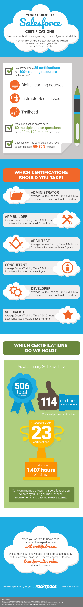

In the age of customer experience, businesses now rely on their customer
relationship management (CRM) systems more than ever, and certifications are
crucial.

<!--more-->

As the world leader in CRM software, Salesforce knows the value of a
well-trained team that understands the importance of customer data. That’s why
there are 25 certifications available to nurture Salesforce talent. Salesforce
designed each course, divided into its own certification track, to meet the
growing demand for technical skills.

When it comes to showing off your technical abilities, a Salesforce
certification packs a punch. Whether you’re an application architect in the
making or you’re a business leader hoping to train a team of cloud consultants,
Salesforce certifications help you develop and differentiate yourself in the
market. With over 100 learning resources and hours of education to explore,
you can make sure that you’re all set to get certified.

As a full-service Salesforce Platinum Consulting Partner with a grand total of
506 certifications to date, Rackspace knows plenty about Salesforce
certifications. We can help you choose the best paths for your team based on
our extensive Salesforce experience.

Check out the following infographic for our guide to developing your knowledge
and empowering your teams through the Salesforce resources:

<a class="cta blue" id="cta" href="https://www.rackspace.com/salesforce">Learn more about Salesforce Customer Relationship Management (CRM)</a>

Visit [www.rackspace.com](https://www.rackspace.com) and click **Sales Chat**
to get started.

Use the Feedback tab to make any comments or ask questions.
