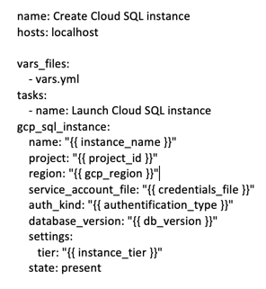
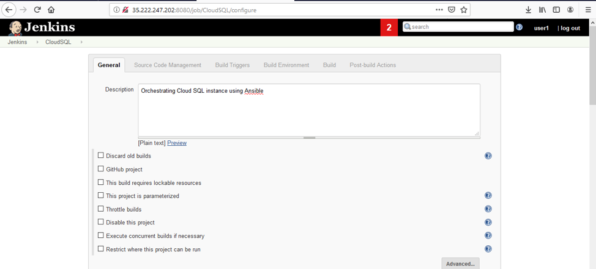
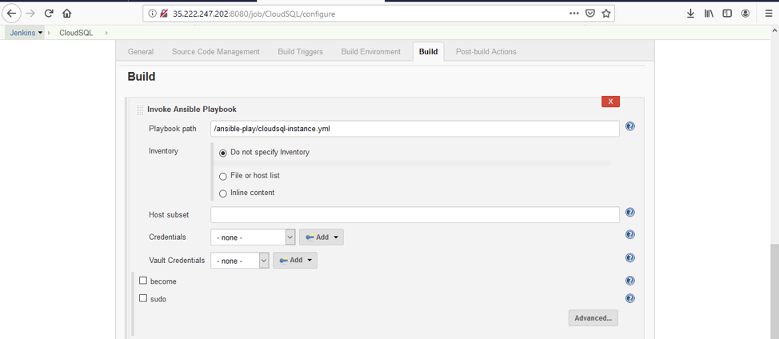
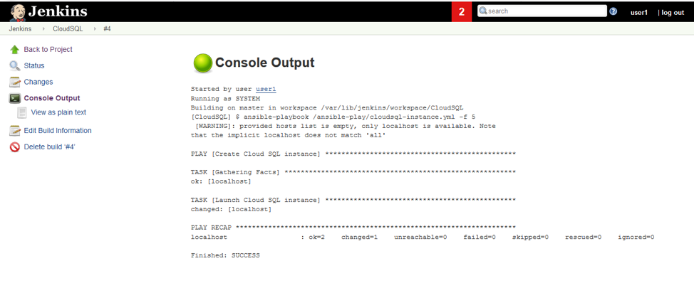
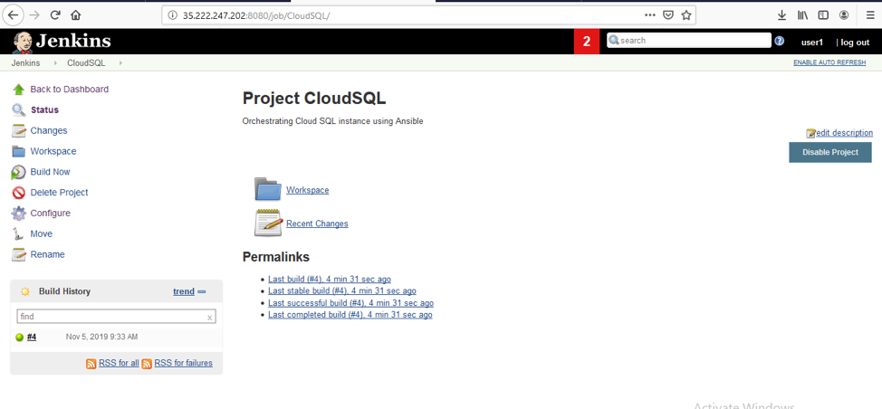
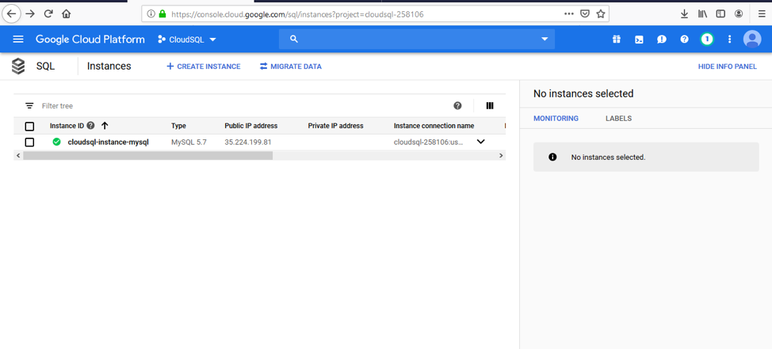

This blog post discusses how you can automate the creation of a Google&reg; Cloud
Platform (GCP) Cloud SQL instance by using Ansible&reg; and Jenkins&reg;. The blog also
includes an example of spinning up a MySQL&reg; Cloud SQL instance, version 5.7,
with an Ansible playbook.

<!--more-->

Using Ansible and Jenkins lets you spin up  a GCP Cloud SQL instance quickly by
accessing Cloud SQL with a project-specific GCP account. This option ensures
additional security by providing access to the GCP console only to users with
GCP admin access. You can write playbooks for different GCP services and rollout
Jenkins jobs to users to spin up GCP infrastructure as needed.

### Necessary tools

To perform this task, you need to use Ansible and Jenkins.

**Ansible**: Use this for configuration management and as an orchestration tool
in DevOps. Ansible has a wide variety of prebuilt modules written in Python for
different products in the market that you can customize by using Python.

**Jenkins**: You can use Jenkins as a continuous integration server or as an
automation server. Based on Java&reg;, Jenkins has a wide range of plug-ins for
different products in the market. You can customize the plug-ins by using Java
or Apache&reg; Groovy.

### Prerequisites

In this task, Ansible acts as an orchestration tool, and Jenkins acts as an
automation server. Prerequisites for doing this task include the following
items:

1. Install Jenkins and Ansible, accessible over the Internet, on the server.

2. Create a service account, assign a Cloud SQL Admin role to the service
   account, and download the key of the service account.

3. After you create the service account, enable the Cloud SQL Admin API for the
   project in which you created the service account. Find the URL for enabling
   the service account by using the following syntax:

        https://console.developers.google.com/apis/api/sqladmin.googleapis.com/overview?project= "Project ID"

4. Use the following commands, as the `root` user, to install the required
   packages on the Ansible Server:

        yum install python-pip
        pip install apache-libcloud
        pip install google-auth

### Set up the Ansible playbook

After completing the prerequisites, you need to move the Ansible playbook and
service account key file to the Jenkins server.

#### Ansible playbook

An Ansible playbook contains a set of instructions written in YAML. This example
uses a gcp\_sql\_instance module to spin up the Cloud SQL instance. The
following playbook creates a GCP Cloud SQL instance of MySQL database version 5.7:

The playbook in this example uses the following playbook variables files and
stores them in **vars.yml**:

-  project\_id: cloudsql-258106
-  authentification\_type: serviceaccount
-  credentials\_file: /ansible-play/cloudsql-auth.json
-  instance\_name: cloudsql-instance-mysql
-  db\_version: MYSQL\_5\_7
-  gcp\_region: us-central1
-  instance\_tier: db-n1-standard-1

#### Jenkins server

Jenkins is an automation server, and the job is a basic component in Jenkins
that you use to define the task that you want to automate.

The job defines `CloudSQL` as the job name.

#### Ansible plug-in in Jenkins

To run the playbook in a Jenkins job, you must install the Ansible plug-in in
Jenkins. Then use that plug-in in the **Build** step of the Jenkins job to specify
the playbook as shown in the preceding screenshot.

After the CloudSQL job runs, you should see output similar to the following
output:

#### Jenkins user interface

The following screenshot shows the user interface (UI) in Jenkins that you use
to run or make changes to the job. The screenshot shows the MySQL Cloud SQL
instance created in GCP after Jenkins job completes:

### Conclusion

Use Jenkins and Ansible to implement Infrastructure as a Code (IaaC), which
helps to avoid human errors during infrastructure spin up and restricts access
to the GCP console to a limited set of users. Automating this task by using
Ansible and Jenkins provides a GUI for authorized Jenkins users who don't know
GCP or how to spin a Cloud SQL instance.

Use the Feedback tab to make any comments or ask questions.

<a class="cta purple" id="cta" href="https://www.rackspace.com/lp/enhancedarchitecturereview">Get a free GCP architecture review</a>

[Chat now](https://www.rackspace.com/#chat) to get started.

