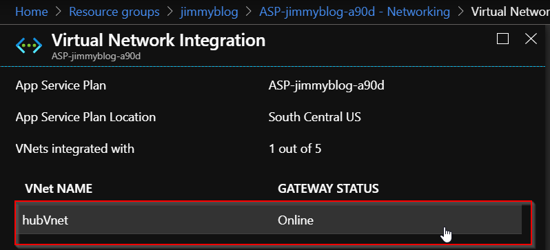
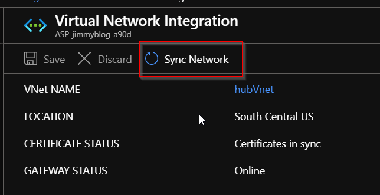
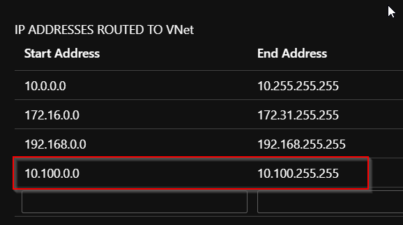
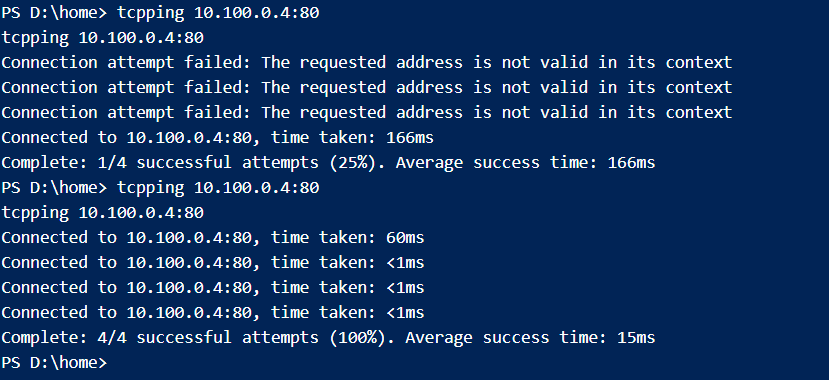
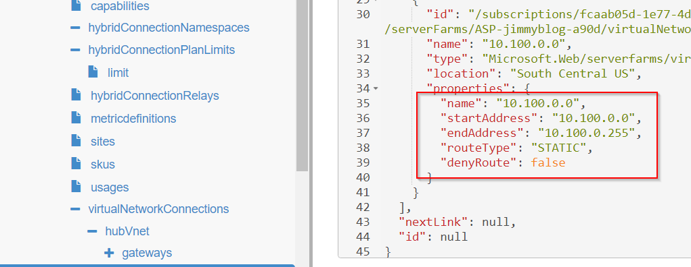

A colleague of mine sent me a message asking if I ever had an issue deploying an Azure&reg; web app
that routed through a hub-and-spoke topology. Trying to think back through the hundreds of deploys
I have done, nothing came to me regarding any difficulties. Digging more into the problem with him,
he explained that the web app could hit any virtual machine in the hub, but nothing in the spokes.
This symptom sounded like a routing issue, with some oddities sprinkled on top.

<!--more-->

Without going into details of setting up virtual network (VNet) integration v1, here are the
basic requirements:

-  Have a standard **App Service Plan**.
-  Have a VPN gateway provisioned with point-to-site configured with an address range
   to hand out to the web apps. 

After you set up the VNet configuration within the Azure web app, it says **connected**.
At this point, you'd expect that you are done, but nothing is ever that easy. After
initially setting up the VNet integration, I accessed the KUDU console and use **TCPPING**
to verify connectivity to the resource within the VNet that I need to reach. TCPPING failed, and
the network did not sync correctly. To manually sync the network to let initial connectivity happen, I used
the following steps:

1) Click on the **App Service Plan** of the web app where you configured VNet integration and select
   **Networking** from the blade. Select **Click here** to manage under **VNet Integration**.
   
2) Click on the VNet that is acting as the hub VNet.
   
3) Click on **Sync Network**.
   

Back at the KUDU console, TCPPING should work when it is pointed to an IP address of a hub virtual machine.
However, trying to ping a virtual machine in the spoke VNet did not work. Within the **App Service Plan** where 
the sync network operation is, I scrolled to the bottom, and there was a table labeled 
**IP ADDRESSES ROUTED TO VNet**. I saw all three private RFC 1918 address ranges listed and was confused about why 
the routing was not working. I tried explicitly adding the address range for the spoke VNet 
and tried TCPPING again, which now succeeded.

I exited out of the networking blade and went back in to see that my address range was gone!
Even though it was gone, my TCPPING requests still worked. To verify what routes are in the app
service plan, I browsed to [https://resources.azure.com]. Then, I drilled down to the app service
plan and into the **virtualNetworkConnections**. As the following image shows, my route type of
static was still there. If I had to guess, I'd say this must be a bug with the user interface.

If you find yourself stuck figuring out why the routing doesn't work, and you have verified that the virtual 
network peering settings are correct, try adding a route for the spoke VNet in the **App Service Plan**.
