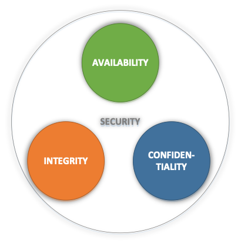
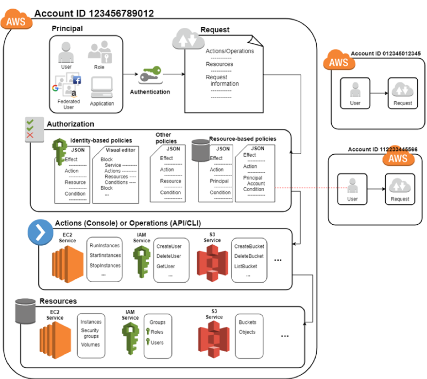
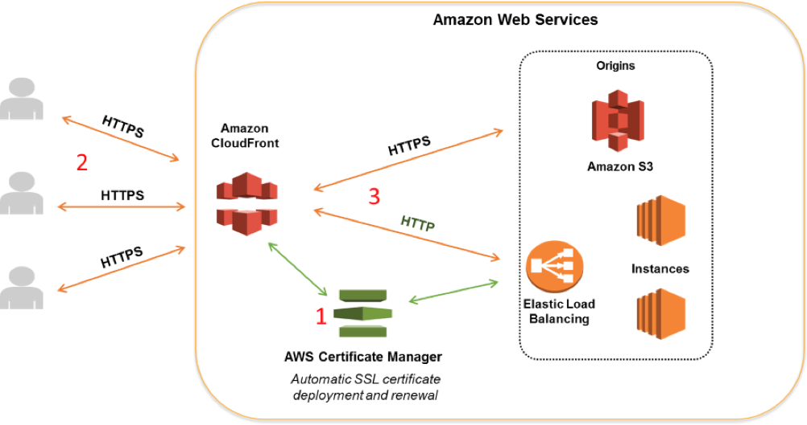
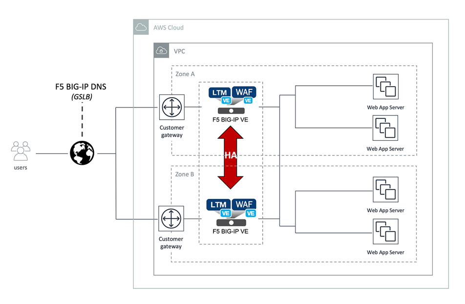
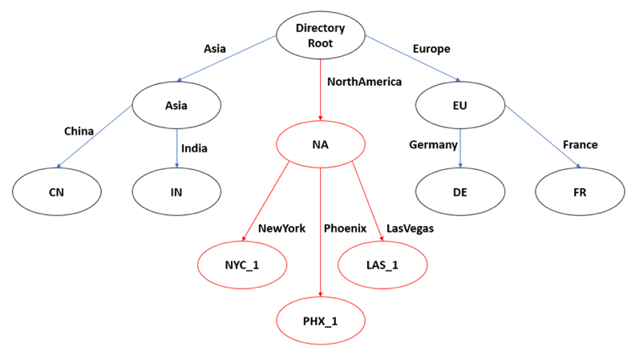
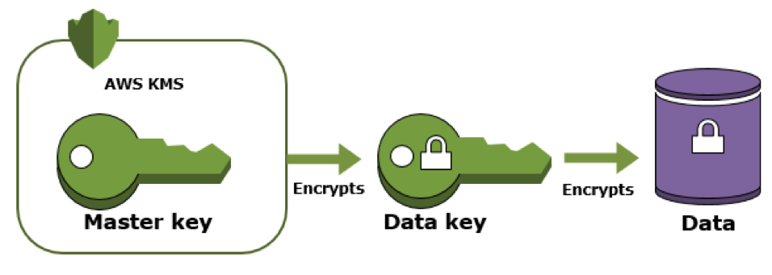
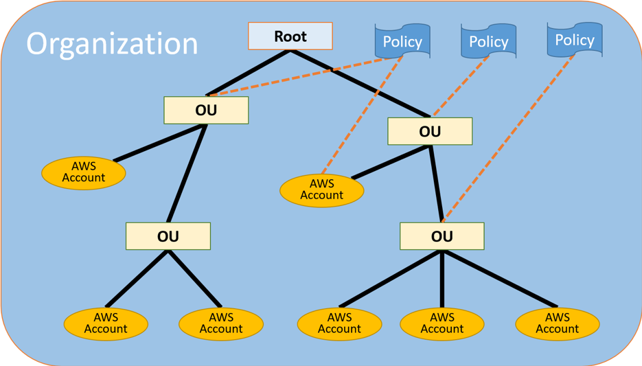
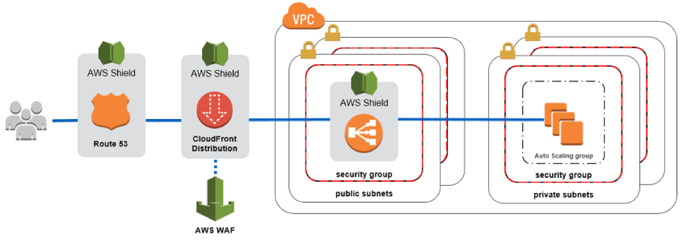
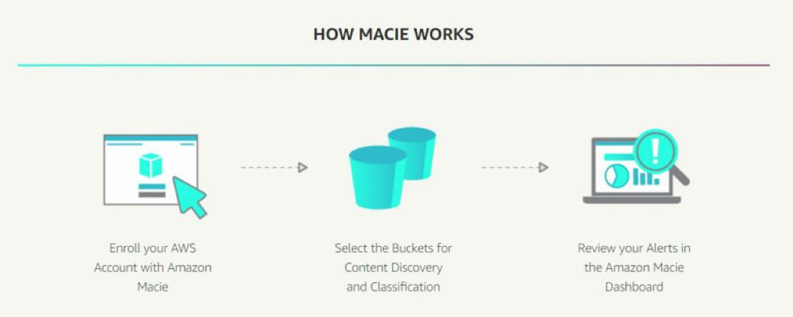
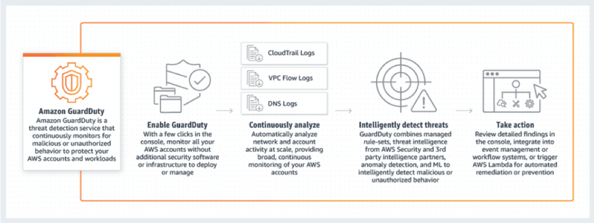

This blog post collects the Amazon&reg; Web Services (AWS) cloud security
components from [their site](https://aws.amazon.com) and other sources,
providing a convenient overview.

<!--more-->

### Introduction

(*Source*: [https://www.paramountassure.com/solutions/cloud-application-security](https://www.paramountassure.com/solutions/cloud-application-security))

Cloud computing security is a fast-growing service that provides many of the
same functionalities as traditional IT security. This includes protecting
critical information from theft, data leakage, and deletion.

One of the benefits of cloud services is that you can operate at scale and
remain secure. It is similar to how you currently manage security, but now you
have new ways of delivering security solutions that address new areas of
concern. Cloud security does not change the approach on how to manage security
from preventing to detective and corrective actions. However, it gives you the
ability to perform these activities in a more agile manner.

(*Source*: [Handbook of Industry 4.0and SMART systems by Diego Galar Pascual, Pascuale Daponte, and Uday Kumar](https://books.google.com/books?id=7YavDwAAQBAJ&pg=PT323&lpg=PT323&dq=choosing+a+provider+that+has+multiple+data+centers+across+the+world+can+help+to+achieve+this&source=bl&ots=ct0JBJW8gP&sig=ACfU3U0cj2aelvfyqxPds2Tv5kEuKbGPNg&hl=en&sa=X&ved=2ahUKEwiFuZ-3uoPnAhXNbc0KHSVcAHwQ6AEwAHoECAwQAQ#v=onepage&q=choosing%20a%20provider%20that%20has%20multiple%20data%20centers%20across%20the%20world%20can%20help%20to%20achieve%20this&f=false))

Your data is secured within data centers and where some countries require data
to be stored in their country. Choosing a provider that has multiple data
centers across the world can help to achieve this.

Data storage often includes certain compliance requirements, especially when
storing credit card numbers or health information. Many cloud providers offer
independent third-party audit reports to attest that their internal process
exist, and that they are effective in managing the security within their facilities where
you store your data.

The following image shows the three main cloud infrastructure principles:

(*Source*: [https://aws.amazon.com/](https://aws.amazon.com/))

### AWS cloud security components

AWS cloud security consists of the following components:

- Identity and Access Management (IAM)
- Inspector
- Certificate Manager
- Web Application Firewall (WAF)
- Cloud Directory
- Key Management Service (KMS)
- Organizations
- Shield
- Macie
- GuardDuty

#### IAM

(*Source*: Unattributed)

IAM, a secure cloud security service, helps you to manage users, assign
policies, and form groups to manage multiple users.

AWS Identity Access Management allows you to do the following functions:

1) Establish access rules and permissions to specific users and applications.
2) Set up permissions for users and applications.
3) Create user groups for common rules assignment.
4) Use CloudTrail to monitor access.
5) Use Identity federation to log in with your company credentials.

(*Source*: [https://docs.aws.amazon.com/IAM/latest/UserGuide/iam-ug.pdf](https://docs.aws.amazon.com/IAM/latest/UserGuide/iam-ug.pdf))

A principal is a person or application that requests an action or
operation on an AWS resource. When a principal tries to use the AWS Management
Console, the AWS Application Program Interface (API), or the AWS Command Line
Interface (CLI), that principal sends a request to AWS.

A principal must be authenticated (signed into AWS) by using their credentials to
send a request to AWS. AWS uses values from the request context to check for
policies that apply to the request. It then uses the policies to determine
whether to allow or deny the request. After AWS approves the operations in your
request, you can perform them on the related resources within your account.

(*Source*: [https://docs.aws.amazon.com/IAM/latest/UserGuide/iam-ug.pdf](https://docs.aws.amazon.com/IAM/latest/UserGuide/iam-ug.pdf))

#### Inspector

Inspector is an agent that you can install on your virtual machines, which
reports any security vulnerabilities.

(*Source*: [https://aws.amazon.com/inspector/](https://aws.amazon.com/inspector/))

Amazon Inspector is an automated security assessment service that helps improve
the security and compliance of applications deployed on AWS. Amazon Inspector
automatically assesses applications for exposure, vulnerabilities, and deviations
from best practices. After performing an assessment, Amazon Inspector produces
a detailed list of security findings prioritized by level of severity. These
findings can be reviewed directly or as part of detailed assessment reports,
which are available through the Amazon Inspector console or API.

**Benefits:**

-	Integrates automated security checks into your regular deployment and
    production processes.
-	Finds application security issues.
-	Helps you gain a deeper understanding of your AWS resources.

(*Source*: [https://aws.amazon.com/](https://aws.amazon.com/))

#### Certificate Manager

(*Source*: [https://aws.amazon.com/certificate-manager/](https://aws.amazon.com/certificate-manager/))

AWS Certificate Manager is a service that lets you easily provision, manage,
and deploy public and private Secure Sockets Layer/Transport Layer Security
(SSL/TLS) certificates for use with AWS services and your internal connected
resources. SSL/TLS certificates are used to secure network communications and
establish the identity of websites over the Internet as well as resources on
private networks. AWS Certificate Manager removes the time-consuming manual
process of purchasing, uploading, and renewing SSL/TLS certificates.

(*Source*: [https://aws.amazon.com/](https://aws.amazon.com/))

#### WAF

(*Source*: [https://aws.amazon.com/waf/](https://aws.amazon.com/waf/))

AWS WAF is a web application firewall that helps protect your web applications from
common web exploits that could affect application availability, compromise
security, or consume excessive resources. AWS WAF gives you control over which
traffic to allow or block to your web applications by defining customizable web
security rules. You can use AWS WAF to create custom rules that block common
attack patterns, such as SQL injection or cross-site scripting, and rules that
are designed for your specific application. New rules can be deployed within
minutes, letting you respond quickly to changing traffic patterns. Also, WAF
includes a full-featured API that you can use to automate the creation,
deployment, and maintenance of web security rules.

**Benefits:**

-  Increases protection against web attacks.

-  Integrates security with application development.

-  Makes deployment and maintenance easy.

-  Improves web traffic visibility.

(*Source*: [https://aws.amazon.com/marketplace/solutions/infrastructure-software/web-application-firewall](https://aws.amazon.com/marketplace/solutions/infrastructure-software/web-application-firewall))

#### Cloud Directory

This service allows you to create flexible, cloud-native directories for
managing hierarchies of data along multiple dimensions.

(*Source*: [https://aws.amazon.com/cloud-directory/](https://aws.amazon.com/cloud-directory/))

AWS Cloud Directory enables you to build flexible cloud-native directories
for organizing hierarchies of data along multiple dimensions. With Cloud
Directory, you can create directories for a variety of use cases, such as
organizational charts, course catalogs, and device registries. While traditional
directory solutions, such as Active Directory Lightweight Directory Services
and other LDAP-based directories, limit you to a single hierarchy, Cloud
Directory offers you the flexibility to create directories with hierarchies
that span multiple dimensions. For example, you can create an organizational
chart that can be navigated through separate hierarchies for reporting
structure, location, and cost center.

**Benefits**:

- Efficiently organize hierarchies of data across multiple dimensions.

- Scale automatically on managed infrastructure.

- Search your directory for objects and relationships.

- Easily adapt to changing data requirements.

(*Source*: [https://aws.amazon.com/](https://aws.amazon.com/))

#### KMS

(*Source*: [https://aws.amazon.com/kms/](https://aws.amazon.com/kms/))

AWS KMS makes it easy for you to create and manage keys and control the use of
encryption across a wide range of AWS services and in your applications. KMS is
a secure and resilient service that uses hardware security modules that have
been validated under **FIPS 140-2**, or are in the process of being validated,
to protect your keys. KMS is integrated with AWS CloudTrail to provide you with
logs of all key usage to help meet your regulatory and compliance needs.

**Benefits**:

- Is fully managed.

- Has centralized key management.

- Manages encryption for AWS services.

- Encrypts data in your applications.

(*Source*: [https://aws.amazon.com/](https://aws.amazon.com/))

#### Organizations

You can create groups of AWS accounts by using Organizations to manage
security and automation settings.

(*Source*: [https://aws.amazon.com/organizations/](https://aws.amazon.com/organizations/))

AWS Organizations helps you centrally govern your environment as you
grow and scale your workloads on AWS. Whether you are a growing startup or a
large enterprise, Organizations helps you to centrally manage billing, to control
access, compliance, and security, as well as to share resources across your AWS accounts.

**Benefits**:

- Centrally manage policies across multiple AWS accounts.

- Govern access to AWS services, resources, and regions.

- Automate AWS account creation and management.

- Configure AWS services across multiple accounts.

- Consolidate billing across multiple AWS accounts.

(*Source*: [https://aws.amazon.com/](https://aws.amazon.com/))

#### Shield

(*Source*: [https://aws.amazon.com/shield/](https://aws.amazon.com/shield/))

AWS Shield is a managed Distributed Denial of Service (DDoS) protection service that
safeguards applications running on AWS. Shield provides always-on detection and
automatic inline mitigations that minimize application downtime and latency,
so there is no need to engage AWS Support to benefit from DDoS protection.
There are two tiers of AWS Shield&mdash;Standard and Advanced.

**Benefits**:

- Seamless integration and deployment.

- Customizable protection.

- Managed protection and attack visibility.

- Cost efficiency.

(*Source*: [https://aws.amazon.com/](https://aws.amazon.com/))

#### Macie

Macie offers a data visibility security service which helps classify and
protect your sensitive critical content.

(*Source*: [https://aws.amazon.com/macie/](https://aws.amazon.com/macie/))

Amazon Macie is a security service that uses machine learning to automatically
discover, classify, and protect sensitive data in AWS. Macie recognizes
sensitive data such as personally identifiable information (PII) or intellectual
property. Macie provides you with dashboards and alerts that give visibility into
how this data is being accessed or moved. The fully managed service continuously
monitors data access activity for anomalies and generates detailed alerts when
it detects the risk of unauthorized access or inadvertent data leaks.

**Benefits**:

- Offers superior visibility of your data.

- Is simple to set up, easy to manage.

- Provides data security automation through machine learning.

- Has custom alert monitoring with CloudWatch.

(*Source*: [https://aws.amazon.com/](https://aws.amazon.com/))

#### GuardDuty

(*Source*: [https://aws.amazon.com/guardduty/](https://aws.amazon.com/guardduty/))

Amazon GuardDuty is a threat detection service that continuously monitors for
malicious activity and unauthorized behavior to protect your AWS accounts and
workloads. With the cloud, the collection and aggregation of account and network
activities is simplified, but it can be time-consuming for security teams to
continuously analyze event log data for potential threats. With GuardDuty, you
now have an intelligent and cost-effective option for continuous threat
detection in the AWS Cloud. The service uses machine learning, anomaly detection,
and integrated threat intelligence to identify and prioritize potential threats.

**Benefits**:

- Comprehensive threat identification.

- Strengthened security through automation.

- Enterprise scale and central management.

(*Source*: [https://aws.amazon.com/guardduty/](https://aws.amazon.com/guardduty/))

### Conclusion

(*Source*: [https://www.forcepoint.com/cyber-edu/cloud-security](https://www.forcepoint.com/cyber-edu/cloud-security))

For businesses making the transition to the cloud, robust cloud security is
imperative. Security threats are constantly evolving and becoming more
sophisticated, and cloud computing is no less at risk than an on-premise
environment. For this reason, it is essential that you work with a cloud provider
that offers best-in-class security that has been customized for your
infrastructure.

Use the Feedback tab to make any comments or ask questions.

### Optimize your environment with expert administration, management, and configuration

[Rackspace's Application services](https://www.rackspace.com/application-management/managed-services)
**(RAS)** experts provide the following [professional](https://www.rackspace.com/application-management/professional-services)
and
[managed services](https://www.rackspace.com/application-management/managed-services) across
a broad portfolio of applications:

- [eCommerce and Digital Experience platforms](https://www.rackspace.com/ecommerce-digital-experience)
- [Enterprise Resource Planning (ERP)](https://www.rackspace.com/erp)
- [Business Intelligence](https://www.rackspace.com/business-intelligence)
- [Salesforce Customer Relationship Management (CRM)](https://www.rackspace.com/salesforce-managed-services)
- [Databases](https://www.rackspace.com/dba-services)
- [Email Hosting and Productivity](https://www.rackspace.com/email-hosting)

We deliver:

- **Unbiased expertise**: We simplify and guide your modernization journey,
focusing on the capabilities that deliver immediate value.
- **Fanatical Experience**&trade;: We combine a *Process first. Technology second.&reg;*
approach with dedicated technical support to provide comprehensive solutions.
- **Unrivaled portfolio**: We apply extensive cloud experience to help you
choose and deploy the right technology on the right cloud.
- **Agile delivery**: We meet you where you are in your journey and align
our success with yours.

[Chat now](https://www.rackspace.com/#chat) to get started.

