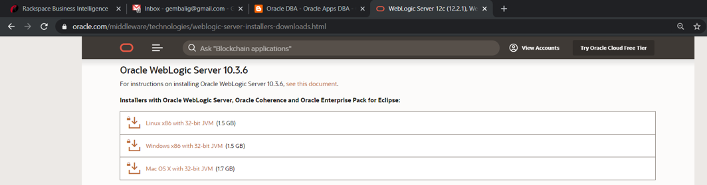
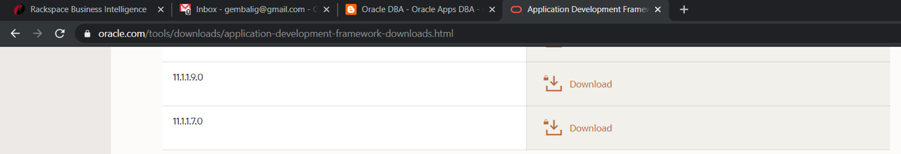
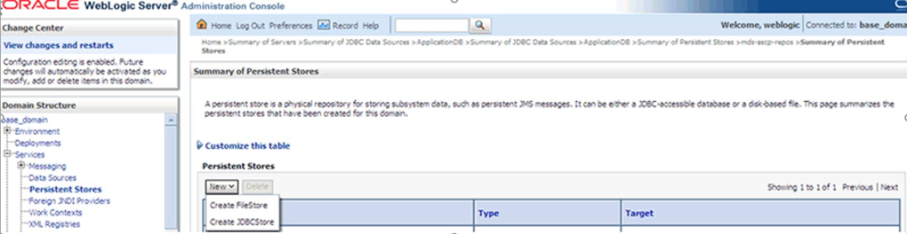

The blog post explains how to integrate Oracle&reg; Application Development
Framework (ADF) with E-Business Suite (EBS) Supply Planning Work Area (SWPA).

<!--more-->

### ADF

Oracle describes ADF in
[Oracle Fusion Middleware Understanding Oracle Application Development Framework](https://docs.oracle.com/middleware/1212/adf/ADFCG/intro.htm#ADFCG111) in the following way:

“Oracle Application Development Framework (Oracle ADF) is an end-to-end
application framework that builds on Java EE standards and open-source
technologies to simplify and accelerate implementing enterprise applications.
Oracle ADF is suitable for enterprise developers who want to create applications
that search, display, create, modify, and validate data using web, mobile, and
desktop interfaces.

“You can use the whole Oracle ADF framework to create an application, or you
can use parts of the framework in combination with the other technologies.
Throughout this guide, applications that contain any ADF technologies are
generally referred to as ADF applications. Web applications that incorporate
ADF technologies throughout the business service, model, controller, and view
layers are referred to as Fusion web applications.”

### SWPA

Oracle describes SPWA in [FAQ For 12.2.5 - SPWA - Supply Planning Work Area](https://support.oracle.com/knowledge/More%20Applications%20and%20Technologies/2049195_1.html) in the following way:

“The Supply Planning Work Area (SPWA) is a component of the Oracle Advanced
Supply Chain Planning (ASCP).

“12.2.5 VCP introduces a new form for users that is an alternative to the
planner workbench. The standard Planner Workbench is still available and will
not be removed from the applications.

“This form uses the same ADF (Application Development Framework) tech stack that
powers Rapid Planning and Fusion applications&mdash;part of the Fusion Middle Ware
(FMW) tech stac. This does not use standard Oracle Forms tech stack that
has been the standard for the last 15+ years.

“It depends on your WebLogic tech stack and ADF rendering of the forms.”

### Integrate ADF with SWPA

In EBS version 12.2.5 and later,  Oracle introduced SPWA, which replaced the
Advanced Supply Chain Planning (ASCP) Planner Workbench in earlier EBS releases.

Use the following steps to integrate ADF with EBS v12.2:

1. Download and install a new or separate WebLogic Server (WLS), version 10.3.6.
2. Download and install ADF Runtime version 11.1.1.9.0.
3. Configure the WLS domain.
4. Create a new managed server in WebLogic.
5. Create a Java Database Connectivity (JDBC) data source.
6. Set up an Oracle Metadata Services (MDS) repository.
7. Start the administrative and managed servers.
8. Deploy the Planning UI application.
9. Set the Oracle Advanced Supply Chain Planning (MSC) profile in EBS.

#### 1. Download and install a new or separate WebLogic Server, version 10.3.6

Download the software from the following URL:

[https://www.oracle.com/middleware/technologies/weblogic-server-installers-downloads.html](https://www.oracle.com/middleware/technologies/weblogic-server-installers-downloads.html)

To install the WLS, use the following steps:

1. Stage this in the file system.

2. Make sure that you have the Java Development Kit (JDK) 1.6 or later.

3. Set the JDK Home by using the following command:

        export JDK_HOME=/u01/utilities/jdk160_29)

4. Install it by running one of the following commands:

   If the installation file type is **jar**, run the following command:

        $(JAVA_HOME)/bin/java –jar wls1036_generic.jar

   If the installation file type is **bin**, run the following command:

        ./wls1036_linux32.bin

Provide the following inputs during the installation process as needed and
complete the installation:

-	Provide the Middleware home directory where you want to install the WLS.
-	Choose the install type ``Typical``.
-	Select the JDK location where you installed the JDK.

#### 2. Download and install ADF Runtime version 11.1.1.9.0

Download the software from the following URL:

[https://www.oracle.com/tools/downloads/application-development-framework-downloads.html](https://www.oracle.com/tools/downloads/application-development-framework-downloads.html)

To install the ADF Runtime, use the following steps:

1. Stage this software in on the Unix server.

2. Run the following commands:

        cd /stage/adf_11.1.1.9.0
        ./runInstaller -jreLoc /u01/utilities/jdk160_29

Provide the following inputs during the installation process as needed and
complete the installation:

-  Skip any software updates.
-  Provide the Middleware home path where you installed WLS in step 1.

#### 3. Configure the WebLogic Server domain

To configure the WLS domain, use the following steps:

1. Go to the newly installed WebLogic **Home/common/bin**.

2. Run the following commands:

        cd /u01/app/oracle/product/fmw_oam2/wlserver_10.3/common/bin
        ./config.sh

Provide the following inputs during the installation process as needed and
complete the installation:

-	Select the first option to generate an automatically configured domain and
    select both the Oracle Enterprise Manager (OEM) and Java Required Files (JRF).
-	Enter the **Domain Name**, ``ascp_domain``.
-	Provide your WebLogic password.
-	Select **Configure Server Start Mode** in the **Production** mode.
-	Select **Administration Server** on the **Optional Configuration** screen.
-	Change the listener port to the other port if you installed the WLS in the same
    EBS Apps tier.
-   Change to port ``7051``, and if Secure Socket Layer (SSL) is not enabled, uncheck **SSL**.

#### 4. Create a new managed server in WebLogic

To create a new managed server in WebLogic, run the following steps:

1. To open the WebLogic Console with port ``7051``, which you used when you
   configured the admin server, browse to
   [https://webtest.linux.local:7051/console](https://webtest.linux.local:7051/console).

2. Log in with your WebLogic username and password.

3. After the Administration Console screen displays, click on
   **Servers -> Create New to create new server**.

4. Enter the **Server Name**,``ASCPManagedServer``,

5. To open the WebLogic EM Console with port ``7051`` , which you used when you
   configured the admin server, browse to
   [https://webtest.linux.local:7051/em](https://webtest.linux.local:7051/em)

6. Log in with your WebLogic username and password

7. After the EM Fusion Middleware Console Control screen displays, click
   **WebLogic Domain -> ASCPManagedServer**.

8. Click **Apply JRF Template**.

A confirmation message displays at the top of the page.

#### 5. Create a JDBC data source

To create a JDBC data source, use the following steps:

1. To open the WebLogic Console with port ``7051``, which you used when you
   configured the admin server, browse to
   [https://webtest.linux.local:7051/console](https://webtest.linux.local:7051/console).

2. Log in with your Weblogic username and password.

3. After the Administration Console screen displays, click
   **ascp_domain->Services->Data Sources -> New -> Generic Data Sources** and
   click **Next**.

4. Select the **Database Driver** type and click **Next**.

5. Select the default options and click **Next**.

6. Provide **DB Name**, **Apps username**, and **Password**. Click **Next** and **Finish**.

#### 6. Set up an MDS repository

To create the MDS directory at the ASCP Managed Server location, use the
following steps:

1. Run the following commands:

        cd /u01/app/oracle/product/fmw_oam2/user_projects/domains/ascp_domain/servers/ASCPManagedServer
        mkdir mds

2. To create a File Persistence Store, open WebLogic Console with port 7051 by
   browsing to [https://webtest.linux.local:7051/console](https://webtest.linux.local:7051/console).

3. Log in with your WebLogic username and password.

4. After the Administration Console screen displays, click on
   **ascp_domain->Services->Persistent Stores -> New -> CreateFileStore**.
   The following **Create a File Store screen** displays:

<ol start=5>
    <li>Enter mds-ascp-repos in the <b>Name</b> field.</li>
    <li>Select <b>ASCPManagedServer</b> from the <b>Target</b> list.</li>
    <li>Enter <b>/u01/app/oracle/product/fmw_oam2/user_projects/domains/ascp_domain/servers/ASCPManagedServer/mds</b>
     in the <b>Directory</b> path field.</li>
    <li>Click <b>Ok</b>.</li>
    <li>If you don't see the directory structure, stop and start ASCPManagedServer.</li>
</ol>

#### 7. Start the administrative and managed servers

To start the admin and managed servers, use the following steps:

1. To start the admin server, run the following commands:

        cd /u01/app/oracle/product/fmw_oam2/wlserver_10.3/server/bin
        ./setDomainEnv.sh
        nohup ./startWebLogic.sh &

2. To start the managed server, run the following commands:

        cd /u01/app/oracle/product/fmw_oam2/wlserver_10.3/server/bin
        ./setDomainEnv.sh
        nohup ./startManagedWebLogic.sh ASCPManagedServer &

#### 8. Deploy the Planning UI application

To deploy the Planning UI application, use the following steps:

1.  Run the following command to copy and extract the ZIP files.

        mkdir /u01/app/oracle/product/fmw_oam2/user_projects/domains/ascp_domain/applications
        cp $MSC_TOP/patch/115/ear/PlanningUIEar.zip /u01/app/oracle/product/fmw_oam2/user_projects/domains/ascp_domain/applications/.

2.  Run the following commands to deploy the Planning application.

        cd /u01/app/oracle/product/fmw_oam2/user_projects/domains/ascp_domain/applications/
        unzip PlanningUIEar.zip
        mkdir /u01/app/oracle/product/fmw_oam2/user_projects/domains/ascp_domain/servers/ASCPManagedServer/stage/PlanningUI
        cp applications/PlanningUI.ear /u01/app/oracle/product/fmw_oam2/user_projects/domains/ascp_domain/servers/ASCPManagedServer/stage/PlanningUI/.

3.  Open the WebLogic UI for the ASCP domain according to the procedure in step 7.

4.  Select **Deployments** in the Domain Structure region, which displays the
    **Summary of Deployments - Control** tab.

5. Select **Install** to install the new Planning application, which displays the
   **Install Application** assistant.

6. To open the Weblogic Console with port ``7051``, browse to
   (https://webtest.linux.local:7051/console)[https://webtest.linux.local:7051/console]

7. Log in with your Weblogic username and password.

8. In the **Administration Console**, click
   **ascp_domain->Deployments -> Install -> Provide Path** and click **Next**.

10. Click **Select ASCPManagedServer** and click **Finish**.

11. After the deployment completes and you see the Planning UI deployment,
    select **Deployments** from the **Domain Structure** region and locate
    **Planning UI** in the **Deployments** table. The Planning UI deployment
    should show as **Active**.

#### 9. Set the MSC profile in EBS

Set the MSC profile in EBS by using the following elements:

- Profile Name: MSC: ASCP Planning URL
- Value: https://webtest.linux.local:7151

### Conclusion

SPWA is a new feature that replaces Planner Workbench in earlier releases.

In SPWA, you configure, view, and analyze your real-world business processes.
By using SPWA, you can do the following:

-	View multiple plans and plan inputs simultaneously.
-	Use predefined page layouts.
-	Create user-defined page layouts to view plan data tailored for your organization.

The SPWA form uses ADF and does not use the standard Oracle Forms. To use SPWA,
you need to install and configure both a WLS and ADF and then enable
the user to work on the ADF page from EBS.

Use the Feedback tab to make any comments or ask questions.

### Optimize your environment with expert administration, management, and configuration

[Rackspace's Application services](https://www.rackspace.com/application-management/managed-services)
**(RAS)** experts provide the following [professional](https://www.rackspace.com/application-management/professional-services)
and
[managed services](https://www.rackspace.com/application-management/managed-services) across
a broad portfolio of applications:

- [eCommerce and Digital Experience platforms](https://www.rackspace.com/ecommerce-digital-experience)
- [Enterprise Resource Planning (ERP)](https://www.rackspace.com/erp)
- [Business Intelligence](https://www.rackspace.com/business-intelligence)
- [Salesforce Customer Relationship Management (CRM)](https://www.rackspace.com/salesforce-managed-services)
- [Databases](https://www.rackspace.com/dba-services)
- [Email Hosting and Productivity](https://www.rackspace.com/email-hosting)

We deliver:

- **Unbiased expertise**: We simplify and guide your modernization journey,
focusing on the capabilities that deliver immediate value.
- **Fanatical Experience**&trade;: We combine a Process first. Technology second.&reg;
approach with dedicated technical support to provide comprehensive solutions.
- **Unrivaled portfolio**: We apply extensive cloud experience to help you
choose and deploy the right technology on the right cloud.
- **Agile delivery**: We meet you where you are in your journey and align
our success with yours.

[Chat now](https://www.rackspace.com/#chat) to get started.
