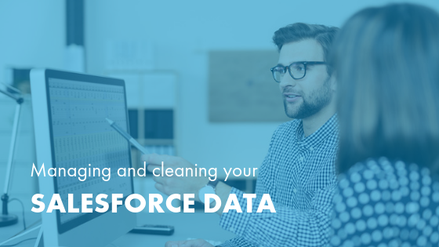

It’s no small task setting up Salesforce&reg;, particularly when it comes to
migrating, cleaning, and maintaining data. Which data do you need to migrate,
and which should you scrub? How can your company decide?

<!--more-->

Rackspace has helped many clients implement and customize Salesforce, giving us
a unique view on best practices and common mistakes,
when migrating, cleaning, and maintaining your business data.

Mismanagement of data can slow down your team, confuse your clients, and could
ultimately get you in a lot of trouble&mdash;especially with new emerging
legislation like General Data Protection Regulation (GDPR). Read on to learn how
to manage your data better and reap the rewards of effective data organization.

### When moving houses or migrating data, take only what you need

Think about moving to a new house. You can hire people to pack your belongings
and move them, but ultimately you have to be the one to go through your
possessions and decide which items to keep and which to discard. Do you need to
keep those old clothes? Should you take the end table to the new house, sell it,
or put it in a storage locker? The homeowner must make some decisions and not
outsource them to a third party, so save unnecessary effort and cost by making
those decisions before moving everything to a different house.

It’s the same when implementing an enterprise solution such as Salesforce. When
we help our clients to implement Salesforce, we recommend they do some level of
data cleanup in advance. A client’s internal team understands the value and
accuracy of their data better than external consultants. You should complete
this data cleanup before migrating to Salesforce so that we can help to configure
the data solutions in a way that suits your company’s data needs.

Rackspace can advise you about the types of data you should clean and what you
can retire. Over time, we’ve made the following observations:

- **Account and contact data is crucial for data accuracy**.
  Having accurate data about companies and people is critical. Ancillary data
  that gives a 360-degree view of a customer is also extremely valuable.

- **Retain notes on customers only if they relevant and useful**. Some
  clients might decide not to migrate note data, or to limit it to a specific
  date range. However, certain industries, such as financial services, might
  find that note data is relevant despite its age, or they might need to retain
  the information for regulatory compliance purposes.

- **It’s important to set rules on what migrates and what doesn’t**. Again,
  consider moving to a new house. It’s time-consuming to assess every piece of
  clothing you own to decide whether to pack it. It’s easier to set a
  rule that anything you haven't worn in four years doesn’t go to the
  new place. Similarly, set rules based on data age and type to determine
  whether you need to migrate that data or not.

### Avoid these common data mistakes

As we’ve helped clients manage and clean their data, we see the same mistakes
recur. Whether your company is working with a consultant to support your data
management practices, or to manage data migration directly, be sure to avoid
these common mistakes:

- **Skipping data migration altogether**. Every so often, we see clients who
decide they want to start with a clean slate and avoid moving any data records.
This choice impairs your company’s understanding of its relationship with your
customers. Implement Customer Relationship Management (CRM) systems to guide
relations with your customers based on customer data, trends, and insights.
Casting aside all existing customer data can be counterproductive to this goal.

- **Missing hierarchical relationships**. Hierarchical relationships enable
companies to see the total value of a client, including its parent and child
subsidiaries. Establishing these relationships can seem simple, but it is often
a complex web. Some CRM platforms don’t support hierarchical relationships as
well as Salesforce, so when you set up this data correctly, you can gain
tremendous insight and analysis.

- **Neglecting data maintenance**. Some companies put in all the effort at the
front end, cleaning their data and designing an effective system to manage
it&mdash;and then they completely neglect its maintenance. Back to our house
analogy, it’s like buying a new house, and never changing the filters or
organizing everyday items efficiently. Set up data validation rules so that
you continue to maintain data integrity standards. Run monthly reports to
identify possible incorrect data. Maintaining the quality of data over the long
term pays dividends with the insight it provides.

Cleaning and migrating your company’s data is as much an opportunity for a fresh
start as moving into a new house. Take the time to do it well, and position your
company to build stronger, more lucrative relationships with your customers.

If you’re interested in implementing Salesforce but have questions about how to
migrate your data, Rackspace can help. Reach out today.

<a class="cta red" id="cta" href="https://www.rackspace.com/salesforce">Learn more about Salesforce Customer Relationship Management (CRM)</a>

Visit [www.rackspace.com](https://www.rackspace.com) and click **Sales Chat**
to get started.

Use the Feedback tab to make any comments or ask questions.
