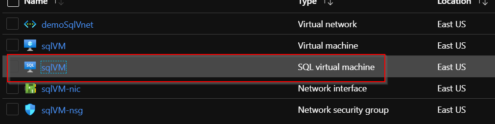
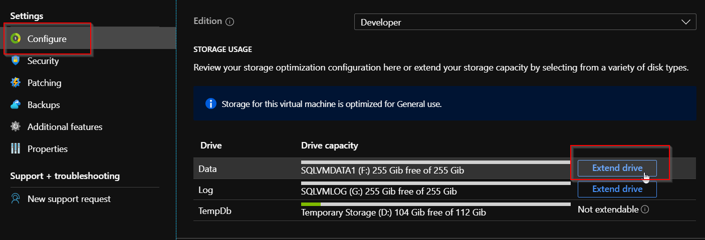

Most release pipelines have some automation to do after configuration to a
virtual machine (VM) to prepare it for use. Looking at SQL Server&reg;, you
can configure a lot of options to make it production-ready. What most people
do not know is that a resource provider within Microsoft&reg; Azure&reg; configures
basic SQL Server settings without the need for any post-configuration scripts.

<!--more-->

When you use the Azure portal, a SQL Server VM comes already registered
with the SQL Server resource provider. Using the resource provider includes
the following benefits:

-  Automated patching and backups
-  Configurable SQL authentication modes
-  Configurable data, log, and temp file paths
-  User-defined storage workload types

The biggest issue about figuring out which method to use for configuration is determining
how flexible you want to be for configuration options. With Azure PowerShell&reg;,
there are not many meaningful settings exposed for post configuration except
for setting the SQL management type. You can find more information about the
management mode [here](https://docs.microsoft.com/en-us/azure/virtual-machines/windows/sql/virtual-machines-windows-sql-register-with-resource-provider?tabs=azure-cli%2Cbash#management-modes) [Azure PowerShell](https://docs.microsoft.com/en-us/powershell/module/az.sqlvirtualmachine/new-azsqlvm?view=azps-3.3.0). Next
in line is the Azure Command Line Interface (CLI). This CLI enables you to set backups, SQL authentication
types, and patching schedules as described [here](https://docs.microsoft.com/en-us/cli/azure/sql/vm?view=azure-cli-latest). The most powerful option is configuring within an Azure Resource Manager (ARM) template. The ARM template
includes all the settings from the CLI as well as configuring SQL storage settings as shown in [Template JSON](https://docs.microsoft.com/en-us/azure/templates/microsoft.sqlvirtualmachine/2017-03-01-preview/sqlvirtualmachines#).

Let's take the example of creating a new SQL Server VM running SQL Server 2019 on
Windows&reg; 2019. Our example project has the following requirements:

- Use mixed-mode authentication 
- Store data and log files on separate drives 

Previously, you needed to use a post-configuration method, such as a Desired State
Configuration (DSC) or custom script extension, to format the drives and configure
the SQL Server settings. Looking at the following three options to provision, let's
evaluate what you can accomplish:

-  Azure PowerShell can create only the SQL VM resource provider object. No configuration
   options exist to meet the requirements given.
-  Azure CLI provides the options to configure mixed-mode authentication and to create a
   SQL Server login with sysadmin privileges.
-  Azure ARM template offers complete control and provides the ability to configure the
   mixed-mode requirement and create data drives along with formatting and to configure SQL
   Server to use them.

One of the great features of using the SQL Server resource provider is that you can now
extend, within the Azure portal, the drives that you configured during deployment&mdash;without
deallocating the virtual machine. You can extend a disk easily in the Azure portal by doing the
following tasks:

-  In the resource group where you provisioned the SQL Server, select the SQL VM
   resource-type object. It should have the same name as the VM.

-  Select **Configure** from the blade, scroll down on the right-hand side, and
   select the **Extend drive** button of the drive to extend.

-  Select the disk size from the drop-down menu to determine by how much to extend
   the current drive. Select **Apply** 

I hope this quick glimpse into using the SQL Server resource provider shows how
easy configuring SQL Server is. You can find the example ARM template that I used
for this article [here](https://github.com/jrudley/azureSqlResourceProvider).
