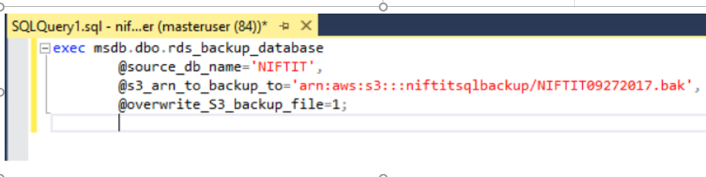
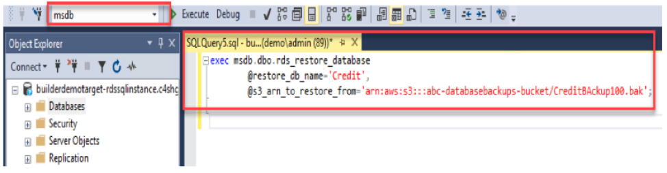

A database backup results when you back up the operational state, architecture,
and stored data of a database. It enables you to create a duplicate instance or
a copy of your database in case the primary database crashes, gets corrupted,
or is lost.

<!--more-->

This blog post discusses backing up, restoring, and monitoring SQL native
databases in Amazon&reg; Web Services (AWS) Relational Database Service(RDS).

### SQL native full backup in AWS RDS

AWS permits you to take only a full backup of a SQL native database in an AWS
RDS SQL instance. You can use the `rds_backup_database` stored procedure to
create a full backup of your SQL database in the S3 bucket, as shown the
following example:

    Command to Perform backup of database exec msdb.dbo.rds_backup_database
    @source_db_name='database_name', @s3_arn_to_backup_to='arn:aws:s3:::bucket_name/file_name_and_extension',
    @overwrite_S3_backup_file=1;

    Command to Perform KMS Encrypted Backups
    exec msdb.dbo.rds_backup_database
    @source_db_name='database_name',
    @s3_arn_to_backup_to='arn:aws:s3:::bucket_name/file_name_and_extension', @kms_master_key_arn='arn:aws:kms:region:account-id:key/key-id',
    @overwrite_S3_backup_file=1;

*Image source*: [https://niftit.com/backup-with-aws-rds/](https://niftit.com/backup-with-aws-rds/)

### SQL Native Full Backup Restore in AWS RDS

The `rds_restore_database` stored procedure enables you to restore SQL database
from an S3 bucket on your AWS RDS instance, as shown in the following example:

**Note**: You might need to change the following parameters in these examples:

- database\_name
- bucket\_name
- file\_name\_and\_extension
- region
- account-id
- key-id

        Command to Perform Restore DB from the backup file available in the S3 bucket.
        exec msdb.dbo.rds_restore_database
        @restore_db_name='database_name',
        @s3_arn_to_restore_from='arn:aws:s3:::bucket_name/file_name_and_extension';

        Command to Perform Restore DB from S3 bucket having KMS key
        exec msdb.dbo.rds_restore_database
        @restore_db_name='database_name',
        @s3_arn_to_restore_from='arn:aws:s3::: bucket_name/file_name_and_extension',
        @kms_master_key_arn='arn:aws:kms:region:account-id:key/key-id';

*Image Source*: [https://www.awslab.io/sqlserver/lab2/](https://www.awslab.io/sqlserver/lab2/)

### AWS RDS back up and restore limitations and exclusions

This section describes AWS RDS limitations and exclusions for backing up or
restoring databases.

#### Exclusions for AWS RDS SQL native backups

The following SQL native elements cannot be backed up or restored in AWS RDS
instances:

- Differential
- Transaction log
- Filegroup backup

#### Limitations of AWS RDS SQL Native backups

The following list contains limitations of backing up your AWS RDS SQL native
databases:

- The maximum supported backup file size is 1 TB supported in an AWS RDS instance.
- You can backup the database in the same region as the RDS instance to which
  it belongs. When a user who has access to the S3 bucket in region A, where
  the RDS instance resides, tries to back up the database to the S3 bucket in
  region B, the following error occurs:

        Aborted the task because of a task failure or an overlap with your
        preferred backup window for RDS automated backup.

        Access Denied.
        Please specify a bucket that is in the same region as RDS instance.

#### Database backup and restore limitation scenarios

##### KMS-encrypted backups

AWS does not support restoring the Key Management Service (KMS) encrypted backup
to an on-premise SQL server or any other EC2 instance. However, if you need to
restore a backup file, you should create a new RDS instance in the same region
with the same KMS key. After you restore the KMS-encrypted backup, take a backup
without encryption to restore it to on-premises or any other EC2 instance.

If you try to restore a KMS-encrypted backup, you might get the following error:

    Msg 3241, Level 16, State 0, Line 1
    The media family on device 'C:\TempDB_Encrypted.bak' is incorrectly formed. SQL Server cannot process this media family.

##### TDE -enabled backups

AWS supports Transparent Data Encryption (TDE)-enabled backups in only
Enterprise editions and requires both a certificate and a master key. Because
the database backup does not include a key, you get the following error when
you try to restore it on an AWS RDS Instance:

    Cannot find server certificate. RESTORE FILELIST is terminating abnormally.

##### Restore a backup in the same AWS instance

AWS does not allow you to overwrite an existing database or restore an AWS RDS
instance to an existing database. You must restore it to a database with another
name. If you try to restore to an existing database, you get the following error:

    Aborted the task because of a task failure or a concurrent RESTORE_DB request.

    Task ID x (RESTORE_DB) exception: Database TestDB cannot be restored because there is already an existing database with the same file_guids on the instance.
    Monitoring Backup and Restore tasks

AWS uses the `rds_task_status` stored procedure to track backup and restore
tasks, as shown in the following example:

    exec msdb.dbo.rds_task_status @db_name='database_name'

*Image Source*: [https://www.awslab.io/sqlserver/lab2/](https://www.awslab.io/sqlserver/lab2/)

After you get the tracking id, you can monitor the backup or restore  process
by using the following code:

    exec msdb..rds_task_status @task_id= 4

### Conclusion

AWS RDS enables you to perform full back up and restoration of SQL native
databases. However, there are some limitations when you take the backup in a
different AWS region S3 bucket and when you restore encrypted and TDE-enabled
backups. You should test the backup and restore process in a test environment
before migrating or restoring your database to production.

Use the Feedback tab to make any comments or ask questions.

### Optimize your environment with expert administration, management, and configuration

[Rackspace's Application services](https://www.rackspace.com/application-management/managed-services)
**(RAS)** experts provide the following [professional](https://www.rackspace.com/application-management/professional-services)
and
[managed services](https://www.rackspace.com/application-management/managed-services) across
a broad portfolio of applications:

- [eCommerce and Digital Experience platforms](https://www.rackspace.com/ecommerce-digital-experience)
- [Enterprise Resource Planning (ERP)](https://www.rackspace.com/erp)
- [Business Intelligence](https://www.rackspace.com/business-intelligence)
- [Salesforce Customer Relationship Management (CRM)](https://www.rackspace.com/salesforce-managed-services)
- [Databases](https://www.rackspace.com/dba-services)
- [Email Hosting and Productivity](https://www.rackspace.com/email-hosting)

We deliver:

- **Unbiased expertise**: We simplify and guide your modernization journey,
focusing on the capabilities that deliver immediate value.
- **Fanatical Experience**&trade;: We combine a Process first. Technology second.&reg;
approach with dedicated technical support to provide comprehensive solutions.
- **Unrivaled portfolio**: We apply extensive cloud experience to help you
choose and deploy the right technology on the right cloud.
- **Agile delivery**: We meet you where you are in your journey and align
our success with yours.

[Chat now](https://www.rackspace.com/#chat) to get started.
