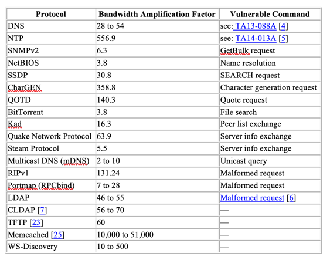

The best-defended environment is useless if your customers cannot get to your site.

<!--more-->

This situation is the reality in the world of hosting and distributed
denial-of-service (DDoS) attacks.  Recently, I heard that hosting without
security compared to buying a car without seat belts. Let me take the analogy
of the car further and say hosting without DDoS mitigation protection is like
driving your new car off the dealership lot without insurance.

### What is DDoS?

Attackers use DDoS attacks to attempt to make an online service unusable by
overwhelming it with a large volume of traffic from multiple sources. Here's
another analogy to describe a DDoS attack: Consider a huge crowd of Black Friday
shoppers trying to get through a single residential door at opening time, also
known in marketing terms as a "Doorbusters" event.

These attacks create conditions in which the system denies legitimate users
access to resources, both yours and your customers'. The bad actors are not
trying to break into a protected environment to steal or destroy your data.
They want to disrupt services and cause as much chaos for the legitimate uses
of
the resources as possible by generating a massive number of phony requests from
a large number of computers worldwide that flood a target server. As a result,
the target server spends all its resources serving requests and becomes virtually
unavailable to users who actually need it.

### Stateful days of DDoS

The days where traditional security tools such as firewalls and an Intrusion
Prevention System (IPS) could help stop a DDoS attack by themselves are long gone.

Stateful devices, such as firewalls and an IPS, track all inbound connections
for inspection and store them in a connection table. These devices match every
data packet against the connection table to verify that the packet
transmitted over an established legitimate connection. The connection table on
stateful devices can handle tens of thousands of active connections, which is
more than enough under a regular, day-to-day activity load.

Under the stress of a DDoS attack that can generate millions of packets per
second, these stateful security devices, usually at the customer's network edge,
must try to keep track of all the malicious incoming connections. The
number of connections quickly exhausts the maximum limits of the device's
connection table, preventing new connections from opening and blocking legitimate
users from establishing connections.

### Bandwidth Onslaught

Other attacks, such as amplification attacks, can significantly increase the
volume of traffic by exploiting protocols with very high amplification factors.
The amplification factor is the ratio between the size of the request and the
response generated. For example, attackers can use an open memcached service to
flood a victim by an amplification factor of up to 51,000 times the request size,
as shown in the following table:

*Image source*:[https://www.us-cert.gov/ncas/alerts/TA14-017A](https://www.us-cert.gov/ncas/alerts/TA14-017A)

Reflection attacks occur when a bad actor spoofs the source address of request
packets, posing as the target of the attack. Servers cannot differentiate
legitimate from spoofed requests when attackers use the User Datagram Protocol
(UDP). Therefore, the servers reply directly to the target of the DDoS attack.
The response, which can come from tens of thousands of sources, can generate
attacks of tens to many hundreds of gigabytes in size. This technique is very
popular because it can use devices that are not compromised. The attack also
hides the real IP address of the bad actor from both the victim's system and
the abused server.

### Too close to home

While many deploy security solutions close to the protected environment, you
shouldn't try to mitigate vast volumes of traffic from DDoS attacks here.
Instead, you want to mitigate DDoS attacks before they reach your network. This
tactic is where an on-premises DDoS solution comes into play in today's world
of network security. Effective solutions can detect and offload malicious
traffic at the hosting provider's edge network, off-ramping traffic to dedicated
scrubbing centers built to handle the volume of attack traffic from a DDoS attack.

 There is no silver bullet device or solution that can defend or block 100% of
 malicious traffic and allow 100% of legitimate traffic through. Here, your
 traditional security tools come back into play by using a hybrid defense
 strategy for DDoS protection. You can have the on-premises DDoS solution take
 on the bulk of the attack, which also protects your dedicated security tools,
 allowing them to continue process traffic to your network.

Bottom line: Use all the security tools at your disposal to defend against DDoS
and other bandwidth-onslaught attacks.

### Why use Rackspace for DDoS mitigation services?

Rackspace delivers industry-leading SLAs and services. Our customers count on
us to keep their systems safe and running 24x7x365. Our experts and
anomaly-detection technologies are on-premises with your network equipment, so
we can be the first to detect any anomalous traffic to your network. Rackspace
DDoS Mitigation Services provide fast mitigation times because there’s no need
to configure routing connections or DNS hosting changes. Our goal is to keep
your infrastructure safe and your business online during a DDoS attack by
offloading malicious traffic processing to our DDoS mitigation hardware.

DDoS Mitigation Services can help you keep your network safe from distributed
denial-of-service attacks.

DDoS mitigation is available as a subscription service for proactive protection
to identify malicious traffic with the first hostile packet, or as an on-demand
service that can be activated if a security event is underway. Both services
include expert setup and custom tuning of your IP-based DDoS protection.
On-demand customers have the option to upgrade to the subscription service after
30 days with no additional setup fee.
