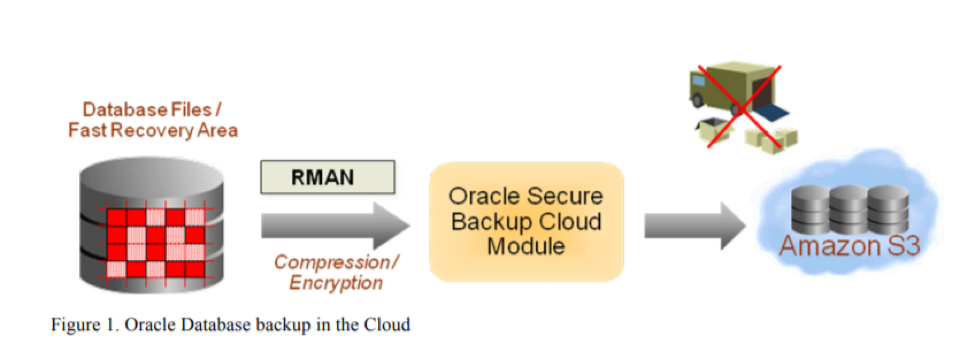

You can backup Oracle&reg; databases in Amazon&reg; Web Services (AWS) starting
with Oracle Database 9i Release 2 or later. You use the Oracle Secure Backup (OSB)
cloud module to do the backup, but remember that OSB does not back up operating system files.

<!--more-->

### Introduction

Starting with Oracle Database 9i Release 2 or later, you can take a Recovery
Manager (RMAN) backup by using OSB on Amazon S3. However, you cannot take
the backup of the operating system (OS) files by using this module. The Amazon
S3 storage is disk-based; it is inherently more reliable than tape media.
Internet storage service providers keep multiple, redundant copies of your data
for availability and scalability purposes. Your organization benefits from this
practice by having more reliable data.

*Image source*: [https://www.oracle.com/technetwork/database/features/availability/twp-oracledbcloudbackup-130129.pdf](https://www.oracle.com/technetwork/database/features/availability/twp-oracledbcloudbackup-130129.pdf)

### Requirements

To follow along with this post, make sure you consider the following requirements.

#### Access keys and the secret access key, or IAM role, to log in to S3

You need an AWS account and an Identity and Access Management (IAM) user with
full access to AWS S3.

The setup process uses the IAM role, or access keys, and the secret access key
of the IAM user.

#### OSB module for AWS

Download the OSB module for AWS from
[https://www.oracle.com/database/technologies/secure-backup-s3.html](https://www.oracle.com/database/technologies/secure-backup-s3.html).

#### Oracle Technology Network (OTN) account

During installation, you need to provide an OTN username and a password.

#### Java 1.7 or higher

You must install Java&reg; 1.7 or later on your server before you can proceed.

Run the following command to check the Java version:

    $java -version

#### Supported platforms

Supported platforms include the following:

- Linux&reg; x86-64
- Microsoft&reg; Windows&reg; (64-bit)
- Oracle Solaris on SPARC (64–bit)
- Oracle Solaris X64
- ZLinux-64
- AIX (PPC64)
- HP-UX&reg; IA64

**Note**: OBS does not support HP-UX PA-RISC 64–bit.

### Install Oracle 12cR2

Use the following steps to install Oracle 12cR2:

1) Create the **wallet** directory to store the AWS access keys and secret
   access key or IAM role.

2) Unzip the  **osbws_installer.zip** file that you downloaded from the link
   provided in the *Requirements* section.

3) Install the OSB cloud module for Amazon S3 into your **ORACLE_HOME** directory
   by running the following commands, substituting the appropriate details for
   your environment:

For Microsoft Windows:

     set ORACLE_HOME=C:\oracle\product\12.2.0\Oracle12cR2
     set ORACLE_SID=TEST

For Linux:

    export ORACLE_HOME=C:\oracle\product\12.2.0\Oracle12cR2
    export ORACLE_SID=TEST

    $ java -jar osbws_install.jar -AWSID XxXxX -AWSKey XxXxX -walletDir
    $ORACLE_HOME/osbws_wallet -libDir $ORACLE_HOME/lib -location eu-west-2
    -awsEndPoint s3-eu-west-2.amazonaws.com -otnUser mmahajan@test.com -otnPass xxxxx

or

    $ java -jar osbws_install.jar -IAMRole xxxxx -walletDir "$ORACLE_HOME\osbws_wallet"
    -libDir "$ORACLE_HOME\lib" -otnUser mmahajan@test.com -otnPass xxxx

### Install OSB by using RMAN

The installation process creates a file in **$ORACLE_HOME/dbs**, often named
**osb\<SID>.ora**, for allocating the channel command in RMAN. When referencing
this file, you should use the full path.

The examples in this post use a sample SID.

The following examples show the parameters of **OSBTEST.ora**:

    ++++++++++++++++++++++++++++++++++++++++++++++
    OSB_WS_HOST=https://s3.amazonaws.com
    OSB_WS_IAM_ROLE=iops-test-dev-ec2-role-policy
    OSB_WS_BUCKET=test-ec2-backups
    OSB_WS_WALLET='location=file:E:\oracle\product\12.2.0\Oracle12cR2\osbws_wallet CREDENTIAL_ALIAS=aws-itco_aws'
    +++++++++++++++++++++++++++++++++++++++++++++++

or

    ++++++++++++++++++++++++++++++++++++++++++++++
    OSB_WS_HOST=https://s3-eu-west-1.amazonaws.com
    OSB_WS_LOCATION=eu-west-1
    OSB_WS_BUCKET=test-ec2-backups
    OSB_WS_WALLET='location=file:E:\oracle\product\12.2.0\Oracle12cR2\osbws_wallet CREDENTIAL_ALIAS=aws-itco_aws'
    +++++++++++++++++++++++++++++++++++++++++++++++

The following example takes a backup of **controlfile** and **datafile 1** after
allocating the channel for `SBT_TAPE`:

    allocate channel c1 device type sbt    parms='SBT_LIBRARY=E:\oracle\product\12.2.0\Oracle12cR2\lib\oraosbws.dll,SBT_PARMS=(OSB_WS_PFILE=E:\oracle\product\12.2.0\Oracle12cR2\database\osbwsSDMS.ora)';

    D:\OSB>rman target /

    Recovery Manager: Release 12.2.0.1.0 - Production on Thu Dec 17 13:38:07 2019
    Copyright (c) 1982, 2017, Oracle and/or its affiliates. All rights reserved.
    connected to target database: TEST (DBID=2717091126)

    RMAN> run
    2> {
    3> allocate channel c1 device type sbt     parms='SBT_LIBRARY=E:\oracle\product\12.2.0\Oracle12cR2\lib\oraosbws.dll,SBT_PARMS=(OSB_WS_PFILE=E:\oracle\product\12.2.0\Oracle12cR2\database\osbwsSDMS.ora)';
    4> backup current controlfile;
    5> }

    allocated channel: c1
    channel c1: SID=50 device type=SBT_TAPE
    channel c1: Oracle Secure Backup Web Services Library VER=3.17.4.21

    Starting backup at 17-DEC-19
    channel c1: starting full datafile backup set
    channel c1: specifying datafile(s) in backup set
    including current control file in backup set
    channel c1: starting piece 1 at 17-DEC-19
    channel c1: finished piece 1 at 17-DEC-19
    piece handle=3iujli8o_1_1 tag=TAG20191217T144544 comment=API     Version 2.0,MMS Version 3.17.4.21
    channel c1: backup set complete, elapsed time: 00:00:07
    Finished backup at 17-DEC-19

    Starting Control File and SPFILE Autobackup on 17-DEC-19
    piece handle=c-2467059049-20191217-00 comment=API Version 2.0,MMS Version 3.17.4.21
    Finished Control File and SPFILE Autobackup on 17-DEC-19
    released channel: c1

    RMAN> run
    2> {
    3> allocate channel c1 device type sbt parms='SBT_LIBRARY=E:\oracle\product\12.2.0\Oracle12cR2\lib\oraosbws.dll,SBT_PARMS=(OSB_WS_PFILE=E:\oracle\product\12.2.0\Oracle12cR2\database\osbwsSDMS.ora)';
    4> backup datafile 1;
    5> }

    allocated channel: c1
    channel c1: SID=50 device type=SBT_TAPE
    channel c1: Oracle Secure Backup Web Services Library VER=3.17.4.21

    Starting backup on 17-DEC-19
    channel c1: starting full datafile backup set
    channel c1: specifying datafile(s) in backup set
    input datafile file number=00001         name=F:\ORADATA\SDMS\SYSTEM01.DBF
    channel c1: starting piece 1 on 17-DEC-19
    channel c1: finished piece 1 at 17-DEC-19
    piece handle=3kujlia1_1_1 tag=TAG20191217T144625 comment=API     Version 2.0,MMS Version 3.17.4.21
    channel c1: backup set complete, elapsed time: 00:03:15
    Finished backup on 17-DEC-19

    Starting Control File and SPFILE Autobackup on 17-DEC-19
    piece handle=c-2467059049-20191217-01 comment=API Version    2.0,MMS Version 3.17.4.21
    Finished Control File and SPFILE Autobackup on 17-DEC-19
    released channel: c1

### List of the backup sets

Run the following commands to get a list of the backup sets for the **controlfile**
and **datafile 1**:

    RMAN> list backup of controlfile;

    BS Key Type LV Size      Device Type Elapsed Time Completion Time
    ------- ---- -- ---------- ----------- ------------ ---------------
    113    Full   18.75M    SBT_TAPE   00:00:01    17-DEC-19
       BP Key: 113  Status: AVAILABLE Compressed: NO Tag:     TAG20191217T144940
       Handle: c-2467059049-20191217-01  Media:    s3.amazonaws.com/sdms-ec2-backups
     Control File Included: Ckp SCN: 64476065    Ckp time: 17-DEC-19

    RMAN> list backup of datafile 1;

    BS Key Type LV Size      Device Type Elapsed Time Completion Time
    ------- ---- -- ---------- ----------- ------------ ---------------
    112    Full   733.25M   SBT_TAPE   00:02:46    17-DEC-19
       BP Key: 112  Status: AVAILABLE Compressed: NO Tag:    TAG20191217T144625
       Handle: 3kujlia1_1_1  Media: s3.amazonaws.com/sdms-ec2-backups

List of datafiles in backup set 112:

     File LV Type Ckp SCN   Ckp Time Abs Fuz SCN Sparse Name
     ---- -- ---- ---------- --------- ----------- ------ ----
     1      Full 64474680  17-DEC-19             NO       F:\ORADATA\SDMS\SYSTEM01.DBF

### Possible installation error

During the backup, you might get an **ORA-03113** error, with the following
Metalink note 2396267.1 to help resolve the issue:

    PSDRPC returns significant error 3113.
    RMAN-00571: ===========================================================
    RMAN-00569: =============== ERROR MESSAGE STACK FOLLOWS ===============
    RMAN-00571: ===========================================================
    RMAN-03009: failure of allocate command on c1 channel at 12/16/2019 15:49:58
    ORA-03113: end-of-file on communication channel

The following error is reported in the alert log:

    ORA-07445: exception encountered: core dump [PC:0x7FEDDB54FBC] [ACCESS_VIOLATION] [ADDR:0x0] [PC:0x7FEDDB54FBC] [UNABLE_TO_READ] []
    Incident details in: <path>\incident\incdir_249332\<oracle_sid>_ora_30776_i249332.trc
    Use ADRCI or Support Workbench to package the incident.
    See Note 411.1 at My Oracle Support for error and packaging details.
    Fri Apr 13 10:01:59 2018
    Dumping diagnostic data in directory=[cdmp_20180413100159], requested by (instance=1, osid=30776), summary=[incident=249332].

#### Error cause

The installation error occurs because the running database service locks the
Serial Backup Tape (SBT) library.

To solve this, perform the following steps:

1. Shut down the database.
2. Reinstall the Oracle Cloud Backup module by using the steps given previously.

### Conclusion

The blog describes the steps to take an RMAN database backup on Amazon S3. The
OSB cloud module backups stored on Amazon S3 storage are always accessible. The
availability of cloud storage services and the access model help your
organization to streamline recovery operations. For instance, you don't need to
ship or load tapes before you perform a restore operation.

Use the Feedback tab to make any comments or ask questions. You can also
[chat now](https://www.rackspace.com/#chat) to start the conversation.

<a class="cta purple" id="cta" href="https://www.rackspace.com/dba-services">Learn more about our Database services</a>
