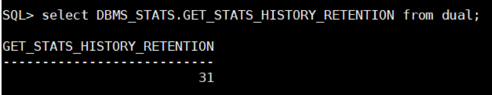
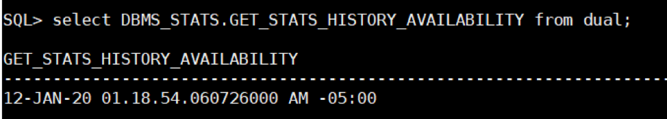

This blog post explores when and how you might restore statistics in Oracle&reg;
Database.

<!--more-->

### Introduction

As a database administrator (DBA), you probably often find that gathering fresh
statistics leads to the optimizer executing suboptimal execution plans. In those
cases, you might want to restore the statistics from a time when the performance
was better.

However, different versions of Oracle Database have minor changes in the way
they handle statistics:

- Oracle 10g began automatically preserving the statistics for easy restoration.
- In 11.1 and later, Oracle introduced a better way, allowing you to defer
  statistics publishing.

### Possible reasons for poor statistics performance

You might find it necessary to gather statistics to ensure that the optimizer
chooses the optimal execution plans, but gathering statistics invalidates the
parsed representation of the SQL statement. Also, reparsing the statement after
gathering stats can make the optimizer choose an execution plan that is
different and less optimized than the original plan.

In Oracle 10g and later, you can restore statistics by using the **dbms_stats**
package, which gives you the option to restore statistics and export statistics.

By default, Oracle retains historical statistics for 31 days, but you can change
that period.

The following image shows the SQL command to show the current retention period:

To change the retention period, run the following command, where *xx* is the
number of days that you want to use:

	 SQL> execute DBMS_STATS.ALTER_STATS_HISTORY_RETENTION (xx)

The following query helps you to understand which historical data stats you can
restore:

**Note:** This example shows the statistics from the previously mentioned date
and later.

### Restoring table statistics

This example demonstrates how to restore table statistics from a prior date.

First, identify which statistics are available by running the following command:

    SQL> select TABLE_NAME, STATS_UPDATE_TIME from dba_tab_stats_history where table_name like 'MY_TABLE' and owner='MYSELF' order by 2;

    TABLE_NAME      STATS_UPDATE_TIME
    --------------- --------------------------------------
    MY_TABLE        20-DEC-19 05.32.26.887184 AM -05:00
    MY_TABLE        20-DEC-19 10.10.19.361091 PM -05:00
    MY_TABLE        21-DEC-19 05.32.14.475934 AM -05:00
    MY_TABLE        21-DEC-19 10.10.18.725917 PM -05:00
    MY_TABLE        22-DEC-19 10.10.17.841143 PM -05:00
    MY_TABLE        23-DEC-19 05.32.56.168779 AM -05:00
    MY_TABLE        23-DEC-19 10.10.23.633939 PM -05:00
    MY_TABLE        24-DEC-19 05.32.14.082730 AM -05:00
    MY_TABLE        24-DEC-19 10.10.21.712948 PM -05:00
    MY_TABLE        25-DEC-19 05.32.13.710159 AM -05:00
    MY_TABLE        25-DEC-19 10.10.17.836929 PM -05:00
    MY_TABLE        26-DEC-19 05.32.14.545533 AM -05:00
    MY_TABLE        26-DEC-19 10.10.12.808687 PM -05:00
    MY_TABLE        27-DEC-19 05.32.13.779967 AM -05:00

You can see that **MY_TABLE** was analyzed several times in the past few days.
To restore the table statistics of the table gathered on
**21-DEC-19 10.10.18.725917 PM -05:00**, run the following command:

    SQL> execute dbms_stats.restore_table_stats('MYSELF','MY_TABLE','21-DEC-19 10.10.18.725917 PM -05:00');

    PL/SQL procedure successfully completed.

### Restoring schema statistics

This example demonstrates how to restore schema statistics from a prior date.

To restore the schema statistics of the table gathered on
**21-DEC-19 10.10.18.725917 PM -05:00**, run the following command:

    SQL> exec dbms_stats.restore_schema_stats(ownname=>'MYSELF', AS_OF_TIMESTAMP=>'21-DEC-19 10.10.18.725917 PM -05:00');

To find the available schema statistic options for the **AS_OF_TIMESTAMP**, run
the following command and choose the appropriate date for restoration:

	 select count(*), stats_update_time from dba_tab_stats_history where owner='MYSELF'group by stats_update_time;

#### Restore other statistics

You've seen how to restore table and schema stats.  The following list shows
all the entities for which you can restore previous statistics:

-	TABLE\_STATS
-	SCHEMA\_STATS
-	DATABASE\_STATS
-	DICTIONARY\_STATS
-	FIXED\_OBJECTS\_STATS
-	SYSTEM\_STATS

### Export statistics that you want to save

You can also export statistics that you want to save or export
current statistics before you make changes by performing the following
steps:

1) Create the statistics table by running a command similar to the following example:

	 Exec dbms_stats.create_stat_table(ownname => 'MYSELF', stattab => 'MYSELF_STATS_<DATE>',tblspace => '<Tablespace Name>');

	**ownname:** owner name
	**stattab:** tablename under user MYSELF to create
	**tblspace:** tablespace under which to create this table

2) Export the statistics in the preceding table by running a command similar to
   the following example:

    exec dbms_stats.export_table_stats('SCHEMA1','TAB1',NULL,'STATS','TAG1_TAB1',TRUE);

   For example:

	 Exec dbms_stats.export_database_stats(statown => 'MYSELF', stattab => 'MYSELF_STATS');

### Conclusion

The information and queries in this post help you to restore all types of
database statistics (Table, Database, Schema, Fixed\_Object, System, and
Dictionary) to a reasonable past date, ensuring smooth database performance.

Use the Feedback tab to make any comments or ask questions. You can also
[chat now](https://www.rackspace.com/#chat) to start the conversation.

<a class="cta teal" id="cta" href="https://www.rackspace.com/dba-services">Learn more about our Database services</a>
