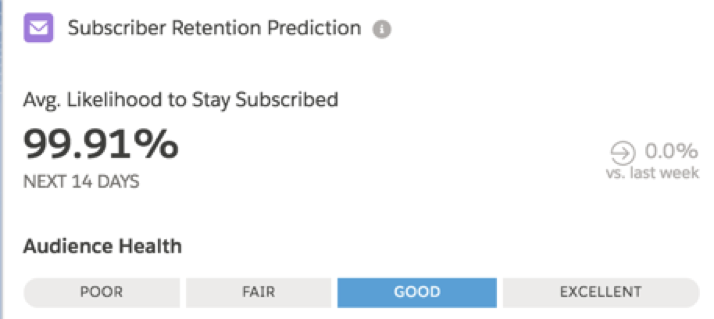
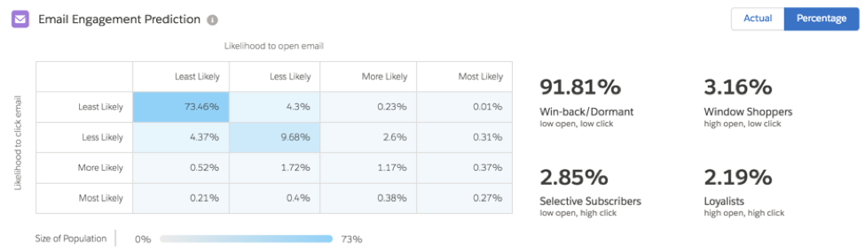
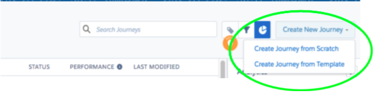
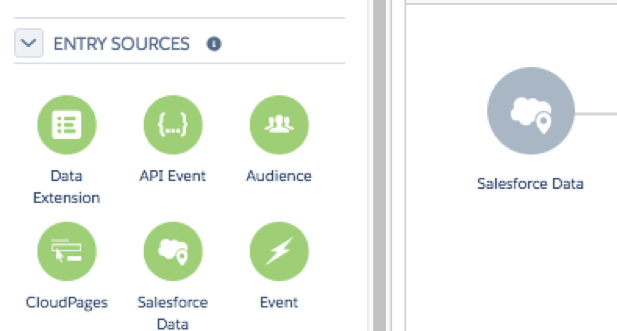
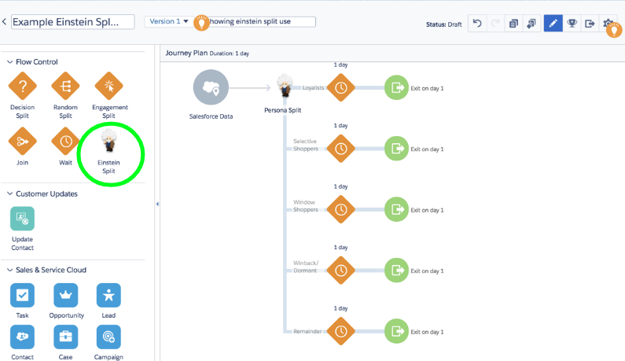
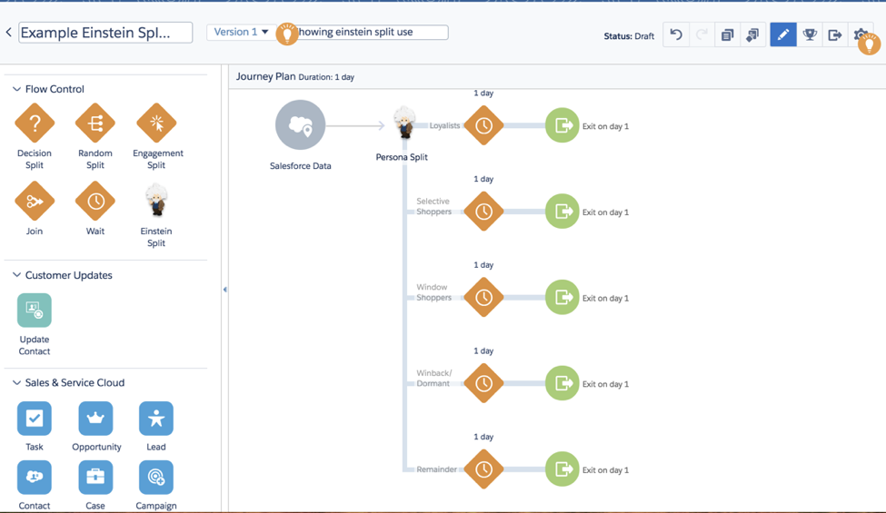
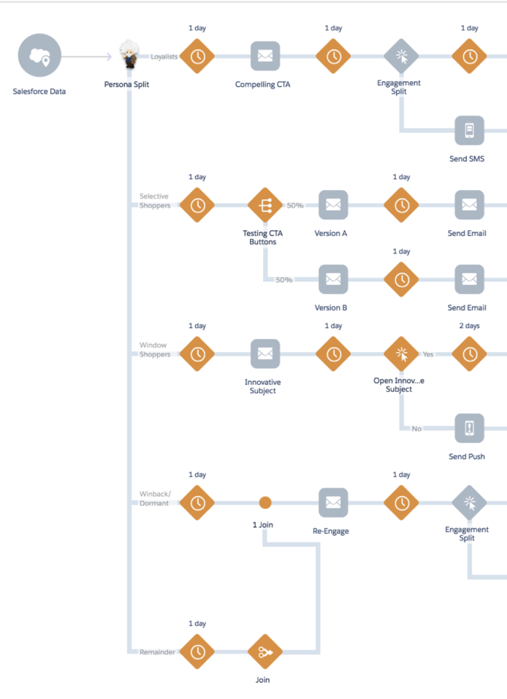

If your business has a corporate or enterprise license for Salesforce&reg;
Marketing Cloud, and you aren’t using Einstein Engagement Scoring, you are
missing a big opportunity to boost your email marketing and improve the return
on investment (ROI) of your Marketing Cloud instance.

<!--more-->

The good news is that with a corporate or enterprise license, you automatically
have access to Einstein Engagement Scoring. Even if your license isn’t corporate
or enterprise level, you can still gain access to this tool by purchasing it as
an add-on.

This tool is powerful&mdash;it uses artificial intelligence (AI) to provide
advanced segmentation that other email tools don’t offer. Less than an estimated
5% of all email marketers use Engagement Scoring, so using this tool gives you
 a significant edge over the competition.

This post shows you how to get the most out of Einstein Engagement Scoring to save time,
improve the ROI of your marketing automation, and elevate your email marketing
efforts.

### What is Einstein Engagement Scoring?

Einstein Engagement Scoring draws on the data from all of your past email
campaigns to segment your subscribers based on how they engage with your emails.
This data enables you to send targeted email messages to different subscribers to
maximize engagement and conversions. Einstein Engagement Scoring assigns scores for each
subscriber’s likelihood to stay subscribed, open an email, or click links within
your email.

Based on the historical behavior of your subscribers, Einstein Engagement
Scoring segments your subscriber list into the following categories:

-	**Loyalists**: Subscribers who are most likely to open your emails and click
   on the links within them
-  **Window shoppers**: Subscribers who are likely to open your emails but are
   unlikely to click on the links within
-  **Selective shoppers**: Subscribers who are unlikely to open your emails but
   when they do open, are very likely to click on the links within
-  **Win-back or Dormant**: Subscribers who are unlikely to open or click on your
   emails and do not engage with your emails

Because the scores are dependent on actions your subscribers have taken, the
AI can't score your subscribers to whom you have sent no emails. To get the most
out of Einstein Engagement Scoring, begin to use it after four to six months of
sending email campaigns within Marketing Cloud. This time gives the tool enough data
to provide you with robust and accurate segments.

### What can you do with this information?

When you have identified the four types of subscribers, you can customize email
marketing for each group. Start by setting individual goals for each segment and
tailor the messaging they receive based on what resonates most with that
group. You can even develop different drip nurture campaigns for each segment to
guide subscribers toward actions you want them to take. These actions include opening
more emails, visiting your website, or downloading specific pieces of content.

These campaigns help you make the most of your marketing spend and your time. One group
might get emails from your company every week, while another group gets an email
once a month. You can put budget towards targeted ads or SMS pushes for the
group where they are likely to have the most impact. Skip these tactics
for those less likely to engage with them.

We expect Einstein Engagement Scoring to become even smarter. While attending the
*Connections 2018* conference, we heard about plans for Einstein Engagement Scoring
to help you predict when to send emails to each segment based on previous open and
click times of those subscribers.

Customizing your email campaigns for each segment can greatly increase the ROI of
your email marketing efforts. For example,
[one e-commerce company](https://www.salesforce.com/blog/2016/09/intelligent-marketing-and-analytics-salesforce-einstein.html)
that reoriented their email marketing around engagement scores saw a 23% increase
in email clicks and a 30% increase in their open rate.

Following are some best practices for setting goals and personalizing messaging
for each segment:

-  **Loyalists: Amp up the call to action (CTA)**. These subscribers are already
   clicking on the emails you send, so make sure what they click leads them to
   a compelling CTA. Whether it’s a landing page, a contact form, or a piece of
   insightful content, offer value and a strong CTA that encourages them to
   convert on your desired goal.
-  **Window shoppers: Increase the click rate**. These subscribers open your
   emails, but rarely find the content interesting or compelling enough to click
   through. Experiment with techniques to encourage them to click more often.
   Test out different messaging, shorter or longer email copy, a different CTA,
   or changing the look of your button.
-  **Selective shoppers: Increase the open rate**. If you can catch this group’s
   attention enough to compel them to open your email, they’re likely to engage
   with the content within. For these subscribers, focus on subject lines. Test
   different lengths, voices, and tones for your subject lines. Look at past
   emails that received high open rates&mdash;what was compelling about the
   subject line?
-  **Dormant: Re-engage**. You need to nurture these subscribers into engaging
   with your emails by showing the value you offer. A re-engagement campaign
   requires unique messaging. Write intriguing your subject lines to prompt
   subscribers to open the emails, but don't make the content a hard sell.

### How to use your engagement data in Journey Builder

Einstein Engagement Scoring makes it easy to not only segment your subscribers
but also to build customized email strategies for each segment. Use the
following steps to import your four segments into Journey Builder:

1. Open your Journey Builder and create a new journey.

   

<ol start=2>
    <li>Define the <b>Entry Source</b> or who gets these emails.</li>
</ol>

   

   

<ol start=3>
    <li>In the left-hand column of options, choose <b>Einstein Split.</b></li>
</ol>

   

<ol start=4>
    <li>Choose <b>Persona Split</b> as the type of split.</li>
</ol>

   

<ol start=5>
    <li>After you select <b>Persona Split</b>, Journey Builder automatically splits your
   email campaign into five paths&mdash;one for each engagement category and a fifth
   path called <b>Remainder</b>. The Remainder path contains subscribers that
   Journey Path could not categorize because of insufficient data.  Likely, they
   are recent subscribers. You can leave Remainder as a standalone path, or use
   the <b>Join</b> option to merge the Remainder category into one of the other
   paths because those subscribers can benefit from the same strategy you use
   for another group.</li>
</ol>

   

<ol start=6>
    <li>Now, you can craft a personalized journey in Journey Builder for each segment.
   You can tailor the number and frequency of emails, subject lines and body
   content, targeted ads, and more to resonate best with each group. Journey
   Builder even allows you to pull Salesforce actions into the journey. For
   instance, if a subscriber downloads two pieces of content in a row, you can
   automatically increase their lead score or trigger a Salesforce action for
   a salesperson to call the subscriber.</li>
</ol>

   

For the best results, always conduct A/B testing to see what works well for each
segment. Within your marketing automation, you can A/B test nearly every aspect
of your emails, including subject lines, email length, and button colors or sizes.
Dig into your data and analytics often to see what’s going well and what can be
improved. Make changes and monitor the results to see what gets better responses
from your audience.

### Don't leave this powerful tool unopened

As a robust marketing automation solution that leverages artificial intelligence,
Marketing Cloud can boost productivity, ROI, and revenue. Yet, many businesses
miss out on the full power of this technology simply because they aren’t aware
of its features.

Using Einstein Engagement Scoring is a no-brainer, especially if your existing
Marketing Cloud instance already includes it. All it takes is the click of a
button to turn on this powerful AI tool and take your email marketing to the
next level.

Not sure if you have Einstein Engagement Scoring already? Want more direction on how to
use it or what types of email messaging to send to your segmented subscribers?
Reach out to Rackspace, your full-service partner for marketing automation and
strategy. Our team of marketing automation experts can help you set up and
access all of the robust features of your Marketing Cloud solution. If you need
help with email strategy, our email marketing specialists partner with you to
build a strategy for each of your segments, produce compelling emails, and
monitor the results of your campaigns. Thanks to AI tools like Engagement Scoring,
you can personalize the consumer journey and watch your open rates&mdash;and
your ROI&mdash;soar.

<a class="cta blue" id="cta" href="https://www.rackspace.com/salesforce">Learn more about Salesforce Customer Relationship Management (CRM)</a>

Visit [www.rackspace.com](https://www.rackspace.com) and click **Sales Chat**
to get started.

Use the Feedback tab to make any comments or ask questions.
