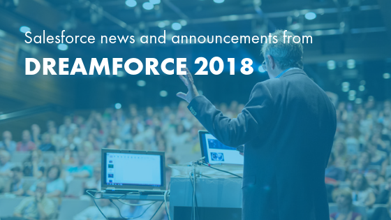

Your team might rely on the Salesforce&reg; platform every day for enhanced
workflow and productivity, but how knowledgeable are you when it comes to the
news and updates about the company itself? In 2018, Salesforce set its sights
on acquisitions and improvements to expand its platform and further grow an
already booming brand.

<!--more-->

It can be tough to stay on top of significant changes and how they might affect
your organization. At Rackspace, we keep close tabs on everything Salesforce,
so we're recapping some of the Salesforce acquisitions and updates from 2018.
Read on to learn how the Salesforce landscape changed and discover what each
development might mean for your company.

### Salesforce and Apple partnership

Salesforce has earned a reputation as a pioneer in the tech industry. In September
of 2018, [the company announced](https://www.salesforce.com/company/news-press/press-releases/2018/09/180924-g/?d=cta-header-1)
that it joined forces with another innovator&mdash;Apple&reg;. The partnership
brought together the most popular Customer Relationship Management (CRM) technology
in the world and the most advanced mobile operating system available on the market.
Together, the two businesses create a robust mobile experience for their users.

#### The benefits

Salesforce redesigned its app to support the latest features of iOS&reg;, as well as
unlocking new resources for developers that want to create iOS solutions.
Benefits of the [new partnership](https://www.apple.com/business/partners/)
include:

- Native Salesforce apps on iOS
- Redesign of the Salesforce mobile app to offer Siri&reg; shortcuts, Business Chat&reg;,
  Face ID&reg;, and more
- The promise of an upcoming Trailhead iOS app
- Developer access to a mobile software development kit (SDK) through Salesforce, optimized for the Apple
  programming language, Swift&trade;, to make deploying apps for iOS on the Lightning&reg;
  platform simple

### Salesforce Customer 360

At Dreamforce 2018, Salesforce announced its new solution,
[Customer 360](https://www.salesforce.com/company/news-press/press-releases/2018/09/180925-k/)&mdash;a
service that allows companies to deliver unified cross-channel experiences for
their customers. This
[unique platform of powerful tools](https://www.salesforce.com/blog/2018/09/what-is-salesforce-customer-360.html)
provides companies with a 360-degree view of each customer's journey. The platform
gives them everything they need to place the customer at the heart of their business
strategy.

#### The benefits

Customer 360 stores one cohesive profile for each customer, centralizing all
data on that customer from your Marketing Cloud, Commerce Cloud, and Service
Cloud platforms. This profile brings greater context to every customer
conversation, giving them a smoother brand experience with any member of your
staff. Other benefits include:

- A streamlined and straightforward user interface for advanced data management
- The opportunity to create connections between Salesforce applications and
  build your own comprehensive customer data model
- A reconciled profile and ID throughout all applications to provide customers
  with a single profile so that agents can recognize the client on any channel
- Pre-built solution packages for Commerce, Marketing, and Service Clouds

### Quip Slides

Salesforce Quip provides state-of-the-art word processing and spreadsheet tools
to companies in need of a complete productivity suite. Salesforce introduced
the [new Slides feature](https://www.salesforce.com/company/news-press/press-releases/2018/09/180918-c/)
within Quip, which is available for corporate and free service users. Supported
by Einstein Artificial Intelligence (AI), Quip Slides makes your workplace
inherently smarter.

#### The benefits

Quip Slides gives businesses an intelligent way to enhance workforce
productivity and empower their teams. Benefits include:

- Engagement insights about how people are using presentation tools, which
  slides have the highest level of engagement and more
- Built-in commenting, co-editing, and chat features so team members can work
  together on presentations
- Ability to embed slides with comment prompts, polls, and questions to gather
  more feedback from audiences
- Interactive charts that automatically collect real-time data in Salesforce
  Reports and Quip Spreadsheets
- Ability to incorporate live data from Salesforce and third-party systems,
  presented through Live Apps so that you can deliver up-to-date content in any slide

### Low-code tools

Developers now have faster and more convenient ways to develop applications with
[new low-code tools](https://www.salesforce.com/company/news-press/press-releases/2018/09/181306-n/)
through the Salesforce Lightning Platform.

#### The benefits

The easy-to-use Salesforce Lightning solution is the simplest way for businesses
to create the apps they need for next-level productivity. Benefits include:

- Lightning Object Creator: The enhanced object creator in Salesforce Lightning
  enables you to transform spreadsheets into innovative apps by using clicks
  instead of code. You can even drag and drop spreadsheets into the object
  creator to make development even faster.
- Lightning Flow Builder: The Lightning Flow Builder is another incredible
  low-code tool empowering companies to automate business processes and enhance
  employee or customer experiences. Anyone can now manage complicated multi-step
  processes through the Salesforce platform.
- Lightning Flow Actions: Through the AppExchange, Lightning Flow Actions connects
  business workflows with the most innovative enterprise cloud ecosystem in the
  world, allowing for enhanced and automated business processes.
- Smarter recommendations: A personalized and updated AppExchange helps companies
  buy or build the solutions they need for real digital transformation.

### Einstein Voice

At Dreamforce 2018, Salesforce unveiled the arrival of
[Einstein Voice](https://www.salesforce.com/company/news-press/press-releases/2018/09/180920-e/),
a platform that delivers innovative voice solutions to Salesforce users. The new
solution enables Salesforce users to speak to their CRM, supporting faster, more
natural interactions. Einstein Voice builds upon the growing popularity of
voice-enabled applications in the consumer and business landscape.

#### The benefits

Einstein Voice automatically transforms unstructured voice data into updates in
Salesforce records. With Einstein Voice, you can speak directly to your Salesforce instance
to make notes, request information, and update records. Other benefits include:

- Add updates and implement changes by talking to Salesforce through Einstein
  Voice Assistant.
- Start your day with a personalized presentation of the most recent Salesforce
  priorities and metrics delivered by your voice assistant.
- Access  information in Salesforce Dashboard via voice commands.

### MuleSoft Enterprise

In March 2018, Salesforce announced its plans to purchase MuleSoft&reg; in a deal
[estimated to be worth $6.5 billion](https://techcrunch.com/2018/03/20/salesforce-is-buying-mulesoft-at-enterprise-value-of-6-5-billion/).
MuleSoft was founded in 2006 and went public in 2017, making it a mature and
well-established acquisition for the CRM powerhouse. According to an
[official announcement](https://www.salesforce.com/company/news-press/stories/2018/3/032018/)
from Salesforce, MuleSoft is the "provider of one of the world's leading
platforms for building application networks." The MuleSoft platform enables
Salesforce to further connect with companies that have far-reaching enterprise
systems. It offers the ability to connect applications, data, and devices across
any cloud infrastructure.

#### The benefits

This acquisition opens up a few strategic doors for Salesforce while providing
expanded options for Salesforce clients. Benefits include:

- Access to over [1,200 customers](https://www.salesforce.com/company/news-press/stories/2018/3/032018/)
  including industry giants like Coca-Cola&reg;, Unilever&reg;, Barclays&reg;,
  and Mount Sinai&reg;
- Integrate an enterprise's relevant data from their back-office systems with
  their Salesforce solution and
  [access that data from anywhere](https://cm-inc.com/what-salesforce-acquisition-of-mulesoft-means-for-your-enterprise/)
- Opportunities to expand strategic initiatives like artificial intelligence and
  machine learning

### Sequence

In the winter of 2017, Salesforce quietly acquired
[Sequence&reg;](https://techcrunch.com/2017/02/01/salesforce-acquires-sequence-to-build-out-its-ux-design-services/),
which is a user experience (UX) design agency based out of San Francisco and New
York. The recent acquisition showcases a desire to offer better digital services
to new and existing Salesforce customers. With clients like Best Buy&reg;,
Peets&reg;, and Apple&reg;, Sequence has paved a path to help large brands better
engage with customers through innovative user experiences.

#### The benefits

Although the Sequence acquisition received less public fanfare, the deal offers
benefits to both Salesforce and its clients. These include:

- Customized
  [brand and content strategies](https://www.salesforceben.com/salesforce-signs-agreement-acquire-sequence-llc/)
  for high-net-worth clients
- Interactive user
  [experiences across both digital and physical](https://techcrunch.com/2017/02/01/salesforce-acquires-sequence-to-build-out-its-ux-design-services/)
  customer environments
- A wide array of services from UI/UX prototyping to journey mapping and web
  development

### Datorama

In summer 2018, Salesforce announced another acquisition, this time featuring
the Israeli company Datorama&reg;. According to the official
[Salesforce press release](https://www.salesforce.com/company/news-press/stories/2018/July/071618/),
Datorama is the "leading cloud-based, AI-powered marketing intelligence and
analytics platform for enterprises, agencies, and publishers." Datorama operates
a team of 400 employees and serves over
[3,000 clients](https://www.reuters.com/article/us-salesforce-com-m-a-datorama/salesforce-agrees-to-acquire-datorama-idUSKBN1K61U5),
including major corporations like PepsiCo&reg;, Ticketmaster&reg;, and Trivago&reg;.

#### The benefits

The acquisition of Datorama further underscores the Salesforce commitment to
better marketing and branding opportunities. Benefits of the merger include:

- An upgraded
  [Salesforce Marketing Cloud](https://www.salesforce.com/company/news-press/stories/2018/July/071618/),
  enhanced with expanded data integration and intelligence
- Smarter marketing decisions based on expanded data and insight capabilities

### Salesforce and Google partnership

The union of Salesforce and Google&reg; brings together two widely used and
highly recognizable digital powerhouses. The partnership
[seamlessly integrates data](https://www.salesforce.com/blog/2017/11/salesforce-google-form-strategic-partnership.html)
from Salesforce Sales and Marketing Clouds with insightful information stored
in Google Analytics 360. The partnership also applies to the Google G Suite,
which Salesforce customers can leverage alongside
[Lightning and Quip](https://www.salesforce.com/blog/2017/11/salesforce-google-form-strategic-partnership.html).

#### The benefits

The partnership between these tech giants brings benefits for loyal fans of both
brands. Audiences saw it firsthand at Google's annual developer conference,
[Next '18](https://www.salesforce.com/blog/2018/07/google-cloud-next-18-salesforce-partnership.html?d=70130000000tP4G),
where Salesforce had a significant presence and facilitated innovative activities.
Other benefits include:

- Access to a free Google G Suite accounts for one year, for Salesforce customers
- More advanced customer insights with the Salesforce + Google Marketing Platform
- Ability to leverage the Google Cloud Platform (GCP)

### What the developments mean for you

The impressive number of new Salesforce acquisitions and partnerships in 2018
highlights the company's ability to push the boundaries of industry standards
and innovation. As Salesforce continues to acquire and partner with other digital
all-stars, its ability to offer high-quality services to its users will increase
at an incredible rate.

Whether you already use Salesforce or are considering implementing this robust
solution, your business will benefit from its ever-evolving suite of tools for
data management, analytics and reporting, automation, and artificial intelligence.
The 2018 features, partnerships, and acquisitions are all positioned to help you
work more efficiently, gain better insights into your target market, and
strengthen relationships with your customers.

If you're ready to implement or upgrade your Salesforce instance, reach out to
the experts at Rackspace. As a Salesforce Gold Consulting Partner and
digital agency, our technical expertise covers Sales Cloud, Service Cloud,
Marketing Cloud, CPQ, and more. We partner with you to make the most of this
robust technology solution and provide transformative value for your business.

<a class="cta red" id="cta" href="https://www.rackspace.com/salesforce-managed-services">Learn more about Salesforce Customer Relationship Management (CRM)</a>

Visit [www.rackspace.com](https://www.rackspace.com) and click **Sales Chat**
to get started.

Use the Feedback tab to make any comments or ask questions.
