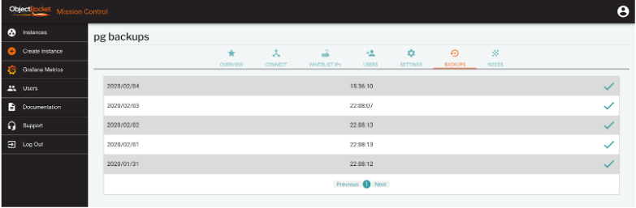
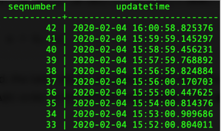
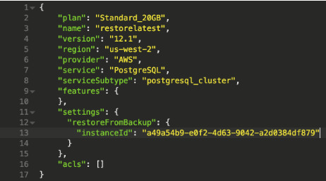
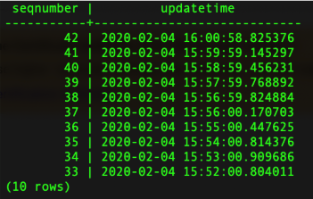
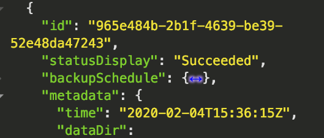
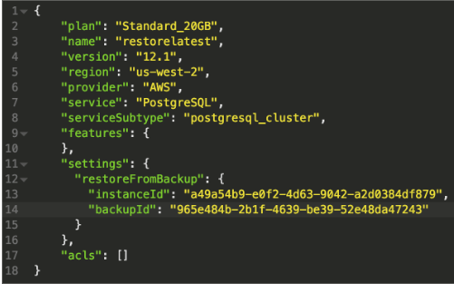
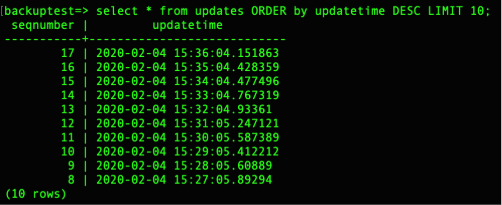
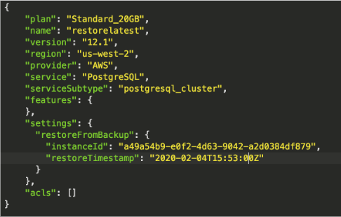
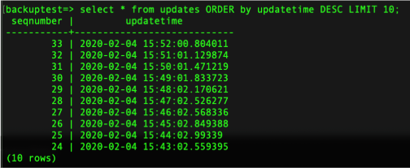

*Originally published on February 6, 2020 at ObjectRocket.com/blog.*

Database administration duties include taking and restoring regular backups,
which is a critical component. ObjectRocket includes daily backups with a two-week
retention and enables those backups by default on all of our database products.

The ObjectRocket PostgreSQL&reg; (Postgres) offering adds a bonus, Write Ahead Log
(WAL) archiving and the ability to restore to any time within the retention window.

This post walks you through point-in-time recovery (PITR) with Postgres on the
ObjectRocket service.

<!--more-->

### No-fuss backups

The backup process is fully automated, and you don’t have to do anything. We
include daily backups in the cost of all instances, and we retain two weeks'
worth of backups at all times. You can view your backup times and the status of
previous in our dashboard or by using the user interface (UI), as shown in the
following image:

### Multiple restore options

When you hit a scenario and want to restore a backup, we offer a number of
options. You can restore from the following points:

- the most recent WAL update we’ve stored
- a specific base backup
- a specific point in time

In all cases, the system restores your data to a new Postgres instance. At
this time, the instance storage must be greater than or equal to the storage on
the original instance. In this process, sometimes called a database fork, you
restore your data to a new and separate database instance. So both the old and
new instances stay active until you remove one.

Restores are currently only exposed by our
[API](https://docs.api.objectrocket.cloud/?__hstc=227540674.02efb364c84d59f26454a496608371d4.1580831896062.1582314791306.1583850805279.4&__hssc=227540674.1.1583850805279&__hsfp=197097889#restore-a-postgresql-instance-from-backup).
Feel free to use this API. Otherwise, our Support team is happy to help
you through the process. We plan on adding restores to the UI in the very near
future.

#### Restore to the latest time

This example uses a simple database that stores a timestamp and a sequence every
minute so that we can see the point to which we restored.

The following image shows the database, and you can see that the last timestamp
was at 16:00:58 (UTC).

To restore to the latest data in this database, provide the instance ID of the
source instance to a new instance create call, as shown in the following image:

After the instance restore completes, connect and check the last timestamp.

As you can see, all of the data is there, and the new Postgres instance is fully
caught up to the source Postgres instance.

You might want to use this scenario to create a test database from your current
data so that you can experiment with a new feature without the risk of affecting
your original data.

#### Restore to a specific backup

To restore from a base backup, start by choosing a target backup. When listing
backups, notice that each backup has a unique ID that you can use to identify
it. In the following image, you can see that the system took the backup at
15:36:15 (UTC):

To restore to this exact backup, add the backup ID to the create call.

After the instance loads, notice that the backup has data and timestamps from
before the backup time of 15:36:15.

#### Restore to a specific time

To specify the time you’d like to restore from, provide the source instance ID
and the time to restore to, as shown in the following image:

In this case, I want to restore to 15:53:00. After the restore completes, you
can see that the data only exists up to that time.

If you look back at the preceding images, you might notice that we did have
another timestamp at 15:53:00, which occurred at just over 0.8 seconds
after 15:53:00. So it does not get included in this restore. You can get
extremely granular with a PITR to target a time and state in the database.

### Conclusion

You can use all of this database recovery functionality. Keep in mind that we’ll
add more features and capabilities in the near future. As always, we’ll keep you
updated, but let us know if you have any requests.

<a class="cta blue" id="cta" href="https://www.rackspace.com/data/dba-services">Learn more about Rackspace DBA Services</a>

Visit [www.rackspace.com](https://www.rackspace.com) and click **Sales Chat**
to get started.

Use the Feedback tab to make any comments or ask questions.
