With Amazon&reg; Web Services (AWS), you have many paths to success and an
abundance of tools at your disposal for meeting your individual goals based on your
circumstances. Furthermore, AWS consistently adds new features and services to
make our lives that little bit easier.

<!--more-->

One of the fundamentals when setting up your AWS environment is the Virtual
Private Cloud (VPC), which is essential to create boundaries between the private
and public Internet. Features core to the VPC setup include Network Access
Control Lists (NACLs), subnets, and security groups.

### Problem

Over the years, organizations are becoming more cloud-agnostic and are deploying
many VPCs for various reasons. Whether it is to create a separation between
development, test, and production or to meet geographical challenges&mdash;
managing multiple VPCs has opened up discussions around using the appropriate
toolsets.

You can create site-to-site virtual private networks (VPNs) between VPCs.
However, this increases management overhead, not to mention the costs involved
when you consider the high availability of the VPN appliances.

Amazon introduced AWS VPC peering, which makes this much easier. However, it did
come with its limitations. One of the main ones is that connectivity is not
transitive between VPCs.

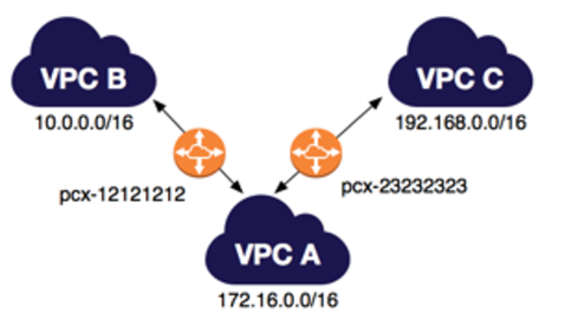

For example, in the preceding diagram, VPC A can talk to both B and C, but B
and C cannot talk to each other. If B and C need to communicate to each other,
you need to set up a peering between B and C. What is more, for each peering,
you also need to configure the routing tables.

Eventually, you need to manage the connectivity between each VPC without having
a central mechanism to route between VPCs. You can easily end up with a web
similar to the one shown in the following image:

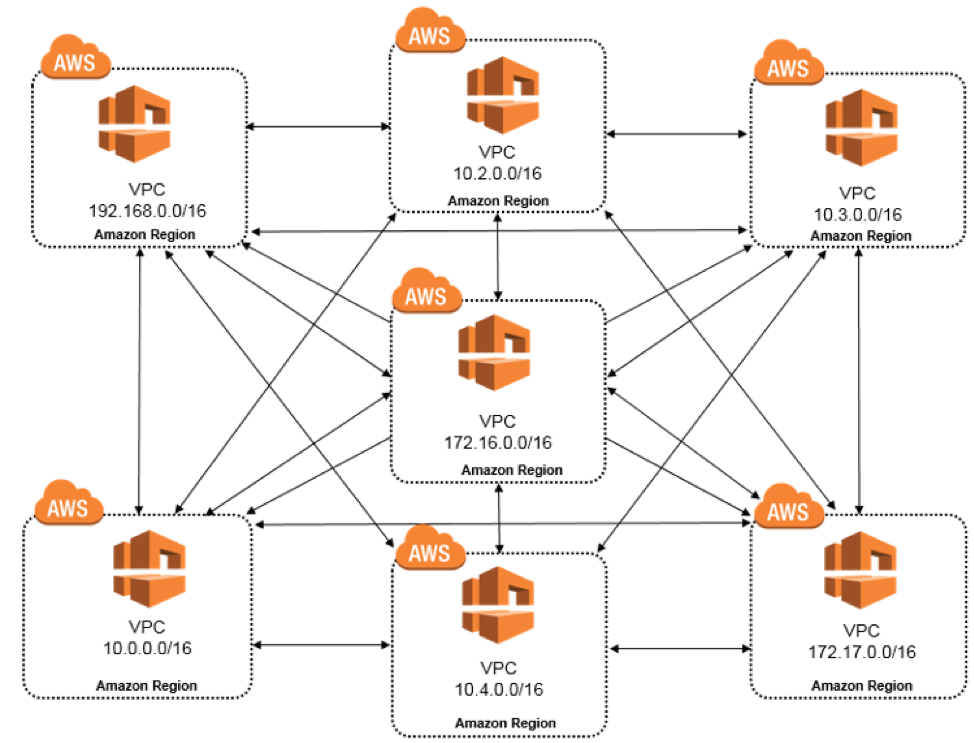

### Solution

Enter AWS Transit Gateway (TGW). TGW lets you do the following:

- Solve the management overhead costs that you incur with VPC peering.
- Have a central location to manage your connection between VPCs.
- Manage VPCs that are in a different account than yours.
- Create a hub and spoke network, as shown in the following diagram:

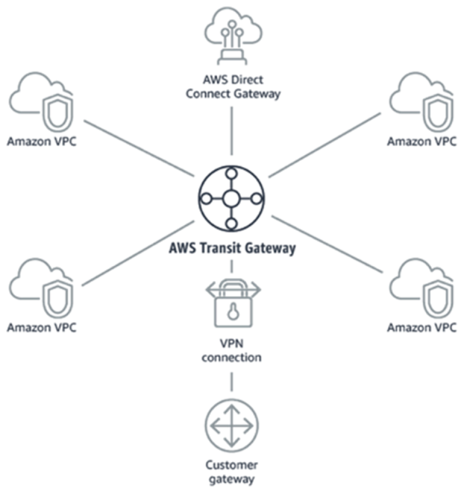

Initially, TGW didn't support inter-region peering, which was a major concern,
but Amazon resolved this problem and added it to the feature list. Now, you
can easily configure connectivity between regions.

### Deployment plan

As part of the prerequisites, you set up a VPC in each of your regions
with an EC2 instance. Ensure that you enable Internet Control Message Protocol
(ICMP) in each security group.

The goal is that you should be able to ping the instances from:

•	VPC A --> VPC B
•	VPC C --> VPC D

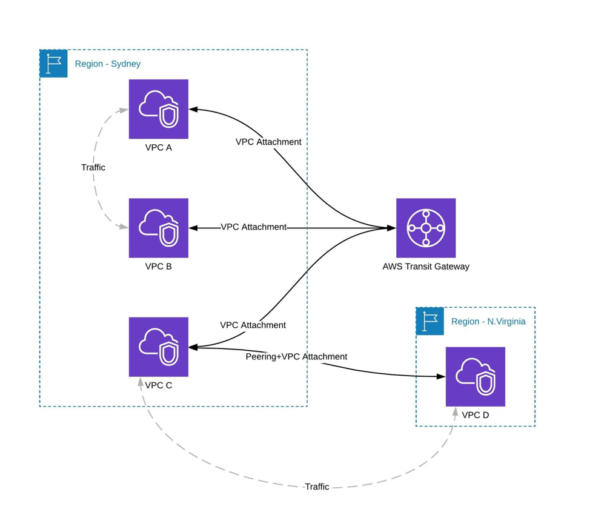

### Deployment

For this setup, use a single AWS account, but you can create TGW between different AWS accounts. You can deploy TGW by using the AWS console, CLI, API, or Cloudformation. For this demo, use the console.

Use the following steps to deploy TGW.

#### 1. Sign in

Sign in to your AWS account, go to the VPC console, and select **Transit Gateway**.

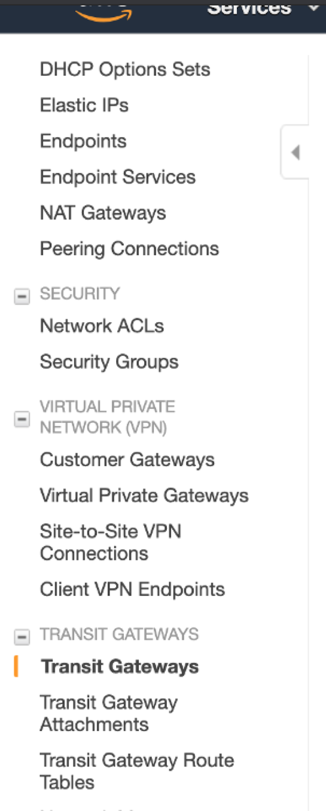

#### 2. Create the TGW

Select **Create Transit Gateway**. Enter a name for the TGW. For this test,
leave the rest as it is, and click **Create Transit Gateway**.

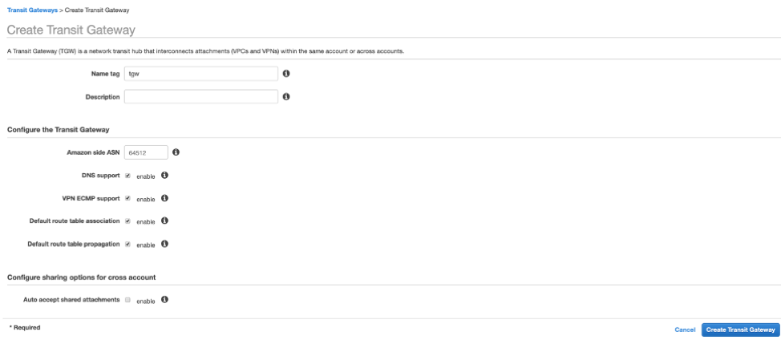

It takes a few minutes for the TGW to become available.

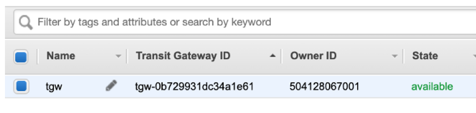

#### 3. Configure VPC A

Complete the following steps to configure VPC A:

a.	Go to **Transit Gateway Attachments** on the left-side of the window and
   create a new attachment. Select the TGW ID you just created.

b.	Select **attachment type**: `VPC`.

c.	Select the VPC ID for which you want to create the attachment. In this case,
   choose VPC A.

d.	Select all the subnets to which you want TGW to route traffic.

You must select at least one subnet and can select only one subnet per Availability Zone.

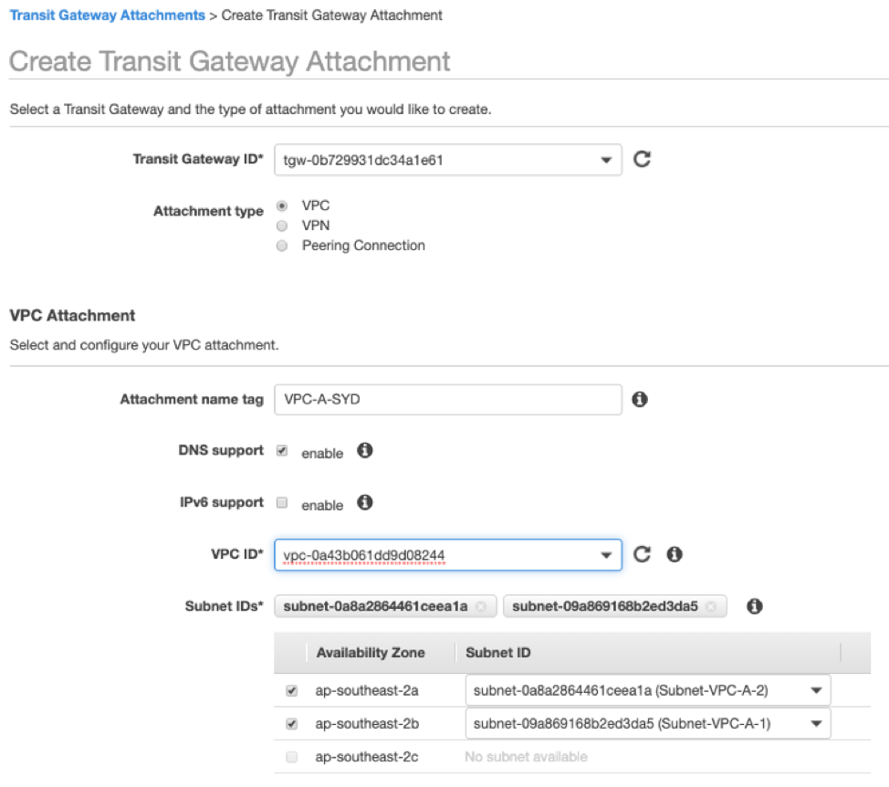

#### 4. Configure VPC B

Create a second attachment for VPC B following the preceding VPC A steps for VPC
B. You now have two TGW attachments.

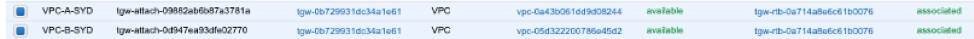

#### 5. Configure route tables

Go to **Transit Gateway Route Tables** from the left-hand side to see the default
route table. Notice two routes in the **Propagation** tab. Propagation occurred
automatically based on the TGW you created in the first step.

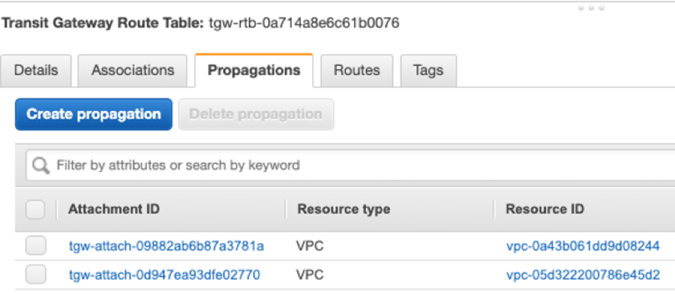

Let's try and ping the instance in VPC B from VPC A. What happens?

Nothing happens because you still need to tell the traffic where to go after it
enters the VPC.

For this, you need to add a route in the route table associated with the subnet
where the EC2 instance is located. If you also want to ping from VPC B --> VPC A,
you need to set the returning destination route back to VPC A.

The target is the TGW ID.

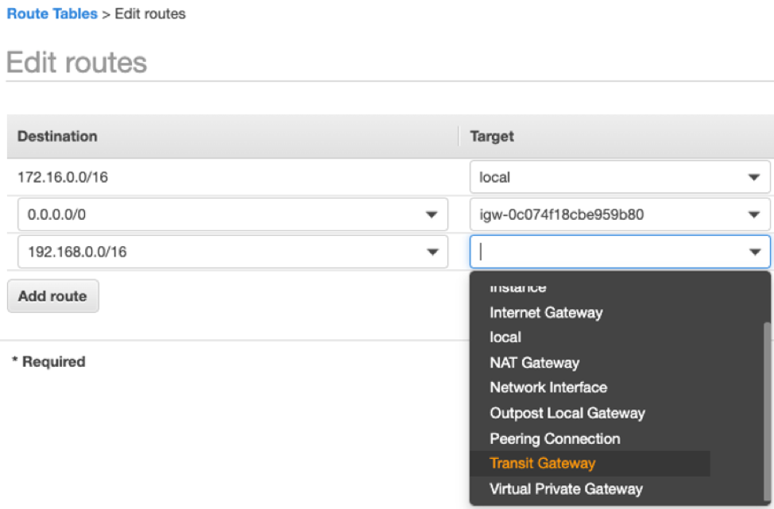

Now, run the ping test again, and you should get a response. Well done!

This completes the connection highlighted in green in the following diagram:

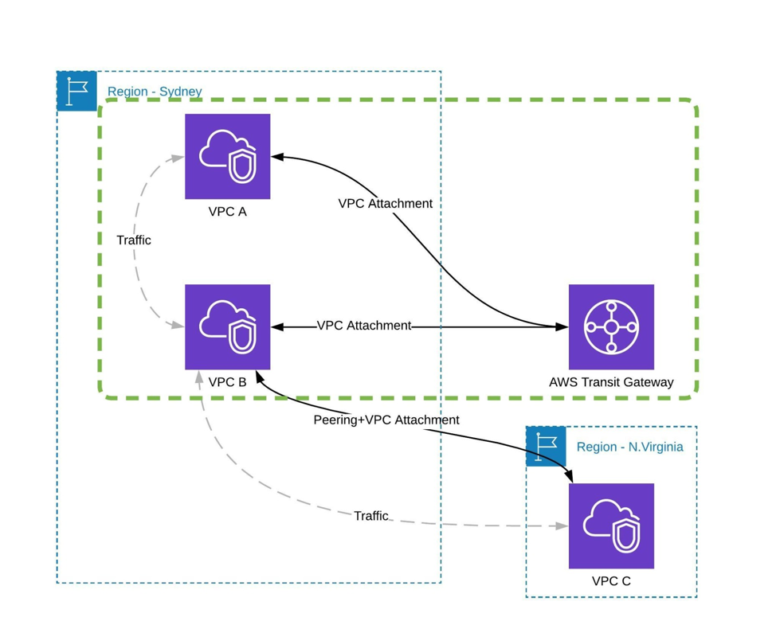

#### 6. Configure inter-region TGW

Recently, AWS introduced inter-region peering with TGW. To do this, you need
to use the **Peering Connection** type to create a new TGW attachment to the TGW
based in the second region, North Virginia. The following diagram shows the
**TGW ID** I created for the outside North Virginia region in this demo:

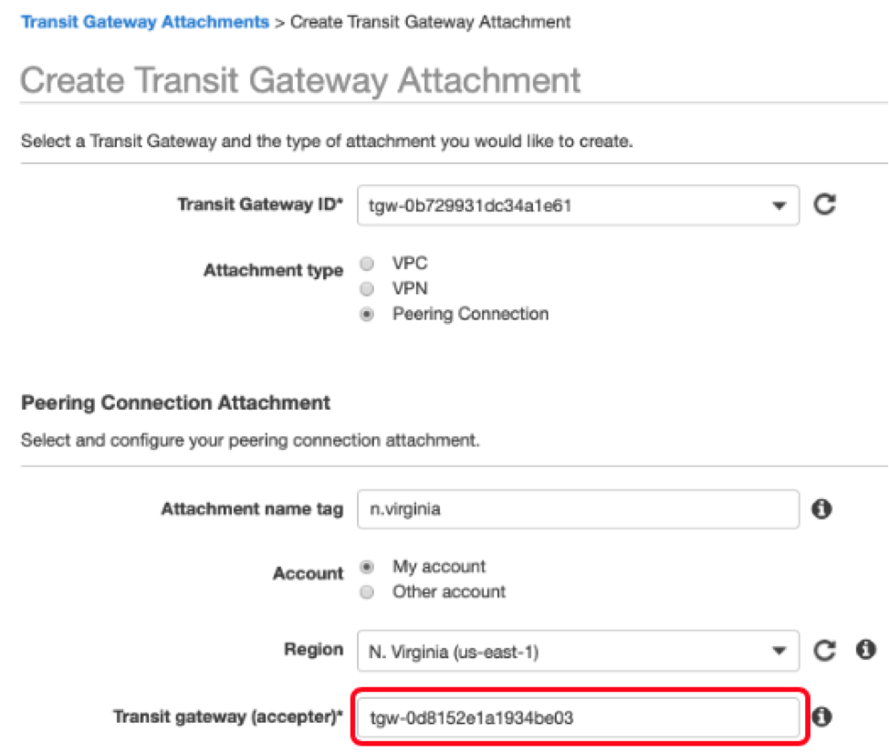

Go to the **n.virginia** TGW attachment console and notice a peering request in
a pending state. Go ahead and accept the request.

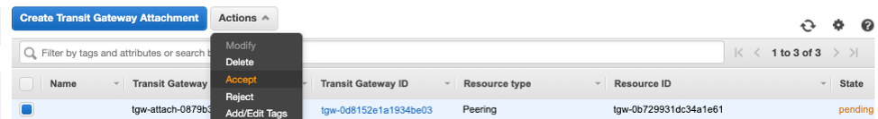

#### 7. Configure VPC C and D attachments

You need to create a new TGW attachment for VPC C and VPC D in their respective
regions with the attachment type: **VPC**.

The following diagrams shows the VPC C and D details:

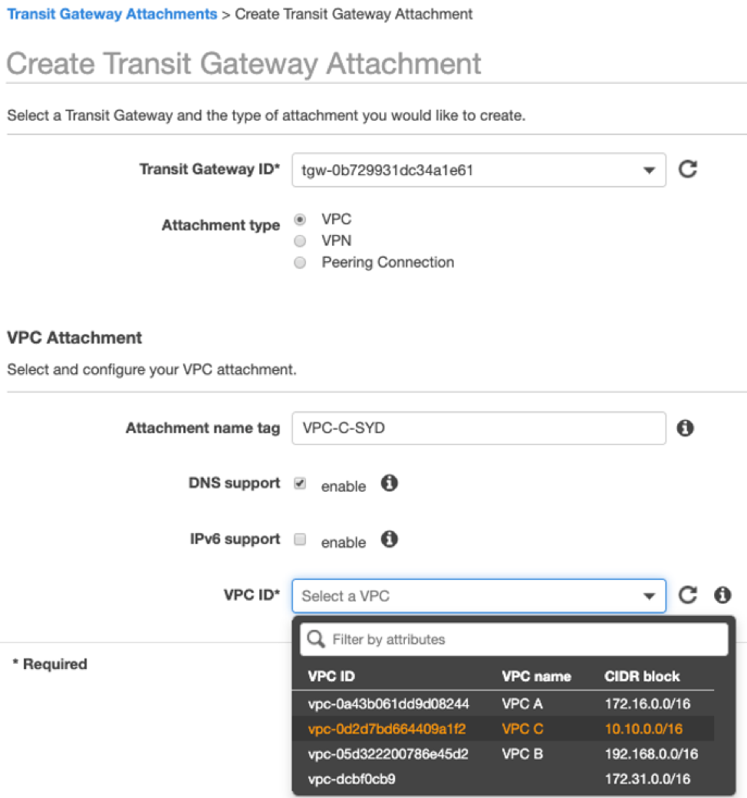

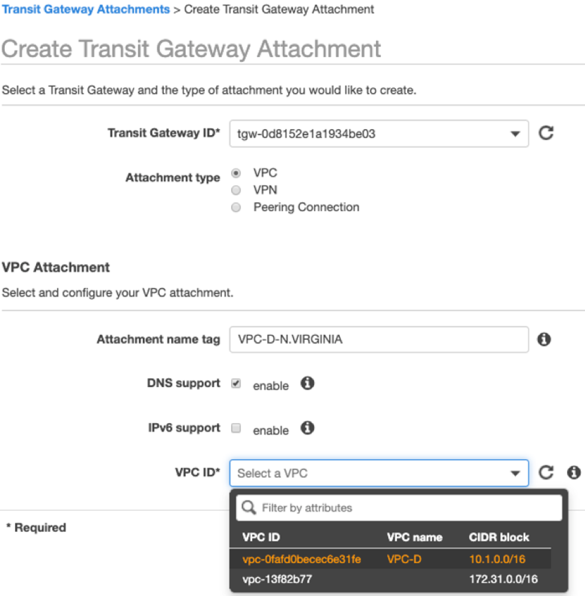

Use the following steps to configure the attachments:

a.	Create an entry in the Sydney TGW route table to route traffic to the classless
inter-domain routing (CIDR) range of VPC D in **n.virginia** region.

NOTE: Make sure to select the correct attachment that references the *peering*
and not the *VPC attachment* type.

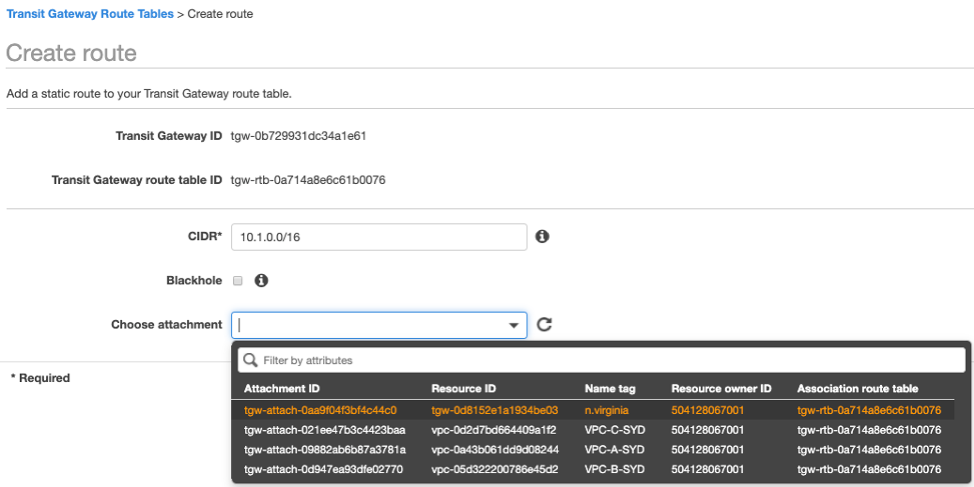

b. Do the same action in the **n.virginia** region to route traffic to VPC C.

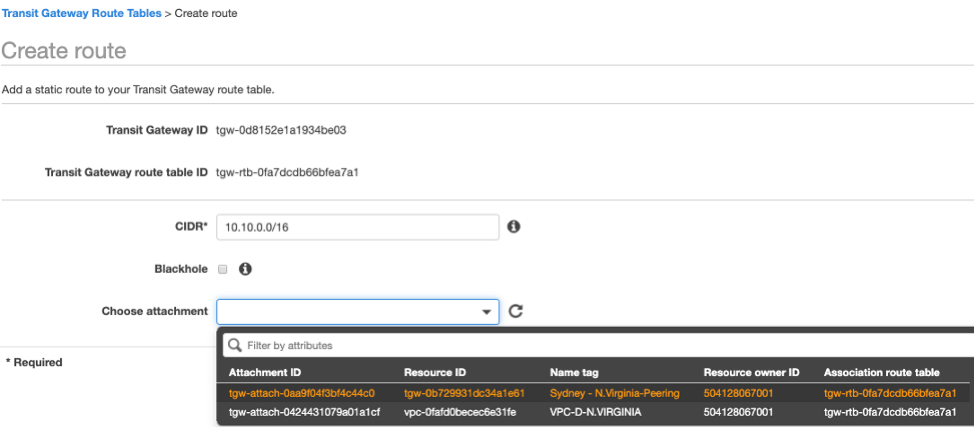

#### 8. Configure the route table

To complete the setup, you need to add a route to the route table associated
with the subnet in which the EC2 instance located. If you also want to ping from
VPC D --> VPC C, you need to set the return destination route back to VPC C.

After you do that, if you ping from VPC C to VPC D, you should get a response.

If you are not getting a response, ensure that you opened security groups to
accept ICMP traffic. If all else fails, take a look at the routes to ensure you
configured them correctly.

### Summary

TGW supports attachments for your direct-connect and site-to-site VPN. You can
now create transitive networks, where previously you needed third-party appliances
to manage all this.

TGW is a welcome solution to the AWS networking feature list. Furthermore, the
addition of inter-region peering with TGW has made life that little bit simpler
when managing multiple VPCs located in various regions around the globe.

Use the Feedback tab to make any comments or ask questions. You can also
visit [www.rackspace.com](https://www.rackspace.com) and click **Sales Chat**
to get started.

<a class="cta blue" id="cta" href="https://www.rackspace.com/managed-aws">Learn more about our AWS services.</a>
