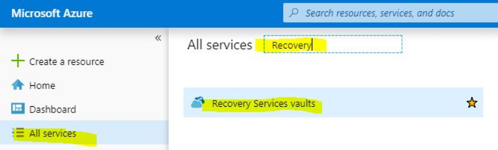
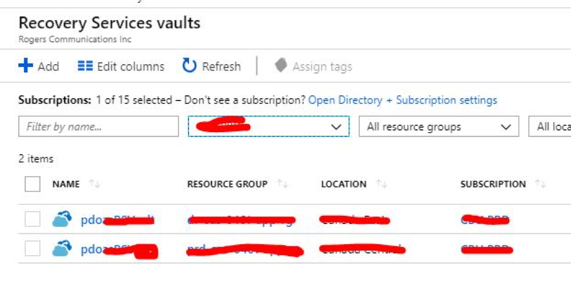
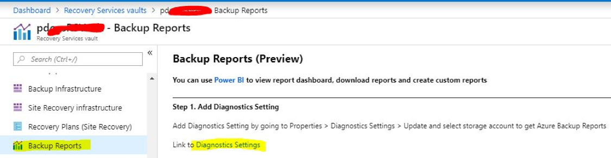
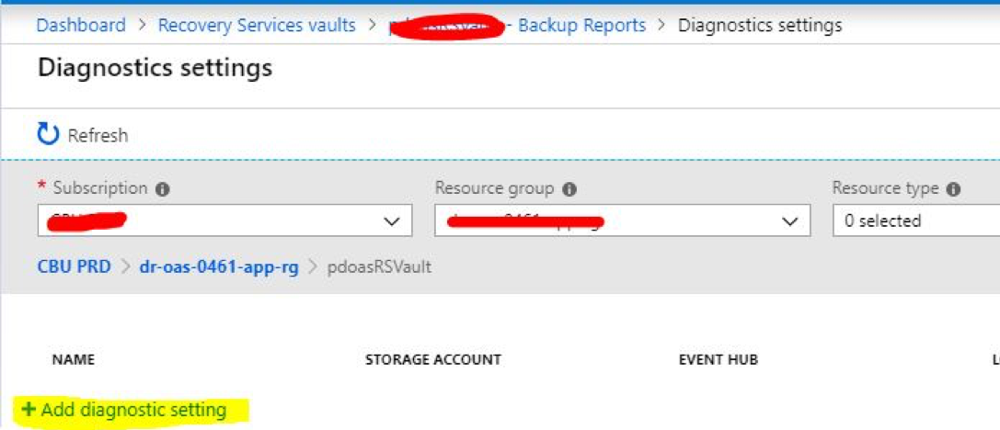
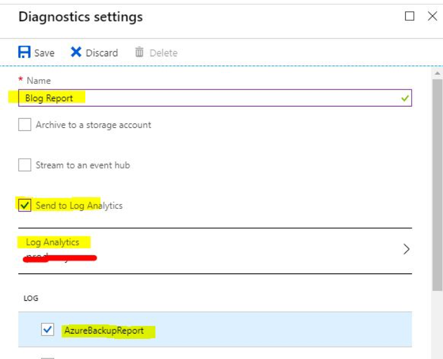
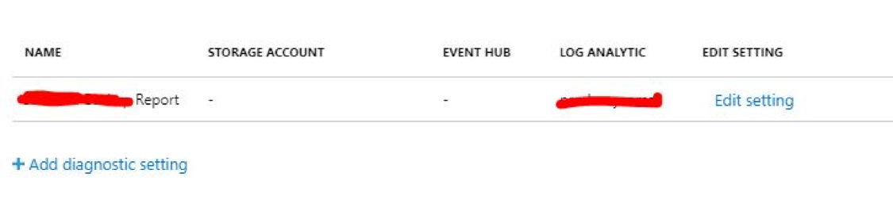
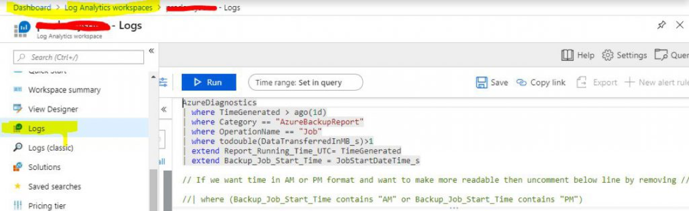
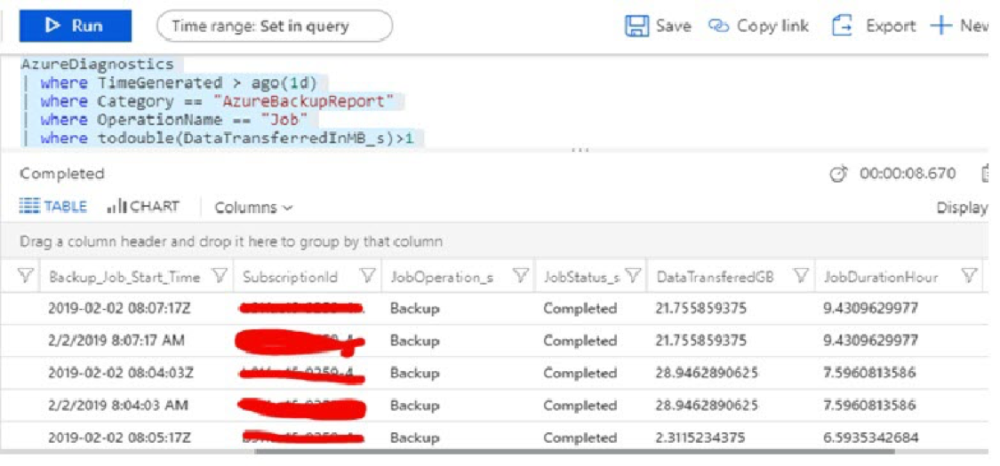
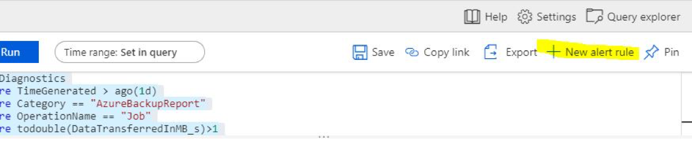
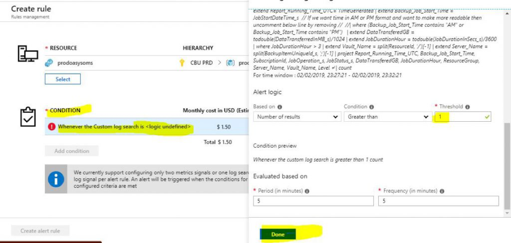

This post explores how to monitor Microsoft&reg; Azure&reg; server
backups and, if the backups run long, use Log Analytics to trigger an alert on
the servers.

**Teaser**: The post unveils new features of Azure **Backup Report** and Azure
**Monitor** and offers some fancy Kusto Query Language (KQL) operations.

<!--more-->

### Introduction

Why should you set an alert for long-running server backups?

DevOps and Azure admin engineers have many virtual machines to manage, routine
tasks to perform, and troubleshooting efforts to undertake. You can't manually
check every function on every VM, so you might miss unexpected behavior such as
a long-running Azure backup, which can be serious. Automated alerts call
problems to your attention.

To make this topic easy to understand, I am dividing the process into the 
following three parts:

1.   Enable **Backup Report**.
2.   Write a KQL query to check long-running server backups.
3.   Configure an alert for long-running server backups.

### Enable Backup Report

**Note**: This post assumes you already use **Recovery Services** vaults to back
up your Azure infrastructure.

Use the following steps to enable an Azure Backup report:

#### 1: Log in to the portal

Log in to the Azure portal, click the **All services blade**, and search for
**Recovery Services vaults**.

#### 2: Select a vault

Select one of the recovery service vaults on which to enable **Backup Report**
and monitor backup duration.

#### 3: Choose Backup Report

Click the recovery vault blade, **Backup Reports**, and click **Diagnostics Settings**.

**Note**: The preview **Backup Reports** feature might not be available in
some regions.

#### 4: Configure Backup Report

To configure **Backup Report**, click on **Add diagnostic setting**.

#### 5: Enable log streaming

You can stream backup logs to Azure Event Hubs, a storage account, or
**Log Analytics**. In this example, I chose **Log Analytics**.

To enable backup log streaming, fill in the name of the report, check
**Send to Log Analytics**, check **AzureBackupReport** in the **Log** section,
and click **Save**.

The portal displays your report, as shown in the following image:

### KQL query to monitor server backups

This section introduces the following KQL query for long-running Azure server
backups:

    AzureDiagnostics
    | where TimeGenerated > ago(1d)
    | where Category == “AzureBackupReport”
    | where OperationName == “Job”
    | where todouble(DataTransferredInMB_s)>1
    | extend Report_Running_Time_UTC= TimeGenerated
    | extend Backup_Job_Start_Time = JobStartDateTime_s

    // If you want time in AM or PM format and want to make more readable, uncomment the following line by removing //

    //| where (Backup_Job_Start_Time contains “AM” or Backup_Job_Start_Time contains “PM”)

    | extend DataTransferedGB = todouble(DataTransferredInMB_s)/1024
    | extend JobDurationHour = todouble(JobDurationInSecs_s)/3600
    | where JobDurationHour > 3
    | extend Vault_Name = split(ResourceId, ‘/’)[-1]
    | extend Server_Name = split(BackupItemUniqueId_s, ‘;’)[-1]
    | project Report_Running_Time_UTC, Backup_Job_Start_Time, SubscriptionId, JobOperation_s, JobStatus_s, DataTransferedGB, JobDurationHour, ResourceGroup, Server_Name, Vault_Name, Level

In case you're not familiar with KQL, let me explain the important elements of
this query.

The query examines the last day of Azure backup data (`where TimeGenerated > ago(1d)`)
to find jobs that took longer than three hours to complete (`where JobDurationHour > 3`).

You can change the number of hours, which is three in this case, to whatever
number you consider to be too long.

### Configure an alert

Glad you made it this far&mdash;read on for the best part!

Use the following steps to set an alert for long-running backups:

#### 1: Open Log Search

Open the **Log Search** section of the **Log Analytics** workspace that you
selected during the report configuration.

#### 2: Paste the KQL query

Copy and paste the preceding KQL query in the **Query** tab and click **Run**.

Servers that took longer than three hours to complete display, as shown in
the following output:

#### 3: Create a new alert

To set an alert for these servers, click **New Alert Rule**.

#### 4: Configure the new alert

Under **Condition**, enter the threshold value with the count. I chose `1`
because I want to create an alert on every server and result.

**Note**: You can also change the **Period** and **Frequency** of the alert, as
needed.

Configure other alert requirements, such as alert name, action group (email
recipient), webhooks, and other conditions.

### Conclusion

That’s all there is to it. This post shows you how to configure an alert on
Azure VM backups that take longer than three hours. The alert sends a
notification email with all the details. With that information, you can take the
appropriate action.

<a class="cta purple" id="cta" href="https://www.rackspace.com/microsoft/managed-azure-cloud">Learn more about our managed Azure cloud.</a>

Use the Feedback tab to make any comments or ask questions. You can also
[chat now](https://www.rackspace.com/#chat) to start the conversation.

Use the Feedback tab to make any comments or ask questions.
