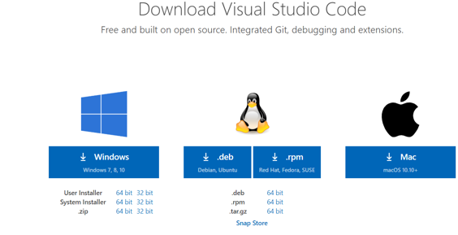
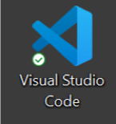
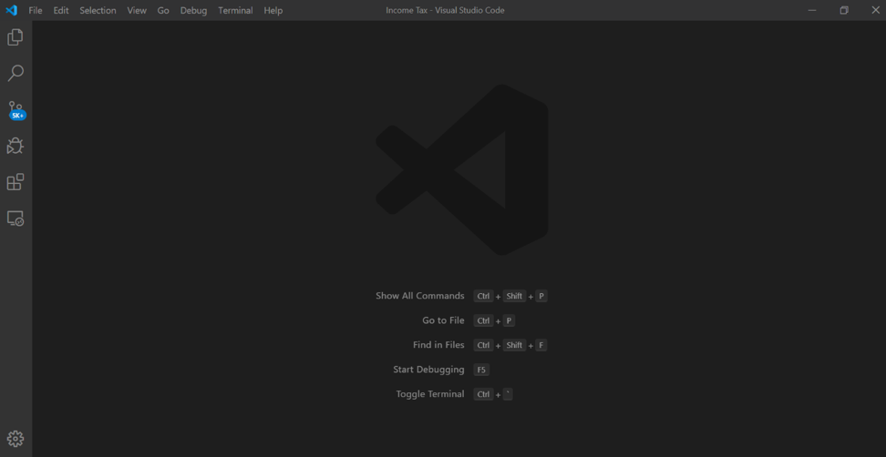
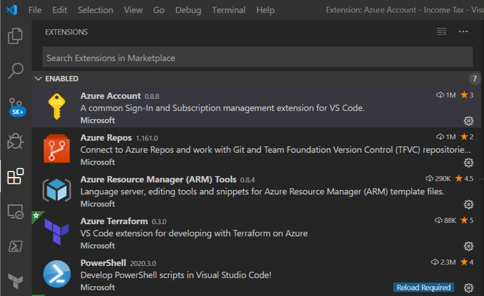
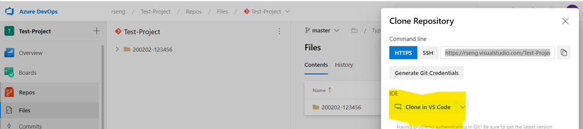
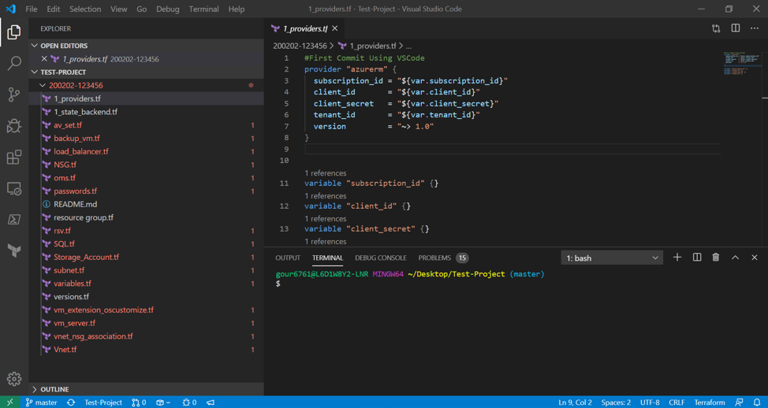
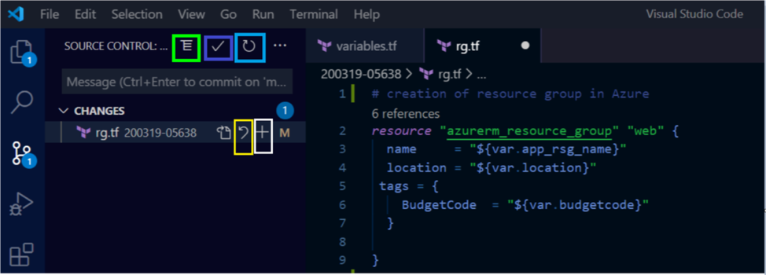
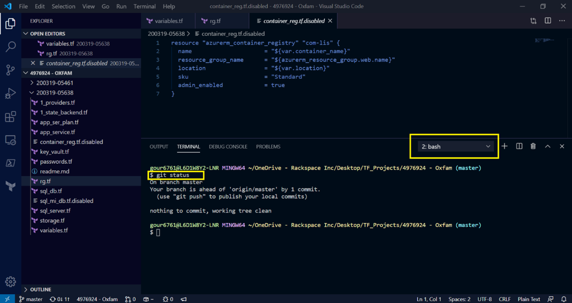
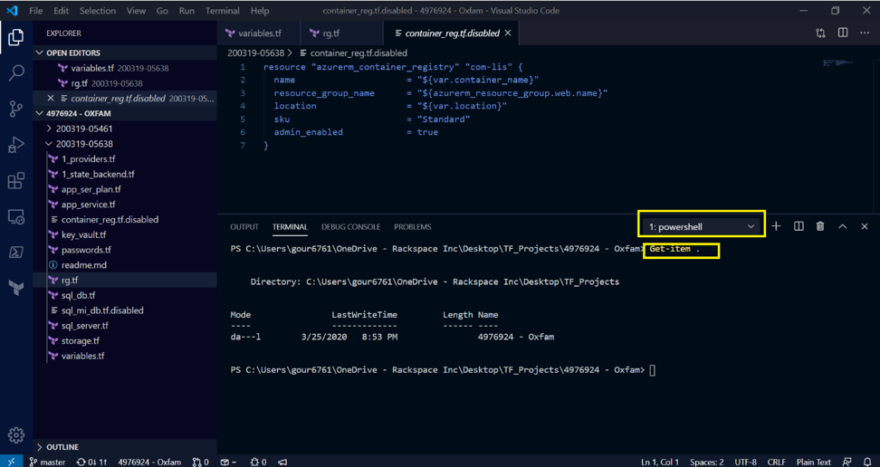

This post describes how to easily configure and use Visual Studio&reg; Code (VS Code)
for Azure&reg; DevOps, Hashicorp&reg; Terraform&reg;, and Git
repositories.

<!--more-->

### Overview

VS Code, an integrated development environment (IDE), requires the following limited resources:

- CPU:  1.6 GHz or faster processor
- RAM:  4 GB
- Storage:  2 – 5 GB
- Support operating system (OS):  Windows&reg;, Mac OS&reg;, and Linux&reg; (Debian&reg; and Red Hat&reg;).

This post covers four topics:

1. Install VS Code
2. Setup and Configure VS Code
3. Create a test project
4. Overview of VS Code for Azure DevOps and Terraform

### Installation

The following steps show how to configure VS Code in Windows 10, but similar
steps work for other OSs.

1. Download the VS Code installer for Windows from
[https://code.visualstudio.com/download](https://code.visualstudio.com/download).

Installation packages differ for each OS, so download the correct package for
your OS.

2. Run the installer (`VSCodeUserSetup-{version}.exe`).

The system installs VS Code in **C:\users\{username}\AppData\Local\Programs\Microsoft VS Code**.

### Configuration

Use the following steps to configure VS Code:

#### 1. Launch VS Code

The VS Code installation process puts a shortcut icon for VS Code on desktop as
shown in the following image:

Click on the icon to launch VS Code. This action opens an empty VS Code
home page for the default configuration.

#### 2. Install extensions

To configure VS Code for Azure DevOps and Terraform, install the following Azure
and Terraform extensions:

- **Azure Account**: The Azure Account extension provides a single Azure sign-in
  and subscription filtering experience for all other Azure extensions. It makes
  the Azure Cloud Shell service available in the VS Code integrated terminal.

- **Azure Repos**: Use this extension to get support for
  [Team Foundation Version Control (TFVC)](https://github.com/Microsoft/azure-repos-vscode/blob/master/TFVC_README.md#quick-start),
  monitor your builds, and manage your pull requests for your TFVC or Git source
  repositories. The extension uses your local repository information to connect
  to either Azure DevOps Services or Team Foundation Server 2015 Update 2 and
  later.

- **Azure Resource Manager (ARM) Tools**: This extension provides language
  support for Azure Resource Manager deployment templates and template language
  expressions.

- **Azure Terraform**: This extension increases developer productivity and
  improves the authoring, testing, and Terraform with Azure experience. The
  extension provides Terraform command support, resource graph visualization,
  and CloudShell integration inside VSCode.

- **PowerShell**: This extension enables you to write and debug PowerShell&reg;
  scripts by using the the VS Code IDE-like interface.

- **Terraform**: This extension provides syntax highlighting, linting,
  formatting, and validation for Terraform.

To install the extension in VS Code, hover over to the extension tab given in
VS Code or press `CTRL+SHIFT+X.`

In the **Search** tab, search for each of the preceding extensions and install
them one at a time. When the installations complete, the extension tab should be
similar to the following image:

Click on each extension to verify it is enabled.

### Create a test project

Create a test project in Azure DevOps and clone that project in VS Code.

To clone this open project, click on the three dots on the right-hand side. A
prompt asks you to clone it the project in an IDE, defaulting to VS Code.

Click on the block and follow the pop-up instructions to clone the entire project.

When the project displays in VS Code, it should appear similar to the following
image:

### Overview of the Vscode user interface.

On the left side, you see all installed extensions. You can click them to
explore them and see their features.

- **Explorer icon**: This first icon opens the entire repo. You can view the files
  or script blocks in VS Code.
- **Lens icon**: Use this icon to search for a keyword and find the shortcut, such
  as `CTRL+F` or `CTRL+H`.
- **Source control icon**: Use this icon to stage, unstage, commit, or undo changes.

The following image shows highlighted icons that you can use in your daily tasks:

- **Green**: Change the toggle view mode.
- **Blue**: Commit changes.
- **Light-blue**: Refresh.
- **Yellow**: Discard changes.
- **White**: Stage all changes.

You can check your project and repository synchronization status in the VS Code
status bar, as shown in the following image:

Notice that the project name is **Test-Project** and has no bugs at this time. I'm
working in the **master** branch. Also, the files have no bugs, as indicated by
the empty synchronization symbol.

You can run PowerShell with Git commands in the VS Code IDE terminal.

If you do not want to use the graphical Git operations (shown in the highlighted
squares in the preceding screenshot), you can install and run Git BASH to open
a terminal in the background. Here, you can run Git commands like `clone`,
`commit`, `pull`, `push`, and so on in the terminal.

### Conclusion

Have fun using VS Code for Azure DevOps and Terraform!

<a class="cta purple" id="cta" href="https://www.rackspace.com/microsoft/managed-azure-cloud">Learn more about our managed Azure cloud.</a>

Use the Feedback tab to make any comments or ask questions. You can also
[chat now](https://www.rackspace.com/#chat) to start the conversation.

Use the Feedback tab to make any comments or ask questions.
