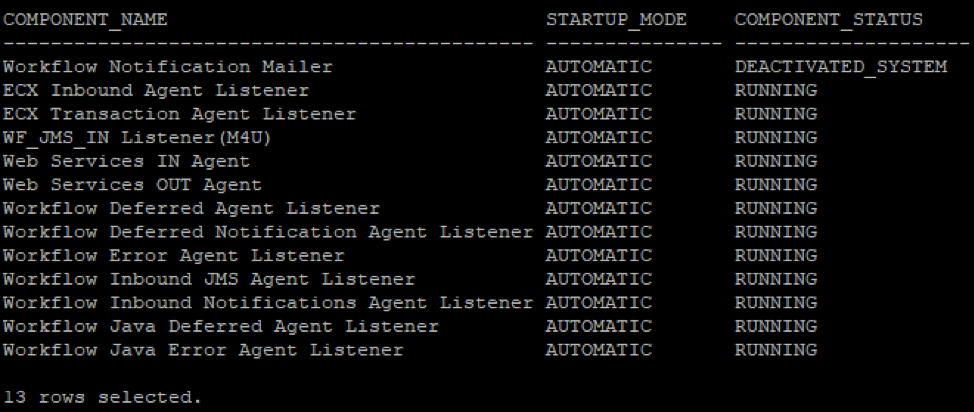
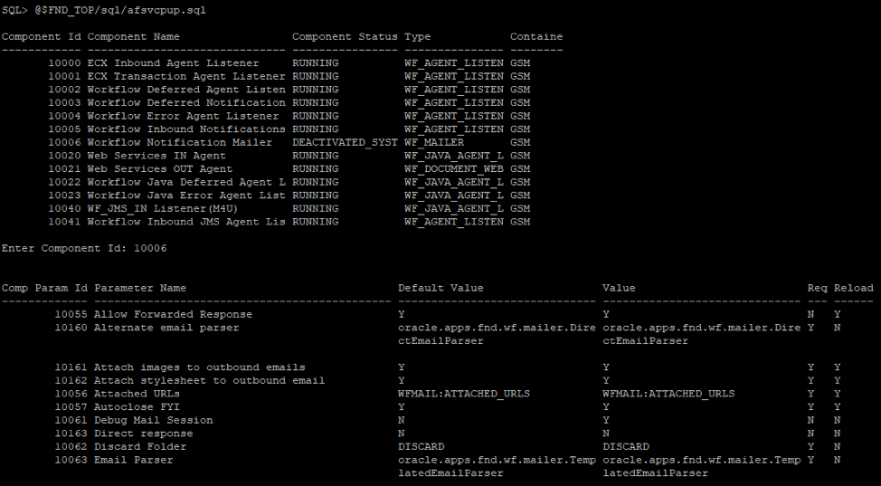
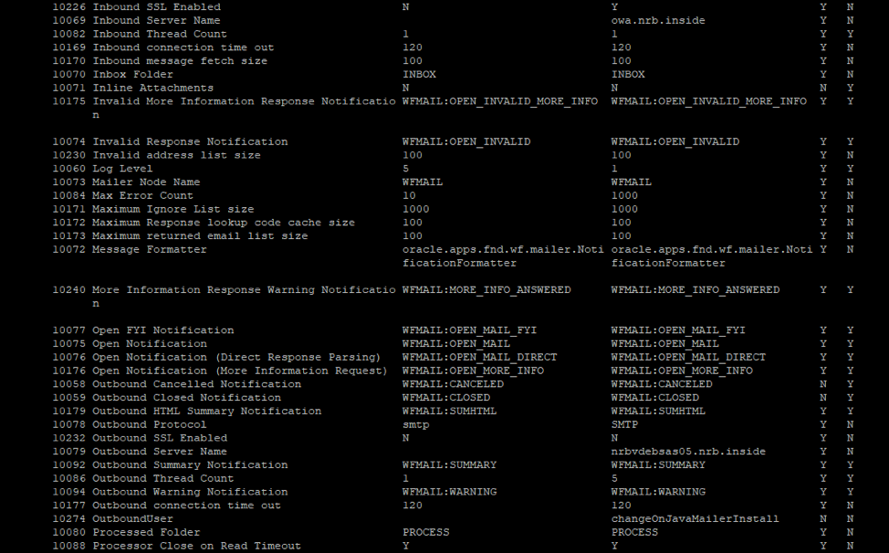

This post discusses a few generic Oracle&reg; Workflow Notification Mailer issues that database administrators
(DBAs) face daily.

<!--more-->

### Introduction

When you manage issues, you deal with the process of recording, tracking, and resolving problems. Because
Workflow Notification Mailer has many components, you might struggle to address issues related to it. To
help you, I cover some issues and possible fixes. Don't miss out on the scripts that you need to manage
Workflow Notification Mailer activities easily.

### Workflow Notification Mailer generic issues and their fixes

The following sections explore some Workflow Notification Mailer issues and solutions.

#### Issue: Users don't get notifications

Users don't receive notification emails or cannot fix the failed notifications.

**Cause:**

The following settings are set to `DISABLED` instead of `MAILHTML`:

- **PREFERENCE_VALUE** in the **FND_USER_PREFERENCES** table
- **NOTIFICATION_PREFERENCE** in the **WF_LOCAL_ROLES** table

**Fix:**

1. Run the following commands to back up the tables:

           SQL> create table fnd_user_preferences_bkp as select * from fnd_user_preferences;

           Table created.

           SQL> create table wf_local_roles_bkp as select * from wf_local_roles;

           Table created.

2. Run the following commands to update the tables:

           select user_name,preference_value from FND_USER_PREFERENCES where preference_value = 'DISABLED' and preference_name = 'MAILTYPE' and module_name = 'WF' and user_name like '%<USER_NAME>%'; 

           update FND_USER_PREFERENCES set preference_value = 'MAILHTML' where preference_name = 'MAILTYPE' and preference_value = 'DISABLED' and module_name = 'WF' and user_name like '%<USERNAME>%'; 

           select * from wf_local_roles where notification_preference = 'DISABLED' and name like '%<NAME>'

           update wf_local_roles set notification_preference = 'MAILHTML' where notification_preference = 'DISABLED' and name like '%<NAME>%'

3. Run the request **Resend Failed/Error Workflow Notifications** from the System Administrator
   responsibility to resend failed notifications. Set the date parameter, **Notifications sent on or after**,
   to the specific date.

   **Note:**  Use the following format for the date: **DD-MMM-YYYY** (Example: 01-JAN-2020)
 
#### Issue 2: Emails go to the wrong folder

The system delivers expense notification approval emails to the **DISCARD** folder instead of the
**PROCESS** folder.

The following example shows the standard approval email **Action** item generated when the approver
clicks on the **Approval** link:

    Action: 'Approve'
    Note: ''
    NID[5513471/192168752214903990869743932721878211126@WFMAIL]

When the notification goes to the Junk folder,  the "Action" items appears as follows:

    Action: 'Approve'Note: ''NID5389465/1779945055187563456464409735425450546126@WFMAIL

**Cause:**

The Microsoft&reg; Outlook&reg; email creation format setting is text mode, or you approved the
notifications from a mobile device.

**Fix:**

Whenever you approve an email notification by using email text mode or from a mobile device, you
should ensure that you do the following actions:

- Put a space between each field.
- Put the **NID** value in brackets.

The message from the preceding example should have at least one space between the fields, and
the **NID** value should include square brackets ([ ]), as shown in the following example:

    Action: 'Approve'
    Note: ''
    NID[5389465/1779945055187563456464409735425450546126@WFMAIL]

#### Issue 3: Users miss emails or get old emails

Users don't receive emails on time, or they get old notifications that are already closed or canceled.

**Cause:**

The issue occurs when the Workflow Notification Mailer queue is full of junk data.

The `wf_notifications` parameter has **mail_status** set to `MAIL` for closed notifications or `SENT`
for open notifications.

In this scenario, the **wf\_notification\_out** queue has very old entries from the **wf_notifcations**
table. This occurrence sends an anomaly notification when the Workflow Background Process request
parameters are incorrect.

**Fix:**

Use the following high-level steps to rebuild the Workflow Notification Mailer queue:

1. Check with the customer about how to purge the old notifications.
2. Keep the date for reference, such as the **begin_date**.
3. Shut down Workflow Notification Mailer.
4. Close all the old **OPEN** notifications that are older than **begin_date**.
5. Update the **mail\_status** to **SENT** for any notifications that are older than **begin_date**.
6. Rebuild the queue by using the following script as the **APPS** user:

           SQL> @$FND_TOP/patch/115/sql/wfntfqup.sql apps <APSS_PASSWD> APPLSYS

### Maintenance scripts for the Workflow Notification Mailer

The commands in this section help you to maintain the Workflow Notification Mailer. You can put the
commands into scripts for your convenience.

#### Script 1

This script modifies the following settings:

- `RUNNING`
- `STARTING`
- `STOPPED_ERROR`
- `DEACTIVATED_USER`
- `DEACTIVATED_SYSTEM`
- `NOT_CONFIGURED`

Use the following commands to update the component_status for the Workflow Notification Mailer
and modify the settings:

    SQL> select component_status
    from fnd_svc_components
    where component_id =
    (select component_id
    from fnd_svc_components
    where component_name = 'Workflow Notification Mailer');

    COMPONENT_STATUS
    ------------------------------
    STARTING

    SQL> update fnd_svc_components set component_status='DEACTIVATED_SYSTEM' where component_id =
    (select component_id
    from fnd_svc_components
    where component_name = 'Workflow Notification Mailer');

    1 row updated

    SQL> commit;

    Commit complete.

#### Script 2

You can use the following commands to set the Mailer **STARTUP_MODE** to `MANUAL` or `AUTOMATIC`:

    SQL> select fsc.COMPONENT_NAME,fsc.STARTUP_MODE,fsc.COMPONENT_STATUS
    from APPS.FND_CONCURRENT_QUEUES_VL fcq, fnd_svc_components fsc where fsc.concurrent_queue_id = fcq.concurrent_queue_id(+)
    order by COMPONENT_STATUS , STARTUP_MODE , COMPONENT_NAME;

    SQL> update fnd_svc_components fsc set fsc.STARTUP_MODE='MANUAL' where fsc.COMPONENT_NAME='Workflow Notification Mailer';

    1 row updated.

    SQL> commit;

    Commit complete.

#### Script 3

This script updates the Workflow Notification Mailer password from the backend:

    SQL> @wfmlrpwupd_in.sql
    Enter value for password: *****
    Enter value for componentid: 10006
    Updated

    SQL> @wfmlrpwupd_out.sql
    Enter value for password: *****
    Enter value for componentid: 10006
    Updated

#### Script 4

Use the following single script to change the Workflow Notification Mailer values from the backend:

    $FND_TOP/sql/afsvcpup.sql

### Conclusion

The Workflow Notification Mailer has many components and some tricky issues. Make sure to back up
the **wf\_\*** tables before updating them.

Refer to the relevant Oracle MetaLink note before running a script to apply the fixes. MetaLink has
many other scripts besides the ones included in this post that can help you to resolve issues in
the Workflow Notification Mailer.

Use the Feedback tab to make any comments or ask questions. You can also
[chat now](https://www.rackspace.com/#chat) to start the conversation.

<a class="cta red" id="cta" href="https://www.rackspace.com/dba-services">Learn more about Databases.</a>
