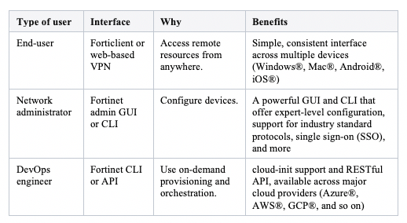

Rackspace announces unlimited availability for the Fortinet® FortiGate-VM in
Rackspace OpenStack Public Cloud. By combining stateful inspection with a
comprehensive suite of robust security features, FortiGate&reg; Next-Generation
Firewall (NGFW) technology delivers complete content and network protection.

<!--more-->

### Use cases

- **VPN endpoint**: Fortinet's web-based graphical user interface (GUI) manager
  takes the complexity out
  of virtual private network (VPN) creation. Connect your office or data centers
  to Rackspace Cloud by using site-to-site VPN, or enable secure access from
  anywhere by using FortiClient&reg; client-to-site VPN. The FortiGate-VM supports
  the latest Internet Key Exchange (IKE), Internet protocol security (IPSEC),
  and Diffie-Hellman parameters.

- **NextGen firewall**: Secure your cloud workloads with a firewall that can
  reduce the attack surface, improve regulatory compliance, and provide trusted
  application access. The FortiGate-VM delivers complete content and network
  protection by combining stateful inspection with a comprehensive suite of
  powerful security features.

- **Intrusion prevention and web application firewall**: Protect against current
  and emerging network-level threats. In addition to signature-based threat
  detection, an intrusion prevention system (IPS) performs anomaly-based
  detection, which alerts users to any traffic that matches attack behavior profiles.

- **Router**: The FortiGate-VM supports industry-standard routing protocols, such
  as Open Shortest Path First (OSPF), Border Gateway Protocol (BGP), and Routing
  Information Protocol (RIP).

### Simple, secure, powerful: Pick three

Whether you are a user connecting to a VPN on your smart phone, a network
administrator setting firewall policies, or a DevOps engineer planning to
provision secure environments quickly, the FortiGate-VM has you covered.

### Not just a firewall: A true universal threat manager

As cyberattacks grow increasingly sophisticated, it becomes more and more
evident that a traditional firewall cannot be a complete security solution.
Fortinet consolidates multiple security and networking functions into the
FortiGate-VM to protect your Rackspace cloud-hosted infrastructure. This
consolidation enables you to spend more time and resources on revenue growth
and profitability. At the same time, consolidation reduces the risks posed by
ransomware, phishing, and other evolving cybersecurity threats.

### Designed for a DevOps world

With innovative features such as cloud-init support, a RESTful API, and
FortiCloud, the FortiGate-VM integrates seamlessly into modern cloud
infrastructures. The FortiGate-VM is also available on all major cloud providers,
including Microsoft&reg; Azure, Amazon Web Services&reg; (AWS), Google&reg; Cloud Platform (GCP), and so on.

### Dive deeper into FortiGate-VM for Rackspace Cloud

Explore and take advantage of FortiGate-VM by reviewing the following documents:

- [Launching FortiGate on Rackspace](https://docs.fortinet.com/vm/rackspace/fortigate/6.0/rackspace-cookbook/6.0.4/962534/launching-fortigate-on-rackspace):
  Includes a quick start guide and explains how to build and access servers
  behind the Fortigate-VM.
- [Backing up FortiGate-VM in Rackspace Cloud](https://support.rackspace.com/how-to/back-up-the-fortinet-fortigate-vm/): Describes how to back up FortiGate-VM.
- [FortiGate Policy Configuration](https://help.fortinet.com/fos60hlp/60/Content/FortiOS/fortigate-firewall/Policy%20Configuration/Policy%20Configuration.htm?Highlight=policy):
  Explains how to set policy (firewall rules) on the FortiGate-VM.
- [Fortinet VPN Cookbook](https://cookbook.fortinet.com/vpns/index.html): Provides instructions about using VPN with Fortinet.
- [Rackspace Public Cloud Server features not available on the FortiGate-VM](https://support.rackspace.com/how-to/rackspace-cloud-servers-features-that-are-not-available-on-the-fortigate-vm/):
  Explains the differences between the FortiGate-VM and typical Windows or
  Linux®-based Rackspace Cloud Servers.

Use the Feedback tab to make any comments or ask questions.

