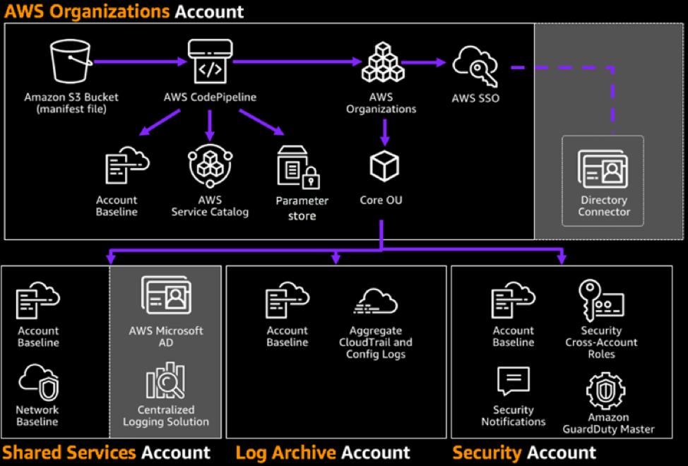

Currently, enterprises are looking for more sophisticated ways of managing their
multi-account Amazon&reg; Web Services (AWS) environments with AWS best practices,
while at the same time incorporating their internal governance and security mandates.

<!--more-->

Until recently, there wasn’t an out-of-the-box solution for multi-account
management from AWS. This problem led enterprises to patch together various tools
and services to meet their requirements.

### Introducing Landing Zone

In 2018, AWS announced Landing Zone. Landing Zone provides a solution to automate
the setup of a multi-account management solution while implementing best practice
security baselines and creating core accounts, including the following:

- Security
- Shared services
- Log archive

The initial deployment of Landing Zone in a multi-account environment requires
you to set up the following Amazon services:

- Simple Storage Service (S3)
- CodePipeline
- AWS Organizations
- Single sign-on
- Service catalog
- Identity and Access Management (IAM)
- Cloudwatch
- GuardDuty
- Simple Notification Service (SNS)

Understandably, manually putting these services together is time-consuming, and
you need a high level of expertise to complete the task. However, you can use
Landing Zone to simplify the deployment. AWS recommends that you connect with AWS
partners to help deploy Landing Zone. Partners take into account specific
business requirements and deploy Landing Zone to best suit your business.

### What Landing Zone does

Landing Zone helps to perform the following tasks:

- Incorporate enterprise-level policies by using security control policies.
- Incorporate AWS best-practice security guard rails as a foundation on which you can build.
- Codify account creation in the organization by using the AWS Account Vending Machine (AVM).
- Configure SAML-based single-sign-on to your identity provider (IdP).
- Centralize logging and automate the setup of CloudTrail across all accounts.

### Deployment

The deployment uses a configuration zip file that is maintained and versioned
by AWS. Sign in to your AWS account to launch the Landing Zone stack, which
creates an S3 bucket and other related resources in your account. Amazon
places the configuration zip file in the S3 bucket, which you can use as a
reference source for CodePipeline.

Because you have access to the source files, you can modify the code to fit your
business needs. The following image shows the default Landing Zone deployment:

 

If you make any changes to the source, CodePipeline runs them in your infrastructure.
Therefore, if you want to create a baseline Virtual Private Cloud (VPC) with
specific network requirements for all new accounts, you can add this to the
source S3 bucket for CodePipeline to deploy.

### Security baseline

Each account that you deploy sets up the following services:

- **AWS CloudTrail** for logging and audit purposes.
- **AWS Config** enabled with configuration log files stored in the log archive
account. This feature also enables some of the managed configuration rules for
monitoring, such as Amazon S3 public read and write.
- **IAM** strict password policy.
- Cross-account access from the security account to the Landing Zone accounts.
- Standardized VPC deployments, such as deleting default VPCs in all regions.
- **CloudWatch** alarms, such as when the root user accesses an account.
- **GuardDuty** for threat detection.

### Costs

As you can see, Landing Zone consumes many AWS services. Therefore the running
costs are approximately $200 a month. However, if you decide to enable Amazon
ElasticSearch as part of the **Centralized Logging** add-on, the estimated monthly
cost doubles to $400 a month.

### Summary

Landing Zone is a step in the right direction when it comes to baselining AWS
best practices as part of an enterprise solution. With access to the source,
companies can choose to develop their internal process and tooling alongside the
offering.

Furthermore, Landing Zone helps smaller organizations by removing some of the
overhead when it comes to incorporating AWS best practices.

Keep in mind that you might need to spend time and money to troubleshoot and
fix any Landing Zone failures.

Control Tower is a Platform as a Service (PaaS) alternative to Landing Zone.
Both tools have great offerings when you need to set up a multi-account solution
with AWS best practices. It’s just a matter of which solution best meets your
business needs.

Use the Feedback tab to make any comments or ask questions. You can also
visit [www.rackspace.com](https://www.rackspace.com) and click **Sales Chat**
to get started.

<a class="cta teal" id="cta" href="https://www.rackspace.com/managed-aws">Learn more about our AWS services.</a>
