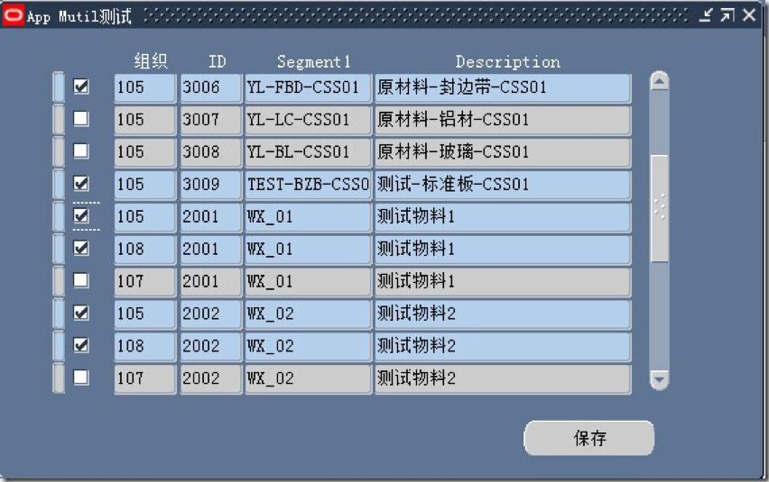

The Oracle&reg; APP\_MULTI package enables you to add multi-selection functionality
to a form. This option is available in APPCORE Library.

<!--more-->

By using the APP\_MULTI package, you can select single or multiple records and
process them as needed. The following image illustrates random record selection:

*Image Source*: [https://i36.me/images/oracle/ebs/ebs_frm_lnchse_with_app_multi_01.jpg](https://i36.me/images/oracle/ebs/ebs_frm_lnchse_with_app_multi_01.jpg)

### Functionality

The APP\_MULTI package enables you to perform the following actions:

- Click on a single record to select it.

- Press and hold the Ctrl key and click on multiple records to select several
  records at the same time.

- Choose **Select All** from the application menu to select all records.

- Choose **Deselect All** from the application menu to deselect all selected
  records.

- Click the first record, and hold down the shift key while you click the last
  record in a sequence to select several contiguous records.

### APP\_MULTI package events

The APP\_MULTI package responds to the following events on a form:

- **KEY-CLRFRM**: (form-level) Validates the record before it clears the form.
  Use example: `APP_MULTI.EVENT('KEY-CLRFRM');`

- **KEY-CLRREC**: (block-level) Fires when you clear the current record. It is
  equivalent to the `clear_record` command.

- **KEY-CREREC**: (block-level) Fires when you create a new record. It is
  equivalent to the `create_record` command.

- **KEY-DELREC**: (block-level) Fires when you delete an existing record. It is
  equivalent to the `delete_record` command.

- **PRE-BLOCK**: (block-level) Fires when you enter a block.

- **POST-BLOCK**: (block-level) Fires when you exit from a block.

- **SELECT_ALL**: (block-level) Fires when you select all records.

- **DESELECT_ALL**: (block-level) Fires when you deselect all records.

- **WHEN-CLEAR-BLOCK**: (block-level) Fires when you clear the block.

- **WHEN-MOUSE-CLICK**: (block-level) Fires when you click the mouse.

- **WHEN-NEW-RECORD-INSTANCE**: (block-level) Fires when you create or query a
  record on the block.

### Manually create triggers

You need to create the necessary triggers and explicitly call the **APP_MULTI.EVENT**
procedure by passing the name of the event being handled, as shown in the
following example:

    PROCEDURE event(p_event_name VARCHAR2,p_blockname
    VARCHAR2 DEFAULT NULL);

For example, the `KEY-CLRREC` trigger can be as simple as the following command:

    APP_MULTI.EVENT('KEY-CLRREC');

**Note:** The procedure accepts an optional argument `p_blockname`. If you don't
pass `p_blockname`, the procedure uses the value of **SYSTEM.TRIGGER\_BLOCK**.

### Selection and deselection events

When you implement the custom **MULTI\_RETURN\_ACTION** trigger (either in a data
block or at the top-level of a form), the system notifies you of the record
selection and deselection. The trigger fires after every individual or bulk
record selection or deselection.

#### Trigger variables

You can use the following variables in the triggers:

- The **GLOBAL.APPCORE\_MULTI\_BLOCK** global: has the name of the data block
  that is affected by record selection or deselection.

- The **GLOBAL.APPCORE\_MULTI\_ACTION** global: has any of the following values:

      - **'RECORD\_SELECTED'**: When a record is selected

      - **'RECORD\_DESELECTED'**: When a record is deselected

      - **'LABEL\_CHANGE'**: When the **Select All** or **Deselect All** menu
        items are enabled or disabled

- The **APP\_MULTI.LOOPING** package variable: has either TRUE or FALSE values,
  depending on whether you called **MULTI\_RECORD\_ACTION** within a loop.

### Retrieve data selected on a form

For each data block, the APP\_MULTI package has a record group with the
record numbers of the currently selected records.

You can perform the following tasks by providing the name of the data block:

- Use the **APP\_MULTI.GET\_GROUP\_COL function to access a record group's **Only**
  column for a specific data block.

- Use the **APP\_MULTI.GET\_GROUP\_COUNT** to get the number of selected records.

For example, given a discrete jobs form, block **W\_JOBS**, and a field,
**WIP\_ENTITY\_ID**, you can print the IDs of the selected jobs by using the
following PL/SQL code:

    DECLARE
     record_number_column    groupcolumn;
     selected_record_count   NUMBER;
     BEGIN
       record_number_column := app_multi.get_group_col ('W_JOBS');
       selected_record_count :=app_multi.get_group_count ('W_JOBS');

     FOR i IN 1 .. selected_record_count
      LOOP
       DECLARE
        record_number     NUMBER;

      v_wip_entity_id   NUMBER;
      BEGIN

       record_number := GET_GROUP_NUMBER_CELL (record_number_column, i);

       GO_RECORD (record_number);

       v_wip_entity_id := NAME_IN ('W_JOBS.WIP_ENTITY_ID');

       fnd_message.debug ( 'v_wip_entity_id' || v_wip_entity_id);

       EXCEPTION
        WHEN OTHERS  THEN
          Null;
      END;
     END LOOP;
    END;

### Conclusion

With the APP\_MULTI package, you can process bulk data in custom Oracle forms.
This package lets you get the details of bulk data that a user selects on the
standard forms. You can use it in form personalization or **custom.pll** code to
add custom functionality in a standard Oracle form.

Use the Feedback tab to make any comments or ask questions. You can also
[chat now](https://www.rackspace.com/#chat) to start the conversation.

<a class="cta blue" id="cta" href="https://www.rackspace.com/dba-services">Learn more about Databases.</a>
