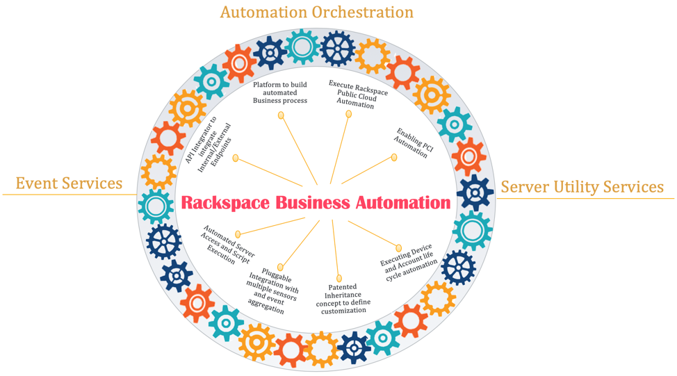
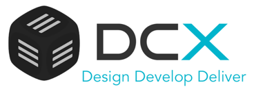

Rackspace business automation offers the capabilities you don't see, which make
the difference in your support, monitoring, and, most importantly, your business
security and compliance.

<!--more-->

Which of the following elements drive Rackspace Fanatical Experience&trade;?

- Our offering bundle

- Our professional services

- The thousands of Rackers delivering **Fanatical Support**&reg; and service delivery

The short answer is that all of these contribute to that experience and the
Rackspace core values.

But this post doesn't focus on those things or try to sell you a product
or service.

### The secret sauce

This post shares a story about one of the ingredients in the secret sauce behind
all of those pillars that make Rackspace the #1 Managed Cloud Company&mdash;automation
driven by world-class process engineering.

This diagram highlights the ecosystem that enables our Automation team's Process
Engineering Group (PEG) to execute world-class vulnerability management, device
end-of-life (EOL) automation, and in partnership with our Global Data Center Infrastructure teams,
world-class physical migration services.

By the end of 2019, the PEG team automated 270,540 hours of previously manual
work and provided other support capabilities that we couldn't hire enough people
to deliver.

### Capabilities that we automate

Rackspace's automation never sleeps. The following capabilities would otherwise
require customer interaction and Racker intervention:

#### Vulnerability and EOL management

In 2019, automation protected customer devices at scale, saving 179,696 hours without
customer intervention, including the following cases:

- **Spectre meltdown remediation**: 12,000 hours saved

- **Cisco&reg; ASA code stage and reboots**: 166,000 hours saved from 2018 through 2019

- **Customer firewall and load balancer reboots alert tickets**: 604 hours saved 2018 through 2019

- **Dell&trade; Remote Access Controller (DRAC) firmware updates**: 1,092 hours saved in 2019

#### Business process input templates

Our business process input templates (BPITs) enabled managed hosted customer self-service saving 3,336 Racker
hours through 2019, including the following cases:

- Manage operating system (OS) users for Windows&reg; and Linux&reg;, such as disabling user accounts
  on Windows and Linux Servers

- Consolidate VPN actions for firewall templates

- Provide VPN automation and customer self-service to support NetSec operations&mdash;you
  can remove, modify, and view VPN users from our customer portal.

- Offer a significant ROI that represents 14,881 NetSec tickets annually, which
  provides a huge reduction in the annual cost-to-serve for Rackspace.

#### Operational efficiencies

Operation efficiencies enable Rackers to focus on business-critical issues faster:

- 93% of monitoring tickets fully resolved through automation end-to-end, from creation
  to close without a human touch.

- More than 230,000 Racker hours saved through auto-remediation.

- 168,000 Racker hours saved in 2019 via smart-ticket diagnostics.

- Fleet management automation tooling offers troubleshooting, patching, and mean time to resolution (MTTR).

  - Windows: 28,000 hours saved

  - Linux: 31,000 hours saved

  - Maintenance: 12,000 hours saved

The preceding efficiencies are just the surface of the eight million events that
Rackspace Business Automation processes every month. But that's not the end of
the story.

### The rest of the story

Our Data Center Automation team (DCX), which manages all of our dedicated OS, IP addresses, provisioning,
and more, works in conjunction with the Business Automation team so that PEG's
lifecycle automation has full functionality.

To provide stellar automation capabilities, PEG does the following:

- Use APIs that handle real network device interaction, which is critical for
  automating customer devices throughout the lifecycle.

- Handle over 1 million calls daily.

- Manage device lifecycle needs.

- Take advantage of the Rackspace switch infrastructure.

- Guarantee configuration consistency with a high rate of success.

- Provide DCX Network services (DCX-NS), which is a central point of control for
  the massively distributed non-transactional data store that governs all
  Rackspace network traffic.

To deliver Fanatical Experience, PEG:

- Aids operations across several platform variations of four major hardware vendors.

- Supports operations in many regions.

- Meets the requirements of different groups of customers, including new features
  and custom tailoring for sales and support.

- Manages lifecycle needs, including assuring you that we remove you configurations
  before you reuse a device.

### Conclusion

On behalf of the teams comprising Rackspace Business Automation, I'm proud to
share their success story.

Use the Feedback tab to make any comments or ask questions.

