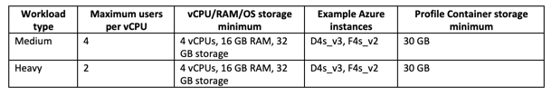
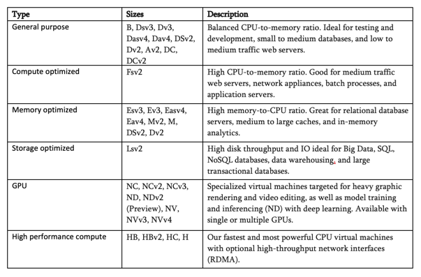
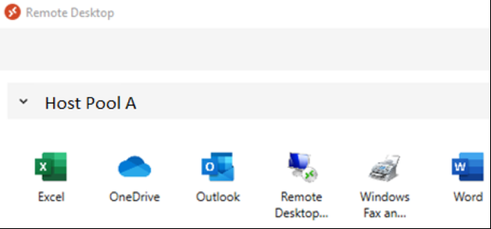

The events unfolding in 2020 accelerated the adoption of remote work in ways no
one could have predicted. Whether your organization plans to use Windows® Virtual
Desktop (WVD) to fill this need rapidly or is on the hunt for a new virtual
desktop infrastructure (VDI) solution, this three-part blog series gives you an
idea of the ways WVD solves for work anywhere scenarios and provides some important
considerations for deploying the new service.

<!--more-->

This series of WVD posts includes:

- [Part one](https://developer.rackspace.com/blog/using-wvd-and-fslogix-part1/) to see what WVD is and what it solves for.
- [Part two](https://developer.rackspace.com/blog/using-wvd-and-fslogix-part2/) for more of the story and how FSLogix makes WVD easier.
- [Part three](https://developer.rackspace.com/blog/using-wvd-and-fslogix-part3/) for the gotchas and good to knows.

### Remote Desktop Services

WVD is the only way to provide a "like-local" virtualized multi-session Windows
10 experience. To make it easier for organizations to adopt Remote Desktop
Services (RDS), Microsoft® takes the complex infrastructure required in a
traditional RDS farm and provides it as a service through the WVD control plane.
In the traditional RDS environment, organizations must run the following
infrastructure to enable RDS, posing significant implementation and management
overhead:

- Networking infrastructure and load balancers

- SSL certificates

- Web access servers

- Licensing servers and Microsoft SQL database

- Session hosts

- Windows images

- Microsoft Active Directory® (AD) domain controllers

- Storage back-end cluster for user folder redirection

With WVD, organizations only need to manage the following components:

- Session hosts

- Windows images

- Active Directory domain controllers

- Azure® AD Connect

- Storage solution for user Profile Containers

Along with reduced complexity, WVD is tightly coupled with Azure Active Directory
(AAD), instantly giving you access to the advanced security and Identity and
Access Management (IAM) features in AAD (such as multi-factor authentication and
conditional access policies).

### How can I use WVD? What solutions does it provide?

Microsoft provides a web-based HTML5 client, and  native applications for all
the major operating systems (OSs), including Windows Desktop, Android® Mobile,
macOS®, and iOS. The protocol used by the clients is open and available for
vendors to create their own clients, so this list will likely grow over time.

After the user opens the web or app client, they register with a workspace and
authenticate to AAD. After the user authenticates, they connect to the WVD
management service and download a list of resources associated with the user in
the workspace. The resources might be a list of Remote Desktop Host Pools or a
list of applications that can be remotely streamed to the user as if they are
running locally. In the following section, we break down each of the user
experiences you can configure with WVD.

#### Multi-session desktop experience

The multi-session desktop use case is the most basic VDI scenario&mdash;organizations
host several users on the same session host virtual machine (VM). Most VDI
solutions use a Windows Server&reg; image with software customizations to try to
make it look like Windows 10. Windows 10 Enterprise multi-session provides a
genuine Windows 10 experience and is only available on Azure through WVD.

One of the most significant advantages of a multi-session virtual host is that
you can achieve cost savings through user density. As soon as your end-users
start loading Outlook&reg; and Teams, you diminish your density greatly. While
Microsoft provides some general sizing recommendations, we’ve found the workload
types in the following table are more realistic for full desktop Office 365&reg;
workers. For more recommendations from Microsoft, check out
[Remote Desktop workloads](https://docs.microsoft.com/en-us/windows-server/remote/remote-desktop-services/remote-desktop-workloads).
We recommend that you always validate your host pool sizing in a pilot
deployment before rolling it out to production.

#### Personal desktop experience

Some organizations have users that would benefit from having a dedicated VM to
themselves. For most organizations, these are power users that are performing
specialized work functions like developers, graphics encoders, and data analysts.
Users with specific hardware requirements must be hosted on a separate host pool
from your multi-Session users, or app virtualization solutions.

Azure has several different types of VMs that provide different hardware
configurations. The following table provides the Microsoft description of the
type of VM&mdash; it’s up to you to find ways to apply the hardware to specific
WVD use cases.

See the following links for more information on the VM types:

- [General purpose](https://docs.microsoft.com/en-us/azure/virtual-machines/sizes-general)
- [Compute optimized](https://docs.microsoft.com/en-us/azure/virtual-machines/sizes-compute)
- [Memory optimized](https://docs.microsoft.com/en-us/azure/virtual-machines/sizes-memory)
- [Storage optimized](https://docs.microsoft.com/en-us/azure/virtual-machines/sizes-storage)
- [GPU](https://docs.microsoft.com/en-us/azure/virtual-machines/sizes-gpu)
- [High performance compute](https://docs.microsoft.com/en-us/azure/virtual-machines/sizes-hpc)

Personal desktop pools can change the story for WVD significantly. Instead of
treating the Session Host VMs as disposable, as we do with Multi-Session Host
Pools, the user is generally allowed to treat the host as "theirs," and they
make customizations to that instance of Windows that aren't built into an image.
You may need to use a more traditional software and patch management solution
for these hosts.

#### App virtualization–remote apps

Consider a scenario where the user has a client machine that they could use for
workloads like web browsing, but they can stream specific applications from the
WVD session hosts to their local machine as if they're running locally. By
creating an application group, you can specify applications by file path, or by
selecting from a list of **Start** menu applications on the hosts, for your users
to launch remotely.

The following screenshot from one of our team member's lab environments shows
how the client displays the available applications to the users. Some major
benefits are that remote apps are not limited to Microsoft or Office 365
applications, and the profile data is kept inside the WVD system.

#### MSIX App Attach–in preview

MSIX App Attach is a new feature that has gained a lot of interest recently, but
it is not quite ready for rapid adoption due to the process required to deploy
the applications. MSIX is an application packaging format standard, and App
Attach's goal is to allow you to pack only your application and its dependencies
to a virtual hard disk (VHD). Don't worry if your application isn't already in
the MSIX format, you can package your existing Microsoft Installer (MSI)
application with MSIX by using Microsoft tools.

The user experience is like app virtualization, except that when users connect,
the session host mounts the MSIX VHD and masks it as if the application is
installed locally. You can see how you might use this feature with FSLogix to
minimize the customizations required in the OS image, allowing you to manage user
profiles and software deployment outside of imaging. Hopefully, Microsoft brings
this feature to general availability soon.

See [Part two](https://developer.rackspace.com/blog/using-wvd-and-fslogix-part2/)
for more of the story and how FSLogix makes WVD easier.

Use the Feedback tab to make any comments or ask questions. You can also
[chat now](https://www.rackspace.com/#chat) to start the conversation.

<a class="cta purple" id="cta" href="https://www.rackspace.com/lp/work-anywhere-solution-microsoft-offer">Learn more about the Microsoft Work Anywhere solution.</a>

