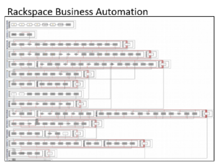

Let's face it.
Every business unintentionally develops silos or divisions within business units,
and Rackspace is no different. A grassroots foundation that needs to be agile,
competitive, and innovative, might enter markets without fully integrating
organizations into core Rackspace tooling. Enter the Process Engineering Group
(PEG).

<!--more-->

PEG,
established in April 2014, is eighteen strong and pioneered this needed
innovation, all while powering what would take thousands to accomplish. PEG
operates as an extension of all Rackspace teams. They provide automation using
a proprietary and patented toolset called Rackspace Business Automation (RBA).
This toolset allows for the orchestration of events through native integrations
with our source-of-truth systems. RBA allows for application program interface
(API) integration, so any system with APIs can access RBA with proper
authentication and contracts&mdash;crashing through silos!

### The impact of PEG

If you are a Rackspace customer, PEG has served you.

PEG formed four strategic alliances with Rackspace to support our customers:

- Enterprise automation
- Provisioning and decommissioning
- Managed security
- Systems integration

Through these alliances, PEG remains agile, accounting for lifecycle events.

What is a lifecycle event? Glad you asked.  Automation is only as good as its
result, and if the result equals a Fanatical Experience&trade;, it's a lifecycle
event.

### Use case

The following current use case demonstrates how PEG encompasses the Rackspace core
values through expertise and agility to connect a myriad of independent events
that result in a Fanatical Experience.

Cisco support set devices **5505|5510|5520** as end-of-life. In late 2018, PEG
worked with the Customer Success teams to notify customers that they had a year
to complete the device migration. During this timeframe, PEG also began working
with the Network Security team and many other teams to architect the migrations to a new
supported device.

We organized the complex independent work from Customer Success, Finance,
Billing, Network Security, Data Center Operations, and other teams to complete
standard maintenance tasks. We built this concise workflow of *ticket* and
*device* lifecycle around our customers&mdash;you and the Rackers who support you.

#### Ticket lifescycle

Project leadership sent a call to action to PEG customers to give input, which
helped to facilitate decision making and establish a schedule.  Through the workflow,
PEG provided specific information to empower its customers to make real-time
decisions, agree to terms, and schedule the upgrades.

*Empowerment such as this allows for an organized and efficient experience for
customers*.

#### Device lifecycle

When scheduled, the new firewall went through premaintenance work. Network
Security and Data Center Operations used push-button automation to prepare the
device for the configuration swap and new firewall during maintenance.

*Of course, this automation was much more complicated, but in a lifecycle event,
our support Rackers use automation to perform these maintenances at scale with
minimal downtime for our customers*.

#### The intersection

The intersection of these lifecycle events happened the morning of the scheduled
maintenance and consisted of people from three teams on a call&mdash;Network Security,
Data Center Operations, and PEG.

The three stages of push-button automation:

When we closed the maintenance window, the following results occurred:

- The new firewall went live.
- The legacy device got a clean slate and billing stopped.
- The new device billing started.

*A fanatical customer experience for all.*

### Another scenario: Vulnerability

Imagine a scenario where all your customers are vulnerable at the same
time&mdash;mass vulnerability. How do you go through the painstaking effort
of scheduling each customer for a maintenance window convenient for them to
patch their devices with potential downtime? This effort requires all hands on
deck.

In February 2017, the Internet Key Exchange (IKE) buffer overflow vulnerability
took us by surprise and had our Network Security team hopping to patch all
customers.  Burn me once shame on you. Burn me twice ...

Since 2017, Rackspace doubled down by adding efficiencies in fleet management,
which included scoping solutions for vulnerabilities and patch management. Over
the following years,  many teams, including Network Security, MyRack Portal
Design, RBA, and  PEG worked toward delivering a world-class model for fleet
management. Rackspace architected and implemented the solution.

In May 2018, the Cisco ASA Web VPN vulnerability impacted over 15 thousand
devices. Rackspace responded rapidly. We sent out communications instructing
customers on how to remediate the vulnerability at their convenience. The
scheduling process staged the new code, preparing it for a refresh at the
scheduled reboot time.

*In just one year, Rackspace implemented an end-to-end solution to communicate
with customers and allow for self-scheduling to stage and patch the vulnerable
device.*

### Conclusion

PEG drives excellence throughout the business by automating tasks and
customer-requested events and through continuous forward-thinking planning and
action.

The Rackspace CORE values:

**Excellence | Customer Driven | Agile | Compassion | Expertise**

Visit [www.rackspace.com](https://www.rackspace.com) and click **Sales Chat**
to start a conversation.

Use the Feedback tab to make any comments or ask questions.

