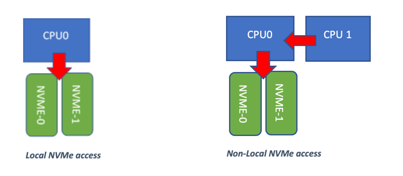
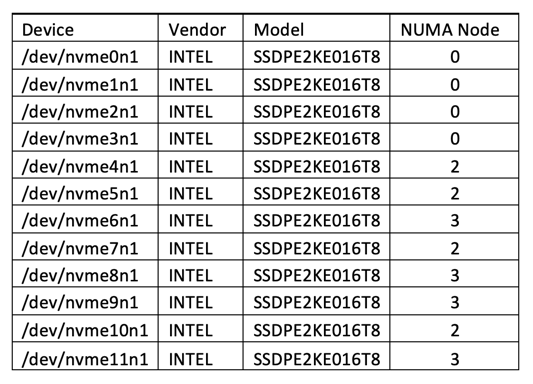
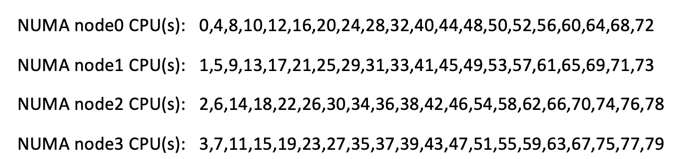
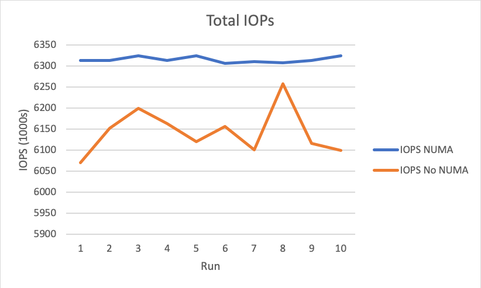
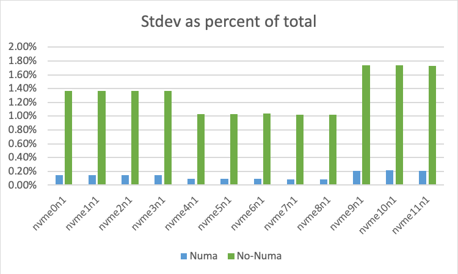

The need for access to high-speed, low-latency storage systems has become
commonplace in today's server industry. Remember, only a few years ago, people
considered SATA and SAS SSDs too expensive for everyday storage use.

<!--more-->

Today, storage systems commonly consist of nothing but NAND-based products. I
remember back in 2015 reading about multimillion-dollar storage systems that
could provide a few million Input/Output Operations Per Second (IOPS). Here we
are in 2020, and I can exceed those numbers with a single system and for a few
thousand dollars. Simply amazing.

Peripheral Component Interconnect (PCI)-based storage has had a mixed past with
Fusion-IO&reg;, providing proprietary
systems and drivers for high-speed performance. Luckily our industry overcame
those vendor-centric models and delivered on a standard interface for PCI storage.
Non-Volatile Memory Express (NVMe) is the common name for providing NAND storage
over a PCI express interface. It has an advantage over SAS and SATA in terms of
protocol simplicity, bandwidth, and driver stacks designed for low latency and
high throughput. NVMe storage technology has been the industry leader in server
storage performance. In its early days, NVMe was only available in a PCI
half-height half-length (HHHL) card. This format made it difficult to scale
systems to leverage a lot of NVMe storage.

Realistically, it was not feasible to install more than two or three NVMe devices
per central processing unit (CPU). Now that U.2 (2.5 inch 15mm) form factors are
readily available, scaling NVMe devices is as easy as scaling SAS or SATA devices.

Because today you can easily scale your Rackspace&reg; server to allow up to 12 NVMe
devices, you have a new set of problems to think about. First, although these
devices are much less expensive than they used to be, they are still relatively
costly. How do you ensure that you are getting the most out of your investment?
Second, because these devices connect directly to the processor PCI bus, how do
you ensure that performance and latency are predictable and consistent?

In this blog post, we explore the impact of NUMA controls in Linux&reg;
operating systems to determine the impact of latency and overall throughput.

We ran two simple experiments, one with NUMA control and one without NUMA control.
Then, we explore the comparative results for latency, bandwidth, IOPs, and deviation
of results between runs.

### The experiment

To better describe the experiment, let me provide an example. With NVMe,
storage attaches directly to a Peripheral Component Interconnect Express (PCIe)
controller. That PCIe controller is embedded into the CPU package. If your
server has one CPU, then all PCIe access is local. This configuration means the
process that accesses the storage runs on the CPU where the storage is located.
If your server has more than one CPU, then there is a possibility that the process
accessing the storage is running on a CPU that does not have the PCI controller
with your NVMe devices attached. Let's call this *non-local access*.

For non-local access to function, the CPU running the process must reach across
the QuickPath Interconnect (QPI) links to access the other processor's PCI
controller. Every time this happens, this should create some measure of latency.
This experiment determines the impact of local and non-local access, as shown in
the following images:

The test setup for this experiment leverages the Rackspace R740xd platform with
12 NVMe devices and two Intel&reg; Cascade Lake -R 6242R processors. We have 12
Intel 4610 1.6T NVMe SSDs.

For inducing I/O work on the drives, we leverage flexible I/O tester (FIO). We
are familiar with this benchmark, which includes the capability to direct the
storage I/O processes at specific CPU cores. This setup works perfectly to allow
both uncontrolled and controlled storage access.

### The setup

We first ran an experiment to determine how many threads were required to push
each SSD drive to its advertised performance limit. In our testing, we found
that it took four threads of FIO with 64 outstanding operations to keep the
drives completely busy and running at their advertised read limits. We then
needed to understand the system's architecture. It is not always obvious what
PCI lanes are attached to which NUMA domain. For this, we used a Linux tool
called `lstopo -v` and the output of the `ls -al /sys/block/` command.

`ls -al /sys/block/` showed us the PCI bus number for each NVMe device. The
`lstopo` output showed us how those PCI bus numbers mapped to the NUMA domains,
where each of our NVMe devices was attached.

The following image shows our system:

With the output of `lspcu`, we could quickly determine what CPU cores were in
each NUMA domain, as shown in the following image:

With these details ironed out, we now know what CPU cores to leverage to access
each NVMe device locally.

Our experiment has the following two test scenarios:

#### Scenario 1: No NUMA vontrol

Run the following command ten times. It performs random read access on all
drives at once and does not implement any NUMA control. It reads for a total of
100 seconds and uses a 30 second ramp time.

    fio --direct=1 --ioengine=libaio --runtime=100 --group_reporting
        --ramp_time=30 --time_based --refill_buffers --norandommap
        --name=fio_read --rw=randrw --bs=4k --end_fsync=1 --rwmixread=100
        --numjobs=4 --iodepth=64 --stonewall --filename=/dev/nvme0n1
        --name=fio_read --rw=randrw --bs=4k --end_fsync=1 --rwmixread=100
        --numjobs=4 --iodepth=64 --filename=/dev/nvme1n1 --name=fio_read
        --rw=randrw --bs=4k --end_fsync=1 --rwmixread=100 --numjobs=4
        --iodepth=64 --filename=/dev/nvme2n1 --name=fio_read --rw=randrw
        --bs=4k --end_fsync=1 --rwmixread=100 --numjobs=4 --iodepth=64
        --filename=/dev/nvme3n1 --name=fio_read --rw=randrw --bs=4k
        --end_fsync=1 --rwmixread=100 --numjobs=4 --iodepth=64
        --filename=/dev/nvme4n1 --name=fio_read --rw=randrw --bs=4k
        --end_fsync=1 --rwmixread=100 --numjobs=4 --iodepth=64
        --filename=/dev/nvme5n1 --name=fio_read --rw=randrw --bs=4k
        --end_fsync=1 --rwmixread=100 --numjobs=4 --iodepth=64
        --filename=/dev/nvme6n1 --name=fio_read --rw=randrw --bs=4k
        --end_fsync=1 --rwmixread=100 --numjobs=4 --iodepth=64
        --filename=/dev/nvme7n1 --name=fio_read --rw=randrw --bs=4k
        --end_fsync=1 --rwmixread=100 --numjobs=4 --iodepth=64
        --filename=/dev/nvme8n1 --name=fio_read --rw=randrw --bs=4k
        --end_fsync=1 --rwmixread=100 --numjobs=4 --iodepth=64
        --filename=/dev/nvme9n1 --name=fio_read --rw=randrw --bs=4k
        --end_fsync=1 --rwmixread=100 --numjobs=4 --iodepth=64
        --filename=/dev/nvme10n1 --name=fio_read --rw=randrw --bs=4k
        --end_fsync=1 --rwmixread=100 --numjobs=4 --iodepth=64
        --filename=/dev/nvme11n1 >>fio_output.txt

#### Scenario 2: Complete NUMA control.

To make this work, we needed to inject the following additional commands options
into the above script:

    --numa_mem_policy=local
    --cpus_allowed= <cores allowed>

This operation causes FIO to isolate memory to correct NUMA regions as well as
to only run FIO processes where we want it to. All other command parameters
like threads, outstanding I/O, and run/ramp time remain the same.

### The results

Here are the results of our experiment.

#### Total IOPS

As is typical in most storage performance benchmarking, this study uses IOPS as
the metric to determine total storage throughput. Specifically, in our tests,
we used an IOP size of 4 kilobytes. Over the ten runs, we consistently saw more
than 6.3 million random 4k I/O operations with NUMA controls in place. With NUMA
controls not leveraged, the system inconsistently ranged from a high of 6.2
million to a low of 6.071 million IOPS. Although a single system doing over six
million IOPs is insanely fast, no one wants to leave performance on the table.

#### Average latency

Outside of just monitoring for total throughput, we also measured the average
latency of I/O operations during the ten test runs.

The NUMA controlled benchmark showed very flat, predictable latencies that were
lower overall than the non-NUMA controlled benchmark.

#### Per-drive performance deviation

Another way we wanted to look at this was in terms of per-drive consistent
performance. For each of the ten passes, did the same drives always have a
variance in performance? We first calculated the average IOPS for each drive
across the ten runs.

Then we calculated the standard deviation (stdev) for the ten runs for each drive.
The following graph represents the stdev as a percentage of the total operations
performed.

Without NUMA, your performance can vary by as much as 1.4 to 1.8 percent from
run to run. With NUMA controls in place, the performance stayed within .02
percent from run to run.  Now, that is consistent!

### Conclusion

Overall, our results show that leveraging NUMA to control process access to NVMe
devices can provide not only an increase in overall throughput but also decrease
the variability in system storage performance.

Visit [www.rackspace.com](https://www.rackspace.com) and click **Sales Chat**
to start a conversation.

Use the Feedback tab to make any comments or ask questions.
